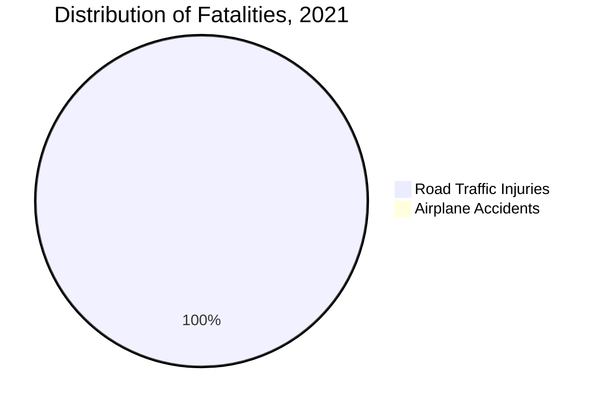
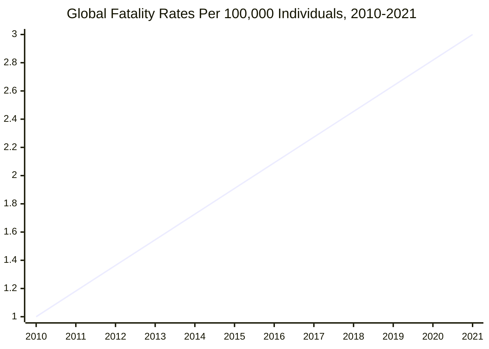

Aviophobia refers to the fear of being on an airplane, helicopter, or other flying vehicles.
It is a very common fear with a prevalence ranging from 2.5% to 40% of the population of Western and Northern Europe and North America depending on the definition <Cite id="Abuso et al." />.

This post briefly explores the various factors that contribute to aviophobia.
It is not a research paper backed with evidence, but rather a collection several observations and hypotheses.

## Flights are Generally Safe

Before discussing the contributing factors of aviophobia, it is worth mentioning that flying is generally safe.

The International Air Transport Association (IATA) is an airline trade association that represents 330 airlines, accounting for >80% of global air traffic <Cite id="IATA" />.
It regularly collects data on airline safety and publishes reports on the same.

The 60th edition of the IATA Annual Safety Report Executive Summary and Safety Overview has collected data for various years, the statistics from which will be discussed <Cite id="IATA, IATA Annual Safety Report Executive Summary and Safety Overview - 60th Edition" />.

### Accidents and Fatalities

Airplanes are, in terms of accidents, one of the safest modes of transportation.
It is more likely for a person to be involved in a car accident than an airplane accident.
This means that once an individual drives to an airport, they've already taken the most dangerous part of their journey.

The statistics below come from the World Health Organization (WHO)'s Global Status Report on Road Safety 2023 <Cite id="Geneva: World Health Organization" />.

This chart shows that road traffic injuries occur at a rate many orders of magnitude higher than airplane accidents.
Notice that the airplane sector in the chart is so small that it is practically invisible.
In fact, the number of fatalities due to road traffic injuries is approximately 10,000 times higher than those due to airplane accidents.

## Sources

<Citation id="Abuso et al.">
Abuso, Athena Beth V., et al. “Overcoming Fear of Flying: A Combined Approach of Psychopharmacology and Gradual Exposure Therapy.” Cureus, vol. 15, no. 5, 1 May 2023, p. e39773, pubmed.ncbi.nlm.nih.gov/37398715/, https://doi.org/10.7759/cureus.39773. Accessed 9 July 2023.
</Citation>
<Citation id="Geneva: World Health Organization">
Geneva: World Health Organization. “Global Status Report on Road Safety 2023.” Injury Prevention, vol. 15, no. 4, 2023, https://doi.org/10.1136/ip.2009.023697.
</Citation>
<Citation id="IATA">
IATA. “About Us.” Www.iata.org, 2021, www.iata.org/en/about/.
</Citation>
<Citation id="IATA">
IATA. “About Us.” Www.iata.org, 2021, www.iata.org/en/about/.
</Citation>
<Citation id="IATA, IATA Annual Safety Report Executive Summary and Safety Overview - 60th Edition">
---. IATA Annual Safety Report Executive Summary and Safety Overview - 60th Edition. 2023.
</Citation>
