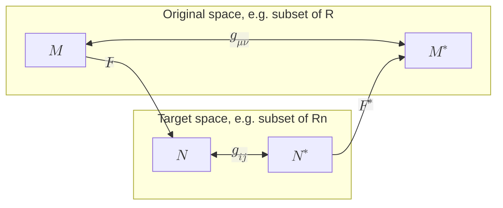

import { Mafs, Coordinates, Plot, Line, Circle, Theme, useMovablePoint, useStopwatch, vec, Vector, LaTeX, Polygon, Transform } from "mafs";

import { useState, useEffect, useCallback } from "react";
import { lineLabel } from "@site/src/utilities/lines";
import { color } from "@site/src/utilities/colors";
import { Fragment } from "react";
import TOCInline from '@theme/TOCInline';
import * as MB from "mathbox-react"
import * as THREE from "three"
import { OrbitControls } from "three/examples/jsm/controls/OrbitControls"
import { TransformControls } from "three/addons/controls/TransformControls";
import Tabs from '@theme/Tabs';
import TabItem from '@theme/TabItem';

# A Brief Introduction to Differential Geometry: Part 1

To understand the Schwarzschild metric and general relativity, we need to introduce some concepts from differential geometry.
The study of general relativity revolves around manifolds, but what exactly is a manifold?
How do we describe the geometry of a manifold? To answer these questions, we will introduce some key concepts from differential geometry.
These will mostly be informal definitions and explanations, as a full treatment of differential geometry is beyond the scope of an set of astronomy notes.

## Table of Contents

<TOCInline toc={toc} />

## Vector Fields in Euclidean Space

The simplest form of a vector is an oriented arrow in Euclidean space ($\mathbb{R}^n$).
It has a magnitude and direction, and is represented by a set of components in a given coordinate system.
These coordinate systems can either be Cartesian (rectangular, marked by $x^i$) or curvilinear (marked by $u^i$).
For instance, in $\mathbb{R}^3$, we can have Cartesian coordinates $(x, y, z)$ or spherical coordinates $(r, \theta, \phi)$.
A vector field is a function that assigns a vector to each point in space.

A **coordinate curve** is a curve that follows one of the coordinate directions in a given coordinate system.
In other words, a coordinate curve $C_1$ in two $\mathbb{R}^2$ is a curve where $u^2$ is constant, and $u^1$ varies.
Similarly, a coordinate curve $C_2$ is a curve where $u^1$ is constant, and $u^2$ varies.
The **tangent** to a coordinate curve at a given point $\vb{p}$ is a vector that points in the direction of the curve at that point, and is given by

$$
\begin{equation}
\pdv{\vb{p}}{u^i} = \partial_i,
\end{equation}
$$

where the latter is an abbreviation for the partial derivative with respect to the coordinate $u^i$.
In differential geometry, the basis vectors are defined as the tangents to the coordinate curves, i.e., $\partial_i$.
In other words, a vector can be written as

$$
\begin{equation}
\vb{v} = v^i \partial_i.
\end{equation}
$$

This means that vectors are differential operators that can act on functions like this:

$$
\begin{equation}
\vb{v}(f) = v^i \partial_i f = v^i \pdv{f}{u^i}.
\end{equation}
$$

Next, suppose $\tilde{u}$ is another coordinate system. We can express a vector in both coordinate systems;

$$
\begin{align}
\vb{v} &= v^i \partial_i, \\
\vb{v} &= \tilde{v}^j \tilde{\partial}_j.
\end{align}
$$

To convert between the two bases, we use the chain rule:

$$
\begin{equation}
\tilde{\partial}_j = \pdv{u^i}{\tilde{u}^j} \partial_i,
\end{equation}
$$

so the components of the vector transform as

$$
\begin{equation}
\tilde{v}^j = \pdv{\tilde{u}^j}{u^i} v^i.
\end{equation}
$$

The partial derivatives $\pdv{u^i}{\tilde{u}^j}$ and $\pdv{\tilde{u}^j}{u^i}$ are the Jacobian and inverse Jacobian matrices, respectively.

### Dual Space

In addition to vectors (living in the space $V$), we also have **covectors** (living in the dual space $V^*$).
They are also known as covariant vectors, one-forms, linear functionals, dual vectors, or bra vectors (in quantum mechanics).
A covector is a linear map that takes a vector as input and produces a scalar as output.

Let $\alpha$ be a covector, and $\vb{v}$ be a vector. The action of the covector on the vector is denoted as

$$
\begin{equation}
\alpha(\vb{v}) = \alpha_i v^i.
\end{equation}
$$

One example of a covector is the **differential form** of a function $f$, denoted as $\dd{f}$.
These provide the contour lines of the function, and are defined by

$$
\begin{equation}
\dd{f}(\vb{v}) = \vb{v}(f) = v^i \partial_i f = v^i \pdv{f}{u^i}.
\end{equation}
$$

The basis covectors are defined as the differentials of the coordinate functions, i.e., $\dd{u^i}$.
As $\dd{u^i}(\vb{v}) = v^i$, we can express a differential form as

$$
\begin{equation}
\dd{f}(\vb{v}) = v^i \partial_i f = \dd{u^i}(\vb{v}) \pdv{f}{u^i}.
\end{equation}
$$

Hence,

$$
\begin{equation}
\dd{f} = \pdv{f}{u^i} \dd{u^i},
\end{equation}
$$

as the multivariable chain rule predicts.
The basis $\dd{u^i}$ form the dual basis where

$$
\begin{equation}
\dd{u^i}(\partial_j) = \delta^i_j,
\end{equation}
$$

and for any covector $\alpha$, we can write

$$
\begin{equation}
\alpha = \alpha_i \dd{u^i}.
\end{equation}
$$

Similar to vectors, covectors also transform between coordinate systems.
However, their components transform in the opposite way to vectors:

$$
\begin{equation}
\tilde{\alpha}_j = \pdv{u^i}{\tilde{u}^j} \alpha_i.
\end{equation}
$$

Notice that $\alpha(\vb{v})$ is invariant under coordinate transformations, as expected for a scalar.
Also, vectors can also be viewed as linear functionals acting on covectors, i.e., $\vb{v}(\alpha) = \alpha(\vb{v})$.

### Metric

To measure distances and angles in a vector space, we need a **metric**.
A metric is, roughly speaking, a structure that tells us about lengths and angles.
When a space is equipped with a metric, it is called a **metric space**.
A metric makes it very easy to do calculus on the space, as we can define concepts like gradients, divergences, and curls.
Without a metric, we have to rely on more abstract definitions, which lies in the realm of topology.

Suppose we want to find the arc length of a curve $C$,

$$
\int_C \dd{s}.
$$

We have

$$
\begin{equation}
\dd{s} = \sqrt{\dd{\vb{r}} \cdot \dd{\vb{r}}}.
\end{equation}
$$

Expanding the dot product gives us

$$
\begin{equation}
\dd{\vb{r}} \cdot \dd{\vb{r}} = \partial_i \cdot \partial_j \dd{u^i} \dd{u^j} = g_{ij} \dd{u^i} \dd{u^j},
\end{equation}
$$

where we have defined the **metric tensor** $g_{ij} = \partial_i \cdot \partial_j$.

Using the metric, we can also define a concept called **duality**.
In essence, we want to find out if every vector $v^i$ has a unique partner $a_j$, i.e., a bijective mapping.
To do so, we define the dual to $\vb{v}$ as $v$ such that

$$
\begin{equation}
v(\vb{w}) = \vb{v} \cdot \vb{w},
\end{equation}
$$

where $\vb{w}$ is any vector in the space.
This makes sense, as both the dot product and the action of a covector on a vector are linear operations that produce a scalar.
Expanding both sides gives us

$$
\begin{equation}
v_j w^j = v^i w^j g_{ij},
\end{equation}
$$

so

$$
\begin{equation}
v_j = g_{ij} v^i.
\end{equation}
$$

This is known as **lowering an index**.
Similarly, we can also **raise an index** by using the inverse metric $g^{ij}$, which is defined such that $g^{ik} g_{kj} = \delta^i_j$.
Thus,

$$
\begin{equation}
v^i = g^{ij} v_j.
\end{equation}
$$

To see an example, we know that the action of $\dd{f}$ on $\vb{v}$ is given by

$$
\begin{equation}
\dd{f}(\vb{v}) = v^i \partial_i f.
\end{equation}
$$

This is just a directional derivative of $f$ along $\vb{v}$, which is also given by the dot product of $\nabla f$ and $\vb{v}$.
Thus we can identify

$$
\begin{equation}
\dd{f}(\vb{v}) = \nabla f \cdot \vb{v},
\end{equation}
$$

so the dual of $\nabla f$ is $\dd{f}$.
In components, we have

$$
\begin{align}
(\nabla f)^i &= g^{ij} \partial_j f, \\
(\dd{f})_i &= \partial_i f.
\end{align}
$$

This gives us a really nice definition of the gradient in any coordinate system, as long as we know the metric.

## Line Integrals

To construct a curve, we use a parameter $\lambda$ to define a mapping from the parameter space to a point in space.
Call this mapping

$$
\begin{equation}
F(\lambda): [a, b] \subset \mathbb{R} \to C \subset \mathbb{R}^n.
\end{equation}
$$

The curve $C$ is the image of the mapping, and $\lambda$ is called a parameter.
Let $\alpha$ be a covector. Notice that we can define $\alpha$ two ways.

First, consider the line integral of $\alpha$ along the curve $C$:

$$
\begin{equation}
\int_C \alpha = \int_C \alpha_i(\vb{r}) \dd{u^i}.
\end{equation}
$$

Importantly, the integrand of an integral is always a differential form like $\alpha$.
Visually, it looks like measuring how many contour lines of $\alpha$ the curve $C$ crosses.

So the covector acts on a vector $\dd{\vb{r}} = \partial_i \dd{u^i}$ that is tangent to the curve.
Next, if we parameterize the curve as $\vb{r} = u^i(\lambda) = F(\lambda)$, we have

$$
\begin{equation}
\int_C \alpha_i(\vb{r}) \dd{u^i} = \int_a^b \alpha_i(u^i(\lambda)) \dv{u^i}{\lambda} \dd{\lambda}.
\end{equation}
$$

But the integrand is just $\alpha(\dv{\vb{r}}{\lambda})$, so we can write

$$
\begin{equation}
\int_C \alpha = \int_a^b \alpha\qty(\dv{\vb{r}}{\lambda}) \dd{\lambda}.
\end{equation}
$$

Now the integral is the action of the covector $\alpha$ on the vector $\dv{\vb{r}}{\lambda}$, integrated over the parameter $\lambda$.
This is a more general definition of the line integral, as it does not depend on the choice of coordinates.
The **pullback** of $\alpha$ by $F$ is defined as that integrand:

$$
\begin{equation}
F^*(\alpha) := \alpha\qty(\dv{\vb{r}}{\lambda}) \dd{\lambda} = \alpha_i(u^i(\lambda)) \dv{u^i}{\lambda} \dd{\lambda}.
\end{equation}
$$

The key idea is that the input is a covector in $C \subset \mathbb{R}^n$, and the output is a covector in $[a, b] \subset \mathbb{R}$.
This is a general concept that can be applied to any mapping between two spaces, not just curves.
So let's define it more generally. Let $M$ and $N$ be two manifolds (we don't need to define manifolds yet, just think of them as spaces that locally look like $\mathbb{R}^n$).
Suppose we have a mapping $F: M \to N$. Then, there exists a mapping between the cotangent spaces (the spaces of covectors) called the pullback.

### Exterior 2-Forms

We have seen the tensor product used before to construct higher-rank tensors from lower-rank ones.
For instance, the tensor product of $\alpha$ and $\beta$ is a rank-2 tensor defined via its action on two vectors:

$$
\begin{equation}
(\alpha \otimes \beta)(\vb{v}, \vb{w}) = \alpha(\vb{v}) \beta(\vb{w}).
\end{equation}
$$

Another product we can define is the **exterior product** or wedge product, denoted by $\wedge$.
Recall that we have seen this before when we studied Clifford algebras in the quantum field theory notes.
The wedge product of two covectors $\alpha$ and $\beta$ is defined as

$$
\begin{equation}
\alpha \wedge \beta = \alpha \otimes \beta - \beta \otimes \alpha,
\end{equation}
$$

which is antisymmetric in its arguments.
Suppose we have two differential forms $\dd{u^i}$ and $\dd{u^j}$, then

$$
\begin{equation}
\dd{u^i} \wedge \dd{u^j} = \dd{u^i} \otimes \dd{u^j} - \dd{u^j} \otimes \dd{u^i},
\end{equation}
$$

which acts on two vectors $\vb{v}$ and $\vb{w}$ as

$$
\begin{equation}
(\dd{u^i} \wedge \dd{u^j})(\vb{v}, \vb{w}) = v^i w^j - v^j w^i.
\end{equation}
$$

This resembles the determinant of a $2 \times 2$ matrix, and indeed, the wedge product of two covectors can be interpreted as the oriented area of the parallelogram spanned by the two vectors.
Note that in a higher dimensional space, the vectors must first be projected onto the 2D subspace spanned by the two covectors, then the area can be computed.
In the context of Clifford algebras, the wedge product produces bivectors, which represent oriented areas in space.
We can write an **exterior 2-form** $\omega$ as a linear combination of basis 2-forms:

$$
\begin{equation}
\omega = \sum_{i < j} \omega_{ij} \dd{u^i} \wedge \dd{u^j},
\end{equation}
$$

where $\omega_{ij} = -\omega_{ji}$ are the components of the 2-form.

Let's generalize to higher dimensions.
In an $n$-dimensional space, an (exterior) $p$-form $\alpha^p$ is a skew symmetric (antisymmetric) rank-$p$ covariant tensor.
Whenever two arguments are interchanged, the sign of the tensor flips.
The geometric interpretation of a $p$-form is that it measures oriented $p$-dimensional volumes.
For instance, a 3-form acts like this:

$$
\begin{equation}
\dd{u^1} \wedge \dd{u^2} \wedge \dd{u^3} (\vb{v}, \vb{w}, \vb{z}) = \det(\mqty[
    \dd{u^1}(\vb{v}) & \dd{u^1}(\vb{w}) & \dd{u^1}(\vb{z}) \\
    \dd{u^2}(\vb{v}) & \dd{u^2}(\vb{w}) & \dd{u^2}(\vb{z}) \\
    \dd{u^3}(\vb{v}) & \dd{u^3}(\vb{w}) & \dd{u^3}(\vb{z})
]) = \det(\mqty[
    v^1 & w^1 & z^1 \\
    v^2 & w^2 & z^2 \\
    v^3 & w^3 & z^3
]).
\end{equation}
$$

It measures the oriented volume of the parallelepiped spanned by the three vectors $\vb{v}, \vb{w}, \vb{z}$ projected onto the 3D subspace defined by the three covectors.

Two facts about $p$-forms are immediately apparent. First, a $p$-form can only exist in a space of dimension $n \geq p$.
Second, shifting any two arguments of a $p$-form flips its sign, so if any two arguments are the same, the $p$-form evaluates to zero.
Thus, in three dimensions, there is only one independent 3-form, $\dd{u^1} \wedge \dd{u^2} \wedge \dd{u^3}$, called the **volume form**.
In the language of Clifford algebras, the volume form is a pseudoscalar.

Now, the exterior product of any $p$-form $\alpha$ and any $q$-form $\beta$ is a $(p + q)$-form defined via the typical multiplicaiton laws.
(This is because vectors spaces with products that satisfy certain axioms are called algebras, and the exterior algebra is one such algebra.)

### Exterior Differential

The **exterior differential** $\dd$ is an operator that takes a $p$-form to a $(p + 1)$-form.
Suppose $\alpha^p$ is a $p$-form defined as

$$
\begin{equation}
\alpha^p := \alpha(u^i) \dd{u^{i_1}} \wedge \dd{u^{i_2}} \wedge \cdots \wedge \dd{u^{i_p}},
\end{equation}
$$
