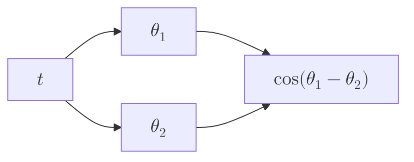

import { Mafs, Coordinates, Plot, Line, Circle, Theme, useMovablePoint, useStopwatch, vec, Vector, LaTeX, Polygon, Transform } from "mafs";

import { useState, useCallback } from "react";
import { lineLabel } from "@site/src/utilities/lines";
import { color } from "@site/src/utilities/colors"
import TOCInline from '@theme/TOCInline';
import * as MB from "mathbox-react"
import * as THREE from "three";
import { Line2 } from 'three/addons/lines/Line2';
import { LineMaterial } from 'three/addons/lines/LineMaterial';
import { LineGeometry } from 'three/addons/lines/LineGeometry';
import { OrbitControls } from "three/examples/jsm/controls/OrbitControls"
import Tabs from '@theme/Tabs';
import TabItem from '@theme/TabItem';

# Elementary Applications of Lagrangian Mechanics

This page contains elementary applications of Lagrangian mechanics to simple systems.
These systems are difficult to analyze using Newtonian mechanics, but the Lagrangian formalism greatly simplifies the analysis.

## Table of Contents

<TOCInline toc={toc} />

## Shortest Path Between Two Points

The shortest path between two points in a plane is a straight line.
*Can we prove this?*
This might seem like an insanely obvious statement, but it is nevertheless an interesting subject of study.
We can use the Lagrangian formalism to prove this statement.

The key is that the shortest path between two points is the path that minimizes the length of the path.
We can create a path between two points by defining a function $\va{r}(t)$ that describes the path, where we can think of $t$ as time.
Suppose this path lives in two-dimensional space, so $\va{r}(t) = (x(t), y(t))$.

Let the total distance of the path be $D[\va{r}]$.
(Recall that we use square brackets to denote functionals, which are functions of functions.)
It is the sum of the infinitesimal distances $\dd{s}$ along the path:

$$
\begin{equation}
D[\va{r}] := \int \dd{s} = \int \sqrt{\dd{x}^2 + \dd{y}^2} = \int \dd{t} \sqrt{\dot{x}^2 + \dot{y}^2}
\end{equation}
$$

where we used the chain rule to write $\dd{s} = \sqrt{\dd{x}^2 + \dd{y}^2} = \sqrt{\dot{x}^2 \dd{t}^2 + \dot{y}^2 \dd{t}^2} = \sqrt{\dot{x}^2 + \dot{y}^2} \dd{t}$.
Therefore, the Lagrangian of the system is:

$$
\begin{equation}
L = \sqrt{\dot{x}^2 + \dot{y}^2}
\end{equation}
$$

Since $L$ does not explicitly depend on $x$ or $y$, we automatically have that $\pdv{L}{x} = \pdv{L}{y} = 0$.
This means that the Euler-Lagrange equations simplify to:

$$
\begin{align}
\dv{t} \pdv{L}{\dot{x}} &= 0 \\
\dv{t} \pdv{L}{\dot{y}} &= 0
\end{align}
$$

The first equation gives:

$$
\begin{equation}
0 = \dv{t} \pdv{L}{\dot{x}} = \dv{t} \qty(\frac{\dot{x}}{\sqrt{\dot{x}^2 + \dot{y}^2}})
\end{equation}
$$

If the derivative of a function is zero, the function is a constant. Therefore, we have:

$$
\begin{equation}
\frac{\dot{x}}{\sqrt{\dot{x}^2 + \dot{y}^2}} = C_1 \label{eq:shortest-path-de-1}
\end{equation}
$$

The same argument for the second equation gives:

$$
\begin{equation}
\frac{\dot{y}}{\sqrt{\dot{x}^2 + \dot{y}^2}} = C_2 \label{eq:shortest-path-de-2}
\end{equation}
$$

Dividing Equation $\eqref{eq:shortest-path-de-1}$ by Equation $\eqref{eq:shortest-path-de-2}$ gives:

$$
\begin{equation}
\frac{\dot{x}}{\dot{y}} = \frac{C_1}{C_2} =: m
\end{equation}
$$

where $m$ is a constant.
Rearranging gives $\dot{y} = m \dot{x}$. Then, integrating both sies by $t$ gives:

$$
\begin{equation}
y = mx + C
\end{equation}
$$

where $C$ is a constant.
This is the equation of a straight line.
Therefore, the shortest path between two points is a straight line.

Crucially, this proof does not rely on Newtonian mechanics.
I made an emphasis on the previous page about deriving the Euler-Lagrange equations without explicitly relying on any specific expression for the Lagrangian.
This shows that the equations hold for any Lagrangian, which includes this one for the shortest path.

## Double Pendulum

The double pendulum is a simple system that exhibits chaotic behavior.
It consists of two pendulums attached to each other, with the second pendulum attached to the first one's bob.
We shall derive the equations of motion for the double pendulum using the Lagrangian formalism.

This will be a very long and tedious derivation, so you can skip some of the mathematical details if you want.

<DoublePendulumVisualizer />

The double pendulum consists of two pendulums attached to each other.
The first pendulum has length $l_1$ and mass $m_1$, and the second pendulum has length $l_2$ and mass $m_2$.
The first pendulum is attached to the ceiling, and the second pendulum is attached to the first pendulum's bob.
The angles of the first and second pendulums with the vertical are $\theta_1$ and $\theta_2$, respectively, and the gravitational acceleration is $g$.

If we use Newtonian mechanics, we would have to find all the forces, including the tension in the strings.
This is very difficult, as the tension in the strings depends on the angles of the pendulums.
We would have to do a lot of vector algebra to find the forces.
Instead, we shall use the Lagrangian formalism, which is much simpler for this system because we simply need the energies of the system.

We have two sets of coordinates we can use: the Cartesian coordinates of the bobs or the angles of the pendulums.
We can use both for now, but we shall write everything in terms of the angles in the end.

From the figure above, we can derive the following coordinate transformations:

$$
\begin{align}
x_1 &= l_1 \sin(\theta_1) \\
y_1 &= -l_1 \cos(\theta_1) \\
x_2 &= l_1 \sin(\theta_1) + l_2 \sin(\theta_2) \\
y_2 &= -l_1 \cos(\theta_1) - l_2 \cos(\theta_2)
\end{align}
$$

The rates of change of these coordinates are, by the chain rule:

$$
\begin{align}
\dot{x}_1 &= l_1 \cos(\theta_1) \dot{\theta}_1 \\
\dot{y}_1 &= l_1 \sin(\theta_1) \dot{\theta}_1 \\
\dot{x}_2 &= l_1 \cos(\theta_1) \dot{\theta}_1 + l_2 \cos(\theta_2) \dot{\theta}_2 \\
\dot{y}_2 &= l_1 \sin(\theta_1) \dot{\theta}_1 + l_2 \sin(\theta_2) \dot{\theta}_2
\end{align}
$$

The velocity of the first bob is:

$$
\begin{equation}
\begin{split}
v_1^2 &= \dot{x}_1^2 + \dot{y}_1^2 \\
&= l_1^2 \cos^2(\theta_1) \dot{\theta}_1^2 + l_1^2 \sin^2(\theta_1) \dot{\theta}_1^2 \\
&= l_1^2 \dot{\theta}_1^2 (\cos^2(\theta_1) + \sin^2(\theta_1)) \\
&= l_1^2 \dot{\theta}_1^2
\end{split}
\end{equation}
$$

The velocity of the second bob is:

$$
\begin{equation}
\begin{split}
v_2^2 &= \dot{x}_2^2 + \dot{y}_2^2 \\
&= \qquad l_1^2 \cos^2(\theta_1) \dot{\theta}_1^2 + l_2^2 \cos^2(\theta_2) \dot{\theta}_2^2 + 2 l_1 l_2 \cos(\theta_1) \cos(\theta_2) \dot{\theta}_1 \dot{\theta}_2 \\
&\qquad {}+ l_1^2 \sin^2(\theta_1) \dot{\theta}_1^2 + l_2^2 \sin^2(\theta_2) \dot{\theta}_2^2 + 2 l_1 l_2 \sin(\theta_1) \sin(\theta_2) \dot{\theta}_1 \dot{\theta}_2 \\
&= l_1^2 \dot{\theta}_1^2 + l_2^2 \dot{\theta}_2^2 + 2 l_1 l_2 \cos(\theta_1 - \theta_2) \dot{\theta}_1 \dot{\theta}_2
\end{split}
\end{equation}
$$

where we used the trigonometric identity $\cos(\alpha) \cos(\beta) + \sin(\alpha) \sin(\beta) = \cos(\alpha - \beta)$.

With both velocities, we can find the kinetic energy of the system, which is the sum of the kinetic energies of the bobs:

$$
\begin{equation}
\begin{split}
T &= \frac{1}{2} m_1 v_1^2 + \frac{1}{2} m_2 v_2^2 \\
&= \frac{1}{2} m_1 l_1^2 \dot{\theta}_1^2 + \frac{1}{2} m_2 (l_1^2 \dot{\theta}_1^2 + l_2^2 \dot{\theta}_2^2 + 2 l_1 l_2 \cos(\theta_1 - \theta_2) \dot{\theta}_1 \dot{\theta}_2) \\
&= \frac{1}{2} (m_1 + m_2) l_1^2 \dot{\theta}_1^2 + \frac{1}{2} m_2 l_2^2 \dot{\theta}_2^2 + m_2 l_1 l_2 \cos(\theta_1 - \theta_2) \dot{\theta}_1 \dot{\theta}_2
\end{split}
\end{equation}
$$

The potential energy of the system is the sum of the potential energies of the bobs:

$$
\begin{equation}
\begin{split}
V &= m_1 g y_1 + m_2 g y_2 \\
&= -m_1 g l_1 \cos(\theta_1) - m_2 g (l_1 \cos(\theta_1) + l_2 \cos(\theta_2)) \\
&= -(m_1 + m_2) g l_1 \cos(\theta_1) - m_2 g l_2 \cos(\theta_2)
\end{split}
\end{equation}
$$

With the kinetic and potential energies, we can find the Lagrangian of the system:

$$
\begin{equation}
\begin{split}
L &= T - V \\
&= \frac{1}{2} (m_1 + m_2) l_1^2 \dot{\theta}_1^2 + \frac{1}{2} m_2 l_2^2 \dot{\theta}_2^2 \\
&\qquad {}+ m_2 l_1 l_2 \cos(\theta_1 - \theta_2) \dot{\theta}_1 \dot{\theta}_2 + (m_1 + m_2) g l_1 \cos(\theta_1) + m_2 g l_2 \cos(\theta_2)
\end{split}
\end{equation}
$$

Recall that in Lagrangian mechanics, we introduce the canonical momenta conjugate to the generalized coordinates as $p_i = \pdv{L}{\dot{q}_i}$.
As such, the momenta are:

$$
\begin{align}
p_1 &= \pdv{L}{\dot{\theta}_1} = (m_1 + m_2) l_1^2 \dot{\theta}_1 + m_2 l_1 l_2 \cos(\theta_1 - \theta_2) \dot{\theta}_2 \\
p_2 &= \pdv{L}{\dot{\theta}_2} = m_2 l_2^2 \dot{\theta}_2 + m_2 l_1 l_2 \cos(\theta_1 - \theta_2) \dot{\theta}_1
\end{align}
$$

### Equations of Motion

The equations of motion are given by the Euler-Lagrange equations:

$$
\begin{equation}
\pdv{L}{q_i} - \dv{t} \pdv{L}{\dot{q}_i} = 0
\end{equation}
$$

The $\dv{t} \pdv{L}{\dot{q}_i}$ term is just the time derivative of the momenta, $\dot{p}_i$.
This we have:

$$
\begin{equation}
\pdv{L}{\theta_i} - \dot{p}_i = 0 \qfor i = 1, 2
\end{equation}
$$

The time derivatives of the first conjugate momentum is:

$$
\begin{equation}
\begin{split}
\dot{p}_1 &= \dv{t} \pdv{L}{\dot{\theta}_1} \\
&= \dv{t} ((m_1 + m_2) l_1^2 \dot{\theta}_1 + m_2 l_1 l_2 \cos(\theta_1 - \theta_2) \dot{\theta}_2) \\
&= (m_1 + m_2) l_1^2 \ddot{\theta}_1 + m_2 l_1 l_2 \cos(\theta_1 - \theta_2) \ddot{\theta}_2 \\
&\qquad {}- m_2 l_1 l_2 \sin(\theta_1 - \theta_2) \dot{\theta}_1 \dot{\theta}_2 + m_2 l_1 l_2 \sin(\theta_1 - \theta_2) \ddot{\theta}_2 \\
\end{split} \label{eq:double-pendulum-dv-p-1}
\end{equation}
$$

More details, please 🥺

That was a bit complicated and some details were skipped.
The difficult part is the time derivative of the cosine term $\cos(\theta_1 - \theta_2) \dot{\theta}_2$.

First, we need to use the product rule. I have colored the terms to make it easier to see which terms are multiplied together:

$$
\begin{equation}
\begin{split}
\dv{t} \qty(\class{pink}{\cos(\theta_1 - \theta_2)} \class{blue}{\dot{\theta}_2}) &= \class{pink}{\cos(\theta_1 - \theta_2)} \dv{\class{blue}{\dot{\theta}_2}}{t} + \class{blue}{\dot{\theta}_2} \dv{t} \qty(\class{pink}{\cos(\theta_1 - \theta_2)}) \\
&= \cos(\theta_1 - \theta_2) \ddot{\theta}_2 + \dot{\theta}_2 \dv{t} \qty(\cos(\theta_1 - \theta_2))
\end{split}
\end{equation}
$$

Now, we need to find the time derivative of the cosine term.
This is tricky - both $\theta_1$ and $\theta_2$ are functions of time, so we need to use the multivariable chain rule.
It is a bit clearer if we draw a diagram of the causal relationships:

As such, the change in $\cos(\theta_1 - \theta_2)$ is given by the sum of the contributions from $\theta_1$ and $\theta_2$:

$$
\begin{equation}
\begin{split}
\dv{t} \cos(\theta_1 - \theta_2) &= \pdv{\cos(\theta_1 - \theta_2)}{\theta_1} \dv{\theta_1}{t} + \pdv{\cos(\theta_1 - \theta_2)}{\theta_2} \dv{\theta_2}{t} \\
&= -\sin(\theta_1 - \theta_2) \dot{\theta}_1 + \sin(\theta_1 - \theta_2) \dot{\theta}_2
\end{split}
\end{equation}
$$

Putting it all together, we have:

$$
\begin{equation}
\begin{split}
\dot{p}_1 &= (m_1 + m_2) l_1^2 \ddot{\theta}_1 + m_2 l_1 l_2 \cos(\theta_1 - \theta_2) \ddot{\theta}_2 \\
&\qquad {}- m_2 l_1 l_2 \sin(\theta_1 - \theta_2) \dot{\theta}_1 \dot{\theta}_2 + m_2 l_1 l_2 \sin(\theta_1 - \theta_2) \ddot{\theta}_2
\end{split} \tag{\ref{eq:double-pendulum-dv-p-1}}
\end{equation}
$$

The time derivative of the second conjugate momentum is:

$$
\begin{equation}
\begin{split}
\dot{p}_2 &= \dv{t} \pdv{L}{\dot{\theta}_2} \\
&= \dv{t} (m_2 l_2^2 \dot{\theta}_2 + m_2 l_1 l_2 \cos(\theta_1 - \theta_2) \dot{\theta}_1) \\
&= m_2 l_2^2 \ddot{\theta}_2 + m_2 l_1 l_2 \cos(\theta_1 - \theta_2) \ddot{\theta}_1 \\
&\qquad {}- m_2 l_1 l_2 \sin(\theta_1 - \theta_2) \dot{\theta}_1 \dot{\theta}_2 + m_2 l_1 l_2 \sin(\theta_1 - \theta_2) \ddot{\theta}_1
\end{split}
\end{equation}
$$

Finally, the partial derivatives of the Lagrangian with respect to the generalized coordinates are:

$$
\begin{align}
\pdv{L}{\theta_1} &= -m_2 l_1 l_2 \sin(\theta_1 - \theta_2) \dot{\theta}_1 \dot{\theta}_2 - (m_1 + m_2) g l_1 \sin(\theta_1) \\
\pdv{L}{\theta_2} &= m_2 l_1 l_2 \sin(\theta_1 - \theta_2) \dot{\theta}_1 \dot{\theta}_2 - m_2 g l_2 \sin(\theta_2)
\end{align}
$$

Putting it all together, the first equation of motion for $\theta_1$ is:

$$
\begin{equation}
\begin{split}
\pdv{L}{\theta_1} - \dot{p}_1 &= 0 \\
-m_2 l_1 l_2 \sin(\theta_1 - \theta_2) \dot{\theta}_1 \dot{\theta}_2 &- (m_1 + m_2) g l_1 \sin(\theta_1) \\
\qquad {}- (m_1 + m_2) l_1^2 \ddot{\theta}_1 &- m_2 l_1 l_2 \cos(\theta_1 - \theta_2) \ddot{\theta}_2 \\
\qquad {}+ m_2 l_1 l_2 \sin(\theta_1 - \theta_2) \dot{\theta}_1 \dot{\theta}_2 &- m_2 l_1 l_2 \sin(\theta_1 - \theta_2) \ddot{\theta}_2 = 0
\end{split}
\end{equation}
$$

Some terms cancel out, and dividing by $l_1$ gives:

$$
\begin{equation}
\begin{split}
(m_1 + m_2) l_1 \ddot{\theta}_1 &+ m_2 l_2 \ddot{\theta}_2 \cos(\theta_1 - \theta_2) \\
&+ m_2 l_2 \dot{\theta}_2^2 \sin(\theta_1 - \theta_2) + (m_1 + m_2) g \sin(\theta_1) = 0
\end{split} \label{eq:double-pendulum-eom-theta-1}
\end{equation}
$$

The second equation of motion for $\theta_2$ is:

$$
\begin{equation}
\begin{split}
\pdv{L}{\theta_2} - \dot{p}_2 &= 0 \\
m_2 l_1 l_2 \sin(\theta_1 - \theta_2) \dot{\theta}_1 \dot{\theta}_2 &- m_2 g l_2 \sin(\theta_2) \\
\qquad {}+ m_2 l_2^2 \ddot{\theta}_2 &+ m_2 l_1 l_2 \cos(\theta_1 - \theta_2) \ddot{\theta}_1 \\
\qquad {}- m_2 l_1 l_2 \sin(\theta_1 - \theta_2) \dot{\theta}_1 \dot{\theta}_2 &+ m_2 l_1 l_2 \sin(\theta_1 - \theta_2) \ddot{\theta}_1 = 0
\end{split}
\end{equation}
$$

Some terms cancel out, and dividing by $l_2$ gives:

$$
\begin{equation}
l_2 \ddot{\theta}_2 + l_1 \ddot{\theta}_1 \cos(\theta_1 - \theta_2) - l_1 \dot{\theta}_1^2 \sin(\theta_1 - \theta_2) + g \sin(\theta_2) = 0 \label{eq:double-pendulum-eom-theta-2}
\end{equation}
$$

As such, we have fully derived the equations of motion for the double pendulum:

<Boxed>
**Equations of Motion for the Double Pendulum**

$$
\begin{align}
(m_1 + m_2) l_1 \ddot{\theta}_1 &+ m_2 l_2 \ddot{\theta}_2 \cos(\theta_1 - \theta_2) \nonumber \\
    &+ m_2 l_2 \dot{\theta}_2^2 \sin(\theta_1 - \theta_2) + (m_1 + m_2) g \sin(\theta_1) &&= 0 \tag{\ref{eq:double-pendulum-eom-theta-1}} \\
l_2 \ddot{\theta}_2 &+ l_1 \ddot{\theta}_1 \cos(\theta_1 - \theta_2) - l_1 \dot{\theta}_1^2 \sin(\theta_1 - \theta_2) + g \sin(\theta_2) &&= 0 \tag{\ref{eq:double-pendulum-eom-theta-2}}
\end{align}
$$

</Boxed>

These are quite messy at the moment, but we will simplify them (actually, we are just hiding the details) a bit here.
First, let's divide both sides of both equations such that the coefficients of $\ddot{\theta}_1$ and $\ddot{\theta}_2$ are 1 in the first and second equations, respectively.
Then, we rearrange to put the terms with $\ddot{\theta}_1$ on the right hand side:

$$
\begin{alignat}{2}
\ddot{\theta}_1 &&+ \class{pink}{\frac{m_2}{m_1 + m_2} \frac{l_2}{l_1} \cos(\theta_1 - \theta_2)} &\ddot{\theta}_2 = \class{blue}{-\frac{m_2}{m_1 + m_2} \frac{l_2}{l_1} \dot{\theta}_2^2 \sin(\theta_1 - \theta_2) - \frac{g}{l_1} \sin(\theta_1)} \\
\ddot{\theta}_2 &&+ \class{pink}{\frac{l_1}{l_2} \cos(\theta_1 - \theta_2)} &\ddot{\theta}_1 = \class{blue}{\frac{l_1}{l_2} \dot{\theta}_1^2 \sin(\theta_1 - \theta_2) - \frac{g}{l_2} \sin(\theta_2)}
\end{alignat}
$$

We shall introduce some auxiliary functions for these coefficients and the terms on the right hand side (which are colored in the equations above):

$$
\begin{align}
\class{pink}{\alpha_1(\theta_1, \theta_2)} &:= \frac{l_2}{l_1} \frac{m_2}{m_1 + m_2} \cos(\theta_1 - \theta_2) \label{eq:def-alpha-1} \\
\class{pink}{\alpha_2(\theta_1, \theta_2)} &:= \frac{l_1}{l_2} \cos(\theta_1 - \theta_2) \label{eq:def-alpha-2} \\
\class{blue}{\beta_1(\theta_1, \theta_2, \dot{\theta}_1, \dot{\theta_2})} &:= -\frac{l_2}{l_1} \frac{m_2}{m_1 + m_2} \dot{\theta}_2^2 \sin(\theta_1 - \theta_2) - \frac{g}{l_1} \sin(\theta_1) \label{eq:def-beta-1} \\
\class{blue}{\beta_2(\theta_1, \theta_2, \dot{\theta}_1, \dot{\theta_2})} &:= \frac{l_1}{l_2} \dot{\theta}_1^2 \sin(\theta_1 - \theta_2) - \frac{g}{l_2} \sin(\theta_2) \label{eq:def-beta-2}
\end{align}
$$

Then, we can write the equations of motion as:

$$
\begin{align}
\ddot{\theta}_1 + \class{pink}{\alpha_1(\theta_1, \theta_2)} \ddot{\theta}_2 &= \class{blue}{\beta_1(\theta_1, \theta_2, \dot{\theta}_1, \dot{\theta}_2)} \\
\ddot{\theta}_2 + \class{pink}{\alpha_2(\theta_1, \theta_2)} \ddot{\theta}_1 &= \class{blue}{\beta_2(\theta_1, \theta_2, \dot{\theta}_1, \dot{\theta}_2)}
\end{align}
$$

Using matrices, we can write these equations as a single matrix equation:

$$
\begin{equation}
\mqty[1 & \class{pink}{\alpha_1} \\ \class{pink}{\alpha_2} & 1] \mqty[\ddot{\theta}_1 \\ \ddot{\theta}_2] = \mqty[\class{blue}{\beta_1} \\ \class{blue}{\beta_2}] \label{eq:double-pendulum-matrix-eom}
\end{equation}
$$

Denote the matrix on the left hand side as $\vb{A}$.

It turns out that $\vb{A}$ is always invertible because the determinant of $\vb{A}$ is always non-zero.
The inverse of $\vb{A}$ is:

$$
\begin{equation}
\vb{A}^{-1} = \frac{1}{1 - \class{pink}{\alpha_1} \class{pink}{\alpha_2}} \mqty[1 & -\class{pink}{\alpha_1} \\ -\class{pink}{\alpha_2} & 1]
\end{equation}
$$

Applying $\vb{A}^{-1}$ to both sides of Equation $\eqref{eq:double-pendulum-matrix-eom}$, we get:

$$
\begin{equation}
\mqty[\ddot{\theta}_1 \\ \ddot{\theta}_2] = \frac{1}{1 - \class{pink}{\alpha_1} \class{pink}{\alpha_2}} \mqty[1 & -\class{pink}{\alpha_1} \\ -\class{pink}{\alpha_2} & 1] \mqty[\class{blue}{\beta_1} \\ \class{blue}{\beta_2}] = \frac{1}{1 - \class{pink}{\alpha_1} \class{pink}{\alpha_2}} \mqty[\class{blue}{\beta_1} - \class{pink}{\alpha_1} \class{blue}{\beta_2} \\ -\class{pink}{\alpha_2} \class{blue}{\beta_1} + \class{blue}{\beta_2}]
\end{equation}
$$

Lastly, we shall write the equations of motion in terms of the angles and their angular velocities.
This means that we shall expand our vector to include the angular velocities:

$$
\begin{equation}
\va{q} = \mqty[\theta_1 \\ \theta_2 \\ \dot{\theta}_1 \\ \dot{\theta}_2]
\end{equation}
$$

The derivative of $\va{q}$ is:

$$
\begin{equation}
\dot{\va{q}} = \mqty[\dot{\theta}_1 \\ \dot{\theta}_2 \\ \ddot{\theta}_1 \\ \ddot{\theta}_2] = \mqty[\dot{\theta}_1 \\ \dot{\theta}_2 \\ \frac{1}{1 - \class{pink}{\alpha_1} \class{pink}{\alpha_2}} (\class{blue}{\beta_1} - \class{pink}{\alpha_1} \class{blue}{\beta_2}) \\ \frac{1}{1 - \class{pink}{\alpha_1} \class{pink}{\alpha_2}} (-\class{pink}{\alpha_2} \class{blue}{\beta_1} + \class{blue}{\beta_2})]
\end{equation}
$$

Defining the functions $\class{green}{f_1(\theta_1, \theta_2, \dot{\theta}_1, \dot{\theta}_2)}$ and $\class{green}{f_2(\theta_1, \theta_2, \dot{\theta}_1, \dot{\theta}_2)}$ as:

$$
\begin{align}
\class{green}{f_1(\theta_1, \theta_2, \dot{\theta}_1, \dot{\theta}_2)} &:= \frac{1}{1 - \class{pink}{\alpha_1} \class{pink}{\alpha_2}} (\class{blue}{\beta_1} - \class{pink}{\alpha_1} \class{blue}{\beta_2}) \label{eq:def-f1} \\
\class{green}{f_2(\theta_1, \theta_2, \dot{\theta}_1, \dot{\theta}_2)} &:= \frac{1}{1 - \class{pink}{\alpha_1} \class{pink}{\alpha_2}} (-\class{pink}{\alpha_2} \class{blue}{\beta_1} + \class{blue}{\beta_2}) \label{eq:def-f2}
\end{align}
$$

All of this gives the final equations of motion for the double pendulum:

<Boxed>

**Equations of Motion for the Double Pendulum**: For a double pendulum with masses $m_1$ and $m_2$, lengths $l_1$ and $l_2$, and angles $\theta_1$ and $\theta_2$ with the vertical, the equations of motion are:

$$
\begin{equation}
\dv{t} \mqty[\theta_1 \\ \theta_2 \\ \dot{\theta}_1 \\ \dot{\theta}_2] = \mqty[\dot{\theta}_1 \\ \dot{\theta}_2 \\ \class{green}{f_1(\theta_1, \theta_2, \dot{\theta}_1, \dot{\theta}_2)} \\ \class{green}{f_2(\theta_1, \theta_2, \dot{\theta}_1, \dot{\theta}_2)}]
\end{equation}
$$

where:

$$
\begin{align}
\class{green}{f_1(\theta_1, \theta_2, \dot{\theta}_1, \dot{\theta}_2)} &:= \frac{1}{1 - \class{pink}{\alpha_1} \class{pink}{\alpha_2}} (\class{blue}{\beta_1} - \class{pink}{\alpha_1} \class{blue}{\beta_2}) \tag{\ref{eq:def-f1}} \\
\class{green}{f_2(\theta_1, \theta_2, \dot{\theta}_1, \dot{\theta}_2)} &:= \frac{1}{1 - \class{pink}{\alpha_1} \class{pink}{\alpha_2}} (-\class{pink}{\alpha_2} \class{blue}{\beta_1} + \class{blue}{\beta_2}) \tag{\ref{eq:def-f2}} \\
\class{pink}{\alpha_1(\theta_1, \theta_2)} &:= \frac{l_2}{l_1} \frac{m_2}{m_1 + m_2} \cos(\theta_1 - \theta_2) \tag{\ref{eq:def-alpha-1}} \\
\class{pink}{\alpha_2(\theta_1, \theta_2)} &:= \frac{l_1}{l_2} \cos(\theta_1 - \theta_2) \tag{\ref{eq:def-alpha-2}} \\
\class{blue}{\beta_1(\theta_1, \theta_2, \dot{\theta}_1, \dot{\theta}_2)} &:= -\frac{l_2}{l_1} \frac{m_2}{m_1 + m_2} \dot{\theta}_2^2 \sin(\theta_1 - \theta_2) - \frac{g}{l_1} \sin(\theta_1) \tag{\ref{eq:def-beta-1}} \\
\class{blue}{\beta_2(\theta_1, \theta_2, \dot{\theta}_1, \dot{\theta}_2)} &:= \frac{l_1}{l_2} \dot{\theta}_1^2 \sin(\theta_1 - \theta_2) - \frac{g}{l_2} \sin(\theta_2) \tag{\ref{eq:def-beta-2}}
\end{align}
$$

and $g$ is the acceleration due to gravity.

</Boxed>

This equation is nonlinear and there is currently no known general analytical solution for it given any initial conditions.
Of course, some special cases can be solved analytically, but they pertain to specific initial conditions.
For example, the most trivial case is when the pendulums are at rest, i.e., $\theta_1(t = 0) = \theta_2(t = 0) = 0$ and $\dot{\theta}_1(t = 0) = \dot{\theta}_2(t = 0) = 0$.
This *does not* mean that we do not know how the double pendulum behaves - solving a differential equation is only one way to understand a system.

The simulation at the top of the page shows the behavior of the double pendulum.
It uses a 4th-order Runge-Kutta method to solve the equations of motion numerically.
The double pendulum exhibits *chaotic behavior*, which means that small changes in the initial conditions can lead to drastically different outcomes.

Systems like the double pendulum are very interesting; while they are simple to describe, they exhibit very complex behavior.
They are the subject of study in the field of nonlinear dynamics, which studies how systems behave when they are not linear.

## Summary and Next Steps

In this section, we have applied the Lagrangian formalism to two systems: the shortest path between two points and the double pendulum.

The shortest path between two points was a simple example to show how the Lagrangian formalism can be used to derive the equations of motion.
We showed that the shortest path is a straight line, which is a result that does not rely on Newtonian mechanics.

The double pendulum was a more complex example that showed how the Lagrangian formalism can be used to derive the equations of motion for a system with multiple degrees of freedom.
The equations of motion for the double pendulum are nonlinear and exhibit chaotic behavior.

In the next section, we will explore a very important concept in classical mechanics: conservation laws.
