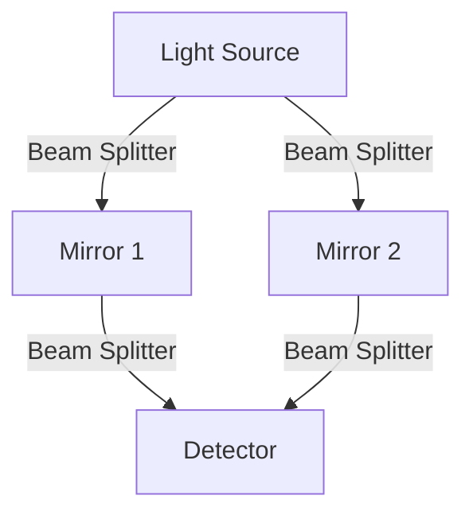

import { Mafs, Coordinates, Plot, Line, Circle, Theme, useMovablePoint, useStopwatch, vec, Vector, LaTeX, Polygon, Transform } from "mafs";

import { useState, useEffect, useCallback } from "react";
import { lineLabel } from "@site/src/utilities/lines";
import { color } from "@site/src/utilities/colors";
import TOCInline from "@theme/TOCInline";
import * as MB from "mathbox-react";
import * as THREE from "three";
import { OrbitControls } from "three/examples/jsm/controls/OrbitControls";
import { range } from "lodash";

## Flaws of Galilean Relativity

Galilean relativity is a classical theory of relativity that describes the motion of objects at everyday speeds.
However, it has some flaws that become apparent when we consider the behavior of light and electromagnetism.
In this section, we will discuss some of the flaws of Galilean relativity and how they led to the development of special relativity.

## Table of Contents

<TOCInline toc={toc} />

## Flaw 1: Light Has No Medium

It is obvious that in Galilean relativity, different observers can measure different speeds of light.
We can see that this is a problem in many ways. This argument is more of a philosophical one than a mathematical one.

Other than light, every other type of wave has a medium.
A sound wave's medium is the molecules that are vibrating.
A water wave's medium is the water itself.
A seismic wave's medium is the ground.
A wave's medium is the material that is vibrating to create the wave.
But light has no medium.

When we measure the speed of a wave, we measure it *relative* to the medium.
For example, if we measure the speed of a sound wave in air, we measure it relative to the air.
In other words, we measure how much faster the wavefronts are moving than the air.
However, without a medium, what does it actually mean to measure the speed of light?

If one doubts that light actually has no medium, one can look at the Michelson-Morley experiment.
The Michelson-Morley experiment was designed to measure the speed of light in different directions.
The setup of the experiment is as follows:

The light source emits a beam of light that is split into two beams by the beam splitter.
The two beams travel to the mirrors, where they are reflected back to the beam splitter.
The beam splitter then recombines the two beams and sends them to the detector.
The two beams travel different distances, and the time it takes for each beam to travel to the detector is measured.
The experiment was designed to measure the difference in time it takes for the two beams to travel to the detector.

If there is a medium, then the speed of light should be different in different directions.
If the Earth is moving through the medium, then the speed of light should be different in the direction of motion and perpendicular to it.
However, the experiment found no difference in the speed of light in different directions.
This is a strong indication that light has no medium.
This is one of the main reasons why we need to modify our understanding of relativity.

## Flaw 2: Electromagnetism is Not Invariant

Recall that in Galilean relativity, the laws of physics are postulated to be invariant under Galilean transformations.
However, this is not true for electromagnetism.
Consider the Lorentz force law, which describes the force on a charged particle in an electromagnetic field:

$$
\begin{equation}
\vb{F} = q \qty(\vb{E} + \vb{v} \times \vb{B})
\end{equation}
$$

In this equation, $\vb{F}$ is the force on the charged particle, $q$ is the charge of the particle, $\vb{E}$ is the electric field, $\vb{v}$ is the velocity of the particle, and $\vb{B}$ is the magnetic field.
The Lorentz force law is not invariant under Galilean transformations.
Rather than showing it mathematically, let's consider a physical scenario:

{(() => {
    const v = 1 / 2;
    const { time, start, stop } = useStopwatch();
    const [galilean, setGalilean] = useState(false);
    useEffect(() => {
        start();
        return () => stop();
    }, [start, stop]);
    const galileanTransform = ([x, y]) => {
        return galilean ? [x - v * time, y] : [x, y];
    };
    const electronPositions = range(0, 20, 1).map(x => [(x + time * v) % 20 - 10, 0]);
    const protonPositions = range(0, 20, 1).map(x => [x % 20 - 10, 1]);
    const loneProtonPosition = [(0 + time * v + 10) % 20 - 10, -2];
    return (
        

            

                <Mafs>
                    <Plot.OfX y={x => 0} style="dashed" opacity={0.5} />
                    <Plot.OfX y={x => 1} style="dashed" opacity={0.5} />
                    {electronPositions.map((pos, i) => (
                        <Circle key={i} center={galileanTransform(pos)} color={color("red")} radius={0.25} />
                    ))}
                    {protonPositions.map((pos, i) => (
                        <Circle key={i} center={galileanTransform(pos)} color={color("green")} radius={0.25} />
                    ))}

                    {/* Lone proton */}
                    <Circle center={galileanTransform(loneProtonPosition)} color={color("green")} radius={0.25} />
                </Mafs>
            

            

                <ControlPanel>
                    <Pills label="Reference Frame" value={String(galilean)} options={{
                        "false": "Room",
                        "true": "Proton"
                    }} onChange={x => {
                        setGalilean(x === "true");
                    }} />
                </ControlPanel>
            

        

    )
})()}

First, consider the room's reference frame.
In the room's reference frame, the lone proton is moving at a velocity $\vb{v}$.
A chain of electrons is moving at the same velocity $\vb{v}$ while a chain of protons above is stationary.

Because of the moving protons, there is a current $\vb{J}$. As such, a magnetic field $\vb{B}$ is created.
It curls around the current, and the lone proton experiences a force $\vb{F} = q \vb{v} \times \vb{B}$.
At the proton's location, $\vb{B}$ points outwards from the page, so $\vb{F}$ points downwards (right-hand rule).

Now, consider the proton's reference frame, where it is at rest.
Regardless of what $\vb{B}$ is, the lone proton has $\vb{v} = \vb{0}$.
But this means that the Lorentz force is obviously zero—contradicting the previous conclusion.
As such, the Lorentz force law is not invariant under Galilean transformations.

## Flaw 3: Derivation of Speed of Light

We shall further motivate the need for special relativity by deriving the speed of light.
Suppose we are in a vacuum, where $\rho = 0$ and $\vb{J} = 0$.
Begin with Faraday's law of induction:

$$
\begin{equation}
\curl{\vb{E}} = -\pdv{\vb{B}}{t}
\end{equation}
$$

We can take the curl of both sides of the equation:

$$
\begin{equation}
\curl{\curl{\vb{E}}} = -\curl{\pdv{\vb{B}}{t}}
\end{equation}
$$

Using the vector identity $\curl{\curl{\vb{E}}} = \grad(\div{\vb{E}}) - \laplacian{\vb{E}}$, we can rewrite the left-hand side:

$$
\begin{equation}
\grad(\div{\vb{E}}) - \laplacian{\vb{E}} = -\curl{\pdv{\vb{B}}{t}}
\end{equation}
$$

We know from Gauss's law that $\div{\vb{E}} = \frac{\rho}{\epsilon_0}$. But since $\rho = 0$ (vacuum), we have $\div{\vb{E}} = 0$.
On the right-hand side, we can swap the curl and the time derivative.
Combining these results, we have:

$$
\begin{equation}
-\laplacian{\vb{E}} = -\pdv{t} \qty(\curl{\vb{B}})
\end{equation}
$$

From the Ampere-Maxwell law, we know that $\curl{\vb{B}} = \mu_0 \vb{J} + \mu_0 \epsilon_0 \pdv{\vb{E}}{t}$.
Since $\vb{J} = 0$, we have:

$$
\begin{equation}
-\laplacian{\vb{E}} = -\mu_0 \epsilon_0 \pdv{\vb{E}}{t}
\end{equation}
$$

Or:

$$
\begin{equation}
\laplacian{\vb{E}} = \mu_0 \epsilon_0 \pdv{\vb{E}}{t}
\end{equation}
$$

This is a wave equation (you can do the same for the magnetic field), and we can see that the speed of the wave is given by:

$$
\begin{equation}
c = \frac{1}{\sqrt{\mu_0 \epsilon_0}}
\end{equation}
$$

Because at the time, both $\mu_0$ and $\epsilon_0$ were thought to be constants, this means that the speed of light is constant.
It implies that $c$ is possibly a "law of physics" (part of the postulate of relativity).

## Special Relativity

To resolve these apparent contradictions, we need to modify our understanding of relativity.
Albert Einstein proposed the theory of special relativity, which is based on two postulates:

1. The laws of physics are the same in all inertial reference frames.
2. **The speed of light in a vacuum is invariant in all inertial reference frames.**

These postulates lead to a new understanding of space and time.
For one, it leads to the conclusion that time is not absolute.
This means that time can be different for different observers, depending on their relative motion.
This means that we must completely rethink how physics works.

Recall that in Galilean relativity, we state that different inertial reference frames disagree on position, but time is absolute.
This is no longer true; for inertial frames, their times differ by a factor known as the Lorentz factor $\gamma$.

Additionally, in Galilean relativity, we can easily use the position $\vb{r}(t)$ to derive quantities like the velocity $\vb{v} = \dv{\vb{r}}{t}$.
However, in special relativity, because time is not absolute, differentiating must be done with respect to one specific time coordinate.

Lastly, Galilean relativity predicts that velocities add simply as $\vb{v} = \vb{u} + \vb{w}$.
However, in special relativity, there is a speed limit of $c$, so the velocity addition formula is more complicated.

## Summary and Next Steps

In this section, we discussed some of the flaws of Galilean relativity and how they led to the development of special relativity.
We saw that light has no medium, electromagnetism is not invariant, and we derived the speed of light.
These flaws led to the development of special relativity, which is based on two postulates: the laws of physics are the same in all inertial reference frames, and the speed of light in a vacuum is invariant in all inertial reference frames.

In the next section, we will introduce the Lorentz transformations, which are the mathematical framework of special relativity.
