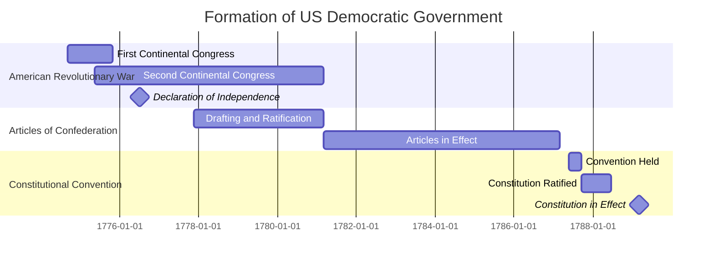

import { Mafs, Coordinates, Plot, Line, Circle, Theme, useMovablePoint, useStopwatch, vec, Vector, LaTeX, Polygon, Transform } from "mafs";

import { useState, useCallback } from "react";
import { lineLabel } from "@site/src/utilities/lines";
import { color } from "@site/src/utilities/colors"
import TOCInline from '@theme/TOCInline';
import * as MB from "mathbox-react"
import * as THREE from "three"
import { OrbitControls } from "three/examples/jsm/controls/OrbitControls"

# Introduction to Democracy

Democracy is a system of government where power is vested in the people, either directly or through elected representatives.
It is characterized by free and fair elections, the protection of individual rights and freedoms, and the rule of law.

## Table of Contents

<TOCInline toc={toc} />

## The Need for Government

As our study of US Politics begins, it is essential to frame the discussion around what politics is about.
Etymologically, "politics" derives from the Greek word "polis," meaning city or city-state.
We are interested in how groups of people organize themselves to make collective decisions, allocate resources, and maintain order.
This leads us to the concept of government, which is the system or group of people governing an organized community, often a state.

But why do we need government in the first place?
Typically, this question is the subject of **the philosophy of politics**, which explores the justification and purpose of government.
A first step one can take is to imagine a world without government, often referred to as the "state of nature."
At first, this may seem appealing, as it suggests complete freedom and autonomy.
One could practice any religion, express any opinion, and pursue any lifestyle without interference.
However, the issue is that *every* individual would have the same freedoms, leading to conflicts of interest.
For example, if one person wants to build a house on a piece of land, but another person wants to use that land for farming, whose right takes precedence?
Without a governing authority to mediate such disputes, individuals may resort to violence or coercion to assert their will.
This can lead to a breakdown of social order, where the strong dominate the weak and chaos ensues.

### The Social Contract

Thomas Hobbes, a 17th-century English philosopher, made many of these arguments in his seminal work *Leviathan* (1651).
Hobbes argued that in the state of nature, the prevailing condition would be "war of every man against every man", and in war, "the two chief virtues are force and fraud."
Moreover, society under war would be devoid of "ownership, legal control, no distinction between *mine* and *thine*."
*Leviathan* was published during the English Civil War, a time of great political turmoil and violence, which likely influenced Hobbes' bleak view of human nature.

To escape this state of nature, Hobbes proposed the idea of a **social contract**.
In *Leviathan*, Hobbes argued that individuals should agree to forego some of their freedom and submit to the authority of a sovereign ruler or government in exchange for protection and order.
For instance, individuals would agree not to harm each other and to respect property rights, while the government would enforce laws and provide security.
This social contract forms the basis of modern political philosophy and underpins the legitimacy of governments in democratic societies.

## The Nature of Government

With the need for government established, we can now explore the different forms that government can take.

Thomas Jefferson, one of the Founding Fathers of the United States, was the principal author of the Declaration of Independence (1776).
He was heavily influenced by the Enlightenment, a philosophical movement that emphasized reason, individualism, and skepticism of authority.
One of the key Enlightenment thinkers who influenced Jefferson was John Locke, an English philosopher who wrote extensively on political theory.

Locke argued that people have **natural rights** to life, liberty, and property, as well as the right to physical harm others, imprison others, or tax others.
The rights to life, liberty, and property are retained, whereas the rights to harm, imprison, or tax others are given up to the government.

A **monarchy** is a form of government where a single individual (the **monarch**) holds supreme authority.
In an **absolute monarchy**, the monarch has unrestricted power and authority over the state and its people.
In contrast, a **constitutional monarchy** limits the monarch's powers through a constitution or legal framework, often sharing power with elected representatives or a parliament.

On the other hand, an **oligarchy** is a form of government where power is concentrated in the hands of a small group of individuals or families.
Monarchy comes from "monos" (single) and "arkhein" (to rule), whereas oligarchy comes from "oligos" (few) and "arkhein" (to rule).

In **popular sovereignty**, the authority of the government is derived from the consent of the governed.
A popular sovereignty is also known as a **democracy**, which comes from the Greek words "demos" (people) and "kratia" (power or rule).
In a democracy, the people have the power to elect their representatives and hold them accountable through regular elections.

The Founding Fathers of the United States were heavily influenced by the ideas of popular sovereignty and democracy.
However, they were also wary of the potential for tyranny of the majority, where the majority could oppress minority groups and strip them of their rights.
As such, a system was established that balanced popular sovereignty with protections for individual rights and freedoms.
This system is written in the US Constitution.

They called this system a **republic**, which is a form of government where the people elect representatives to make decisions on their behalf.
Instead of direct democracy, where citizens vote on every issue, a republic allows for a more efficient and effective decision-making process.
This definition was encapsulated in the Federalist Papers, a series of essays written by Alexander Hamilton, James Madison, and John Jay to promote the ratification of the US Constitution.
In Federalist No. 10, James Madison argued that a large republic would be the best defense against factions, or groups of individuals with shared interests that could potentially oppress others.

### Types of Democracies

In a **participatory democracy**, citizens have direct involvement in decision-making processes.
This can take the form of town hall meetings, referendums, or citizen assemblies.
Participatory democracy emphasizes the importance of civic engagement and active participation in governance.
The advantage of participatory democracy is that it allows for a more direct expression of the will of the people.
It is obviously impractical, however, for large, complex societies where decisions need to be made quickly and efficiently.

Note that a participatory democracy is different from a direct democracy.
In a participatory democracy, citizens do not make decisions on every issue, but rather have a large say in the decision-making process.
Examples of participatory democracy include Switzerland and some local governments in the United States.
Some states in the US, such as California, allow for direct democracy through ballot initiatives and referendums.

In a **pluralist democracy**, power is distributed among multiple interest groups and organizations.
These groups compete for influence and representation in the political process.
Pluralist democracy recognizes the diversity of interests and perspectives within society and seeks to ensure that all voices are heard.
The advantage of pluralist democracy is that it allows for a more inclusive and representative decision-making process, and often leads to many compromises that balance the interests of different groups.
However, it can also lead to gridlock and inefficiency, as competing interests may make it difficult to reach consensus.

Examples of pluralist democracies include the United States and many European countries, where interest groups such as labor unions, business associations, and advocacy organizations play a significant role in shaping policy.

In an **elite democracy**, power is concentrated in the hands of a small group of individuals or elites.
These elites may be wealthy, educated, or hold positions of authority in society.
Elite democracy recognizes that not all citizens have the same level of knowledge or expertise in governance, and seeks to ensure that decisions are made by those who are best equipped to do so.
The advantage of elite democracy is that it can lead to more efficient and effective decision-making, as elites may have the knowledge and experience needed to govern.
However, it can also lead to a lack of representation and accountability, as elites may prioritize their own interests over those of the broader population.
This means that it is not truly democratic and leans towards oligarchy.

Examples of elite democracies include some parliamentary systems, where political parties and their leaders hold significant power in the decision-making process.
The Electoral College in the United States can also be seen as an example of elite democracy, as it gives disproportionate influence to certain states and their electors.
In fact, much criticism of the Electoral College stems from the fact that it undermines the principle of popular sovereignty.

## Formation of a Democratic Government

Now that we have established the need for government and the nature of democratic government, we can explore how the US democratic government was formed.

The first American colonies were established in the early 17th century by settlers seeking religious freedom, economic opportunities, and political autonomy.
There were thirteen original colonies, each with its own unique characteristics and governance structures.
These included:

1. The New England Colonies (Massachusetts, Connecticut, Rhode Island, New Hampshire) - founded primarily for religious reasons by Puritans and Pilgrims seeking to escape religious persecution in England.
2. The Middle Colonies (New York, New Jersey, Pennsylvania, Delaware) - characterized by religious and cultural diversity, with settlers from various European countries.
3. The Southern Colonies (Maryland, Virginia, North Carolina, South Carolina, Georgia) - established for economic reasons, with a focus on agriculture and plantation economies.

These colonies were largely self-governing, with elected assemblies and governors appointed by the British Crown.
However, tensions between the colonies and the British government began to rise in the mid-18thth century, primarily due to issues of taxation and representation.
The British government imposed a series of taxes on the colonies, such as the Stamp Act (1765) and the Townshend Acts (1767), without providing the colonies with any representation in the British Parliament.
This led to widespread protests and boycotts of British goods, culminating in the Boston Tea Party (1773), where American colonists dumped British tea into Boston Harbor as a protest against taxation without representation.

The American Revolutionary War (1775-1783) ensued.
In 1774, the colonies convened the First Continental Congress to coordinate their response to British policies.
In 1775, the Second Continental Congress was formed, which acted as the de facto government of the colonies during the Revolutionary War.
On July 4, 1776, the Second Continental Congress adopted the Declaration of Independence, which formally declared the colonies' independence from Britain.
The Declaration of Independence outlined the colonies' grievances against the British Crown and articulated the principles of popular sovereignty and individual rights.
Today, July 4th is celebrated as Independence Day in the United States.

The War was still far from over, and it would take several more years of fighting before the colonies secured their independence.
During the war, the first attempt at a national government was made with drafts of the **Articles of Confederation**.
At that time, the 13 colonies were referred to as "states", and the purpose of the Articles was to create a "firm league of friendship" among the states.
This was to ensure mutual defense and cooperation during the war, and eventually to achieve independence from Britain.

We will explore the Articles of Confederation in more detail in a later section.
However, it is important to note that the Articles created a weak central government with limited powers.
The central government had no power to tax, regulate commerce, or enforce laws.
This led to numerous problems, such as the inability to pay war debts, regulate trade between states, and maintain order.
The breaking point came in 1786 with **Shays' Rebellion**, an armed uprising in Massachusetts led by Revolutionary War veteran Daniel Shays.
The rebellion highlighted the weaknesses of the Articles of Confederation and the need for a stronger central government

In 1787, a **Constitutional Convention** was convened in Philadelphia to address the problems of the Articles of Confederation.
It was presided over by a young **George Washington*, who led the Continental Army during the Revolutionary War and would later become the first President of the United States.
The Convention was attended by 55 delegates from 12 states (Rhode Island did not send any delegates).
The delegates were a diverse group, including lawyers, merchants, planters, and politicians.
Notable figures included James Madison, Alexander Hamilton, Benjamin Franklin, and Gouverneur Morris.

Although it originally aimed to revise the Articles of Confederation, the Convention quickly decided to draft an entirely new constitution.
The resulting document, the **United States Constitution**, established a federal system of government with three branches: the legislative, executive, and judicial branches.
It also created a system of checks and balances to prevent any one branch from becoming too powerful.
The Constitution was signed on September 17, 1787, and was ratified by the states in 1788.
It went into effect on March 4, 1789.

### Declaration of Independence (1776)

Let's take a closer look at the Declaration of Independence.
Below is an excerpt from the document that outlines the principles of popular sovereignty and individual rights.

> When in the Course of human events, it becomes necessary for one people to dissolve the political bands which have connected them with another, and to assume among the powers of the earth, the separate and equal station to which the Laws of Nature and of Nature's God entitle them, a decent respect to the opinions of mankind requires that they should declare the causes which impel them to the separation.
>
> We hold these truths to be self-evident, **that all men are created equal, that they are endowed by their Creator with certain unalienable Rights, that among these are Life, Liberty and the pursuit of Happiness.**--That to secure these rights, Governments are instituted among Men, deriving their just powers from the consent of the governed, --That whenever any Form of Government becomes destructive of these ends, it is the Right of the People to alter or to abolish it, and to institute new Government, laying its foundation on such principles and organizing its powers in such form, as to them shall seem most likely to effect their Safety and Happiness. Prudence, indeed, will dictate that Governments long established should not be changed for light and transient causes; and accordingly all experience hath shewn, that mankind are more disposed to suffer, while evils are sufferable, than to right themselves by abolishing the forms to which they are accustomed. But when a long train of abuses and usurpations, pursuing invariably the same Object evinces a design to reduce them under absolute Despotism, it is their right, it is their duty, to throw off such Government, and to provide new Guards for their future security.

One of the most important lines in this excerpt is "that all men are created equal, that they are endowed by their Creator with certain unalienable Rights, that among these are Life, Liberty and the pursuit of Happiness."
This line encapsulates the aforementioned ideas of natural rights and popular sovereignty.
The following sentence, "that to secure these rights, Governments are instituted among Men, deriving their just powers from the consent of the governed," further emphasizes that governments derive their legitimacy from the consent of the people they govern.
This is a reference to the social contract theory proposed by Hobbes and Locke, as well as popular sovereignty.
The rest of the excerpt outlines the right of the people to alter or abolish a government that becomes destructive of their rights.

### US Constitution (1787)

Now, let's examine the US Constitution, which established the framework for the new government.
It consists of a preamble, seven articles, and 27 amendments.

The preamble sets forth the purpose of the Constitution.

> We the People of the United States, in Order to form a more perfect Union, establish Justice, insure domestic Tranquility, provide for the common defence, promote the general Welfare, and secure the Blessings of Liberty to ourselves and our Posterity, do ordain and establish this Constitution for the United States of America.

<figure>
    
    <figcaption>Scene at the Signing of the Constitution of the United States by Howard Chandler Christy (1940)</figcaption>
</figure>

<figure>
    
    <figcaption>United States Constitution, first page</figcaption>
</figure>

The preamble emphasizes that the Constitution is established by "We the People," highlighting the principle of popular sovereignty.
The words are written in large, bold letters to signify their importance.
In an original draft, the preamble began with "We the People of the States of New Hampshire, Massachusetts, Rhode Island, Connecticut, New York, New Jersey, Pennsylvania, Delaware, Maryland, Virginia, North Carolina, South Carolina and Georgia," listing all 13 states.
James Wilson (1746-1798), a delegate from Pennsylvania, suggested shortening it to "We the People of the United States" to emphasize that the Constitution was established by the people as a whole, rather than by the individual states.
This was a significant shift from previous ideas, such as the Articles of Confederation or the government of the British Empire, where power was derived from the states or the monarch.
Now, the people were the ultimate source of authority.
This is why the executive branch can deem laws unconstitutional; the constitution, which represents the will of the people, holds more authority than any law passed by Congress.

We can see that *We, the People* are establishing the Constitution to "form a more perfect Union, establish Justice, insure domestic Tranquility, provide for the common defence, promote the general Welfare, and secure the Blessings of Liberty to ourselves and our Posterity."
These goals reflect the social contract theory.
Let's break them down one by one:

1. **Form a more perfect Union**: This refers to the need for a stronger central government that can effectively govern the states and maintain order.
    Essentially, it means to improve upon the weaknesses of the Articles of Confederation.
    It needed to be strong enough to achieve common goals, yet not so strong as to infringe upon the rights of the states or the people.

    Also note that historically, the term "perfect" did not mean flawless or ideal, but rather complete or whole.
2. **Establish Justice**: This refers to the need for a fair and impartial legal system that protects the rights of individuals and ensures that laws are applied equally to all citizens.
    It does not mean that judges have the power to create justice as they see fit; in 1905, *Jacobson v. Massachusetts* rejected the idea that the constitution granted judges independent powers.
    This line instead establisheds the purpose of the judicial branch, and the body of the constitution is what defines justice.
3. **Insure domestic Tranquility, provide for the common defence**: This refers to the need for a government that can maintain law and order within the country and protect against external threats.
    A government must be able to maintain law and order and prevent civil unrest, such as with Shays' Rebellion.
    However, they must not wield power such that they could form a standing army and oppress the people.
    This was a major concern for the Founding Fathers, who had just fought a war against a tyrannical government (the British Crown).
    The Second Amendment was later added to the Constitution to ensure that the people had the means to defend themselves against a potentially oppressive government.

    In terms of common defence, the government must be able to protect the country from external threats, such as foreign invasions or attacks.
    Under Articles I and II of the Constitution, Congress and the President have the powers to raise and maintain armed forces for this purpose.
4. **Promote the general Welfare**: This refers to the need for a government that can promote the well-being of its citizens through policies and programs that address social and economic issues.
    The Supreme Court ruled that this was not a blank check for Congress to do anything they want; in *United States v. Butler* (1936), the Court held that Congress could only promote the general welfare through its enumerated powers.

5. **Secure the Blessings of Liberty to ourselves and our Posterity**: This refers to the need for a government that can protect the individual rights and freedoms of its citizens, both now and in the future.
    The Constitution includes a Bill of Rights, which outlines the fundamental rights and freedoms of individuals, such as freedom of speech, religion, and the press.
    These rights are protected from government infringement, ensuring that future generations can also enjoy these blessings of liberty.

### Federalist No. 10 (1787)

In order for the US Constitution to take effect, it needed to be **ratified** (approved) by at least nine of the thirteen states.
This was a contentious process, as many states were wary of giving too much power to the central government.
To promote the ratification of the Constitution, Alexander Hamilton, James Madison, and John Jay wrote a series of essays known as the **Federalist Papers**.
These essays outlined the principles of the Constitution and argued for its ratification.
One of the most famous essays is **Federalist No. 10**, written by James Madison.

