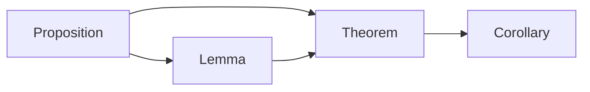

# Logic and Proofs Quickstart

The first important concept in abstract algebra is how logic and proofs work.
In a logical system, we make logical arguments:

1. Start with axioms - these are the basic assumptions that we take to be true.
2. Use logical reasoning to derive theorems - these are the conclusions that we can draw from the axioms.

This is known as an axiomatic approach to logic. Axioms are the starting point, and theorems are the conclusions.
Note that:

1. Axioms must not contradict each other. Since they are all true, they must all be true at the same time, hence they must be consistent.
2. Axioms must be independent. If one axiom can be derived from the others, then it is not an axiom, but a theorem.
3. A logical system cannot have too many axioms. If there are too many axioms, then the system becomes too complex and restrictive.

## Rigor, Deduction, and Induction

We need to understand the difference between deductive and inductive reasoning.

- For deductive reasoning, if the premises are true, then the conclusion must be necessarily true. For example:

    1. All cats are mammals.
    2. Fluffy is a cat.
    3. Therefore, Fluffy is a mammal.

  Note that the premises do not have to be true for the argument to be deductively valid. For example:

    1. All cats are amphibians.
    2. Fluffy is a cat.
    3. Therefore, Fluffy is an amphibian.

  While premise 1 is false, the argument is still deductively valid.
- For inductive reasoning, the premises are true, and the conclusion is _likely_ to be true. For example:

    1. All cats we have seen are mammals.
    2. Therefore, all cats are mammals.

  Inductive reasoning is not as strong as deductive reasoning, but it is still useful in many contexts.

Generally, in science, we use inductive reasoning to make generalizations from specific observations.
However, in mathematics, we use deductive reasoning to prove theorems from axioms.

The deductive nature of mathematics is what gives it its rigor.
It is a precise and structured way of reasoning that allows us to draw conclusions with certainty.

## Statements

A statement is a sentence that is either true or false, but not both (law of excluded middle).

For example:

- $2 + 2 = 4$ is a statement.
- $2 + 2 = 5$ is a statement.
- $4 + 2$ is not a statement, because it is not clear what the statement is saying.
- $\forall a, b \in \mathbb{Z}, a + b \in \mathbb{Z}$ is a statement (don't worry about those weird symbols for now).

A mathematical proof aims to convince the reader about the truthfulness of a statement.

### Types of Statements

We assign different statements to different types:

1. A proposition - when we can prove that the statement is true.
2. A theorem - when the proposition is important.
3. A lemma - when the proposition is a stepping stone to a theorem.
4. A corollary - when the proposition is a direct consequence of a theorem.

Generally, the process is:

## Important Things to Remember

There are some rules that we must follow when proving theorems:

1. Theorems cannot be proven by examples, since that is inductive reasoning. However, they can be disproven by counterexamples.
2. Theorems must not assume any unstated premises. They must be self-contained.
3. Theorems must be precise and unambiguous. They must not be open to interpretation.

Additionally, there are some tips for writing proofs:

1. If it is too difficult to prove a theorem directly, try proving its contrapositive.
    For example, if you aren't able to prove that all cats are mammals, try proving that all non-mammals are non-cats.
2. To prove that something _exists_ and is _unique_, first prove that it _exists_, then prove that it is _unique_ by assuming two objects $a$ and $b$ that satisfy the conditions, and show that $a = b$.
