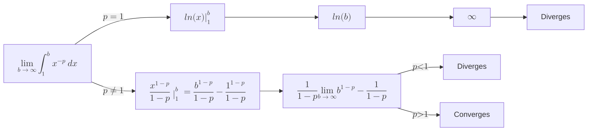

import { Mafs, Coordinates, Point, Plot, Line, Circle, Theme, useMovablePoint, useStopwatch, vec, Vector, LaTeX, Polygon, Transform } from "mafs";
import MathEquation from "@site/src/components/Math";
import { lineLabel } from "@site/src/utilities/lines";
import { color } from "@site/src/utilities/colors"
import { useState } from "react";
import range from "lodash/range";
import { gamma } from "mathjs";
import { FTOCProof1 } from "./Integration.mdx";
import TOCInline from '@theme/TOCInline';

# Infinite Series: Part 1

Infinite series are essentially sums of an infinite number of terms.
There's a lot of interesting properties and theorems that come out of them.

Although some courses cover infinite series before calculus, analysis of infinite series heavily involves calculus.
Therefore, trying to understand infinite series without a solid understanding of calculus makes it difficult to grasp the full picture.

## Table of Contents

<TOCInline toc={toc} />

## The Domain for Infinite Series

When learning about infinite series, it's usually taught many times throughout different years, at different depths.

1. Algebra/Precalculus class - Typically, arithmetic and geometric series are introduced here, along with the formula for the sum of a finite geometric series.
    The concept of an infinite geometric series and its sum (when it converges) may also be covered.
2. Calculus class - Calculus classes delve deeper into series, focusing on tests for convergence (e.g. ratio test, comparison test) and divergence. Power series, Taylor series, and their applications are also major topics.
    The concept of a limit is used to define convergence, but rigorous proofs are usually not the focus.
3. Real Analysis class - Real analysis is where the rigorous foundations of infinite series are established.
    Topics like the Cauchy sequences, metric spaces, the types of convergence (i.e. absolute/conditional convergence, pointwise/uniform) are explored in depth.
    Proofs of theorems from calculus (e.g., convergence tests) are provided, along with a more theoretical understanding of infinite series.

## Philosophy of Infinite Series

There's actually a lot of philosophy behind infinite series.

Firstly, most philosophers agree that an actual infinite cannot exist in the physical world.
This is because it leads to paradoxes, such as Hilbert's Hotel.

Therefore, we treat them instead as _potential_ infinites.
This means that we can keep adding terms to the series, but we never actually "reach" the infinite.

Hold your hands out in front of you.

Now, move them halfway together.
Then, move them halfway again.

You can keep doing this forever, but you'll never actually touch your hands together.
There i0't an infinite number of points between your hands, but you can keep dividing the distance in half.

This also means that when we say "the sum of the series **equals** $1$", we're not saying that the sum _is_ $1$, but that it _approaches_ $1$ as the number of terms approaches infinity.
Perhaps this is a bit pedantic, but it's an important distinction.
It is also probably one of the main reasons for the debate of whether or not $0.999\dots = 1$.

Another example of this distinction is the sum of the series $1 - 1/3 + 1/5 - 1/7 + \cdots$.

Before revealing the sum, consider the following:

> The sum of rational numbers cannot be irrational.

That's just common knowledge, right? You can even construct a simple proof for it:

1. Let $a$ and $b$ be rational numbers. Then, $a = p/q$ and $b = r/s$, where $p, q, r, s \in \mathbb{Z}$.
2. The sum of $a$ and $b$ is $a + b = (ps + rq) / (qs)$.
3. Since both the numerator and denominator are integers, the sum of rational numbers is rational; $a + b \in \mathbb{Q}$.

But the sum of the series above evaluates to $\pi/4$, which is irrational.
Using conventional thinking, this is impossible.

This is why infinite series are so interesting. They challenge our understanding of mathematics and force us to think in new ways.
However, this entire discussion is more suited to be in a real analysis course, rather than a calculus course.

## Convergence and Divergence

The most important concept in infinite series is that of convergence and divergence.

A series is said to converge if the sequence of partial sums converges to a finite limit.
In other words, if the sum of the series approaches a finite number as the number of terms approaches infinity, then the series converges.

A series is said to diverge if the sequence of partial sums does not converge to a finite limit.

### Important Distinction: Series vs. Sequences

It's important to distinguish between series and sequences.

A **sequence** is an ordered list of numbers.

A **series** is the _sum_ of the terms of a sequence.

| Sequence | Series |
|----------|--------|
| $1, 2, 3, 4, 5$ | $1 + 2 + 3 + 4 + 5$ |
| $1, 1/2, 1/3, 1/4, 1/5$ | $1 + 1/2 + 1/3 + 1/4 + 1/5$ |
| $1, 2, 4, 8, 16, \dots$ | $1 + 2 + 4 + 8 + 16 + \dots$ |

### Example Problem: Convergence of a Set

> Consider the set of numbers:
>
> $$
> \begin{equation}
> \qty{1, -\frac{1}{2}, \frac{1}{3}, -\frac{1}{4}, \frac{1}{5}, -\frac{1}{6}, \dots}
> \end{equation}
> $$
>
> What does this set converge to?

Let's first visualize this by plotting the terms of the series:

<Mafs
    viewBox={{
        x: [1, 10],
        y: [-1, 1]
    }}
>
    <Coordinates.Cartesian />
    {range(1, 20).map((n) => (
        <Point x={n} y={n % 2 === 0 ? -1 / n : 1 / n} key={n} />
    ))}
</Mafs>

Just visually, it seems like the series is converging to $0$.

We can also show this through algebra.
When considering series, we often use the concept of the limit of a sequence towards infinity.

So first, we need to decide on an expression for the $n$-th term.
We have the fraction $1/n$ when $n$ is odd, and $-1/n$ when $n$ is even.
To add the sign, we can use $(-1)^n$.

Therefore, the $n$-th term is:

$$
\begin{equation}
a_n = \frac{(-1)^n}{n}
\end{equation}
$$

Meaning, the set can be expressed as:

$$
\begin{equation}
\qty{a_n}_{n=1}^{\infty}, \quad a_n = \frac{(-1)^n}{n}
\end{equation}
$$

Now, we can find the limit of the sequence as $n$ approaches infinity:

$$
\begin{equation}
\lim_{n \to \infty} \frac{(-1)^n}{n} = 0
\end{equation}
$$

### Example Problem: Convergence of Different Sequences (Informally)

> Evaluate the convergence of the following sequences:
>
> 1. $\displaystyle a_n = \frac{(n + 8)(n + 1)}{n(n - 10)}$
> 2. $\displaystyle b_n = \frac{e^n + 1}{e \cdot n + 1}$
> 3. $\displaystyle c_n = \frac{n^2 + 1}{n + 1000}$
> 4. $\displaystyle d_n = (-1)^n$
>
> [(Source)](https://www.khanacademy.org/math/ap-calculus-bc/bc-series-new/bc-10-1/v/identifying-sequence-convergence-divergence)

We can evaluate the convergence of these sequences by finding the limit of the sequence as $n$ approaches infinity.

1. $\displaystyle a_n = \frac{(n + 8)(n + 1)}{n(n - 10)}$

    We can find the limit of this sequence by considering the degree of the numerator and denominator:

    $$
    \begin{equation}
    \lim_{n \to \infty} \frac{(n + 8)(n + 1)}{n(n - 10)} = \lim_{n \to \infty} \frac{n^2 + 9n + 8}{n^2 - 10n}
    \end{equation}
    $$

    Since both the numerator and denominator have the same degree, then the limit is the ratio of the leading coefficients, which is $1$.
    Therefore, the sequence convergences.

2. $\displaystyle b_n = \frac{e^n + 1}{e \cdot n + 1}$

    Notice that the numerator has a $e^n$ term, which grows much faster than the $e \cdot n$ term in the denominator.
    Therefore, the limit of the sequence is $\infty$, and the sequence diverges.

3. $\displaystyle c_n = \frac{n^2 + 1}{n + 1000}$

    Since the numerator has a higher degree ($n^2$) than the denominator ($n$), the limit of the sequence is $\infty$, and the sequence diverges.

4. $\displaystyle d_n = (-1)^n$

    This one is interesting.
    As $n$ increases, the sequence alternates between $1$ and $-1$.
    Although it's not unbounded, it doe0't converge to a single value.
    Therefore, the sequence diverges.

## Partial Sums

Recall that the $n$th partial sum of a series is the sum of the first $n$ terms of the series.

Let $S$ be an infinite series:

$$
\begin{equation}
S = \sum_{n=1}^{\infty} a_n = a_1 + a_2 + a_3 + \cdots
\end{equation}
$$

The $n$th partial sum of $S$ is denoted by $S_n$ and is given by:

$$
\begin{equation}
S_n = \sum_{i=1}^{n} a_i = a_1 + a_2 + \cdots + a_n
\end{equation}
$$

### Example Problem: Evaluating Partial Sums

> The series $S$ is given by:
>
> $$
> \begin{equation}
> S = \sum_{n=1}^{\infty} \frac{1}{n(n + 1)}
> \end{equation}
> $$
>
> 1. Evaluate $S_{100}$.
> 2. Find a general formula for $S_n$.

The $n$th term of the series is given by:

$$
\begin{equation}
a_n = \frac{1}{n(n + 1)}
\end{equation}
$$

1. Of course we won't manually sum the first $100$ terms, so we'll manipulate the series a bit to hopefully find a pattern.

    We can use partial fractions to split the series into two:

    $$
    \begin{align}
    \frac{1}{n(n + 1)} &= \frac{A}{n} + \frac{B}{n + 1} \\
    1 &= A(n + 1) + Bn
    \end{align}
    $$

    Let $n = 0$:

    $$
    \begin{align}
    1 &= A(1) + B(0) \\
    A &= 1
    \end{align}
    $$

    Let $n = -1$:

    $$
    \begin{align}
    1 &= A(0) + B(-1) \\
    B &= -1
    \end{align}
    $$

    Therefore, the series can be expressed as:

    $$
    \begin{equation}
    \frac{1}{n(n + 1)} = \frac{1}{n} - \frac{1}{n + 1}
    \end{equation}
    $$

    Therefore, $S_{100}$ can be expressed as:

    $$
    \begin{align}
    S_{100} &= \sum_{n=1}^{100} \qty(\frac{1}{n} - \frac{1}{n + 1}) \\
    &= \qty(\frac{1}{1} - \frac{1}{2}) + \qty(\frac{1}{2} - \frac{1}{3}) + \cdots + \qty(\frac{1}{100} - \frac{1}{101}) \\
    &= \frac{1}{1} - \cancel{\frac{1}{2} + \frac{1}{2}} - \cancel{\frac{1}{3} + \frac{1}{3}} - \dots - \cancel{\frac{1}{100}} - \frac{1}{101} \\
    &= 1 - \frac{1}{101} \\
    &= \frac{100}{101}
    \end{align}
    $$

2. We can generalize what we did above to find a general formula for $S_n$:

    Using the same cancellation method as above, we can find that:

    $$
    \begin{align}
    S_n &= \sum_{i=1}^{n} \qty(\frac{1}{i} - \frac{1}{i + 1}) \\
    &= \qty(\frac{1}{1} - \frac{1}{2}) + \qty(\frac{1}{2} - \frac{1}{3}) + \cdots + \qty(\frac{1}{n} - \frac{1}{n + 1}) \\
    &= \frac{1}{1} - \cancel{\frac{1}{2} + \frac{1}{2}} - \cancel{\frac{1}{3} + \frac{1}{3}} - \dots - \cancel{\frac{1}{n}} - \frac{1}{n + 1} \\
    &= 1 - \frac{1}{n + 1} \\
    &= \frac{n}{n + 1}
    \end{align}
    $$

### Example Problem: Identifying nth Term From Partial Sums

> The $n$th partial sum of a series is given by:
>
> $$
> \begin{equation}
> S_n = \frac{n - 1}{n}
> \end{equation}
> $$
>
> Find the $n$th term of the series, $a_n$.

The trick to this problem is to notice the relationship between the partial sum and the $n$th term:

$$
\begin{align}
S_n &= a_1 + a_2 + \cdots + a_{n - 1} + a_n \\
- \quad S_{n - 1} &= a_1 + a_2 + \cdots + a_{n - 1} \\
\hline
S_n - S_{n - 1} &= a_n
\end{align}
$$

We can use this relationship to find the $n$th term of the series:

$$
\begin{align}
a_n &= S_{\class{blue}{n}} - S_{\class{yellow}{n - 1}} \\
&= \frac{\class{blue}{n} - 1}{\class{blue}{n}} - \frac{\class{yellow}{n - 1} - 1}{\class{yellow}{n - 1}} \\
&= \frac{(n - 1)^2 - n(n - 2)}{n(n - 1)} \\
&= \frac{\cancel{n^2 - 2n} + 1 - \cancel{n^2 + 2n}}{n(n - 1)} \\
&= \frac{1}{n(n - 1)}
\end{align}
$$

Therefore, the sum of the series is:

$$
\begin{equation}
S = \sum_{n=1}^{\infty} \frac{1}{n(n - 1)}
\end{equation}
$$

## To Infinity and Beyond

We've dealt with partial sums, that is, the sum of the first $n$ terms of a series.
But what happens when we sum an infinite number of terms?

Generally, we can say that the sum of an infinite series is the limit of $S_n$ as $n$ approaches infinity.
If this limit exists and is finite, then the series converges, and diverges otherwise.

### Example Problem: Sum of an Infinite Series

> Find the sum of the series:
>
> $$
> \begin{equation}
> \sum_{n=1}^{\infty} \frac{n^3}{n^2 + 1}
> \end{equation}
> $$

We can find the sum of this series by finding the limit of the sequence as $n$ approaches infinity:

$$
\begin{align}
\lim_{n \to \infty} \frac{n^3}{n^2 + 1} &= \lim_{n \to \infty} \frac{n^3}{n^2} \\
&= \lim_{n \to \infty} n \\
&= \infty
\end{align}
$$

Therefore, the series diverges.

## The Geometric Series

export function VisualGeometricSeries({ q = 0.5, qrLabels = false }) {
    const r = 1 - q;
    const xScale = 5;
    return (
        <Mafs
            viewBox={{
                x: [1, 5],
                y: [-4, 1]
            }}
        >
            <Transform scale={[xScale, 1]}>
                {range(1, 4).map((i) => {
                    const yOff = -1 * i;
                    const xOff = 1 - r ** (i - 1);
                    const rectHeight = 0.5;
                    return (
                        <Transform scale={[r ** (i - 1), 1]} translate={[xOff, yOff]} key={i}>
                            <Polygon
                                points={[
                                    [0, 0],
                                    [q, 0],
                                    [q, -rectHeight],
                                    [0, -rectHeight],
                                ]}
                                color={color("green")}
                            />
                            {qrLabels ?
                                <LaTeX
                                    tex={"q" + (i > 1 ? `r^{${i - 1}}` : "")}
                                    at={[q / 2, -(rectHeight / 2) - 0.4]}
                                />
                                : <LaTeX
                                    tex={String(q ** i)}
                                    at={[q / 2, -(rectHeight / 2) - 0.4]}
                                />
                            }

                            <Polygon
                                points={[
                                    [q, 0],
                                    [1, 0],
                                    [1, -rectHeight],
                                    [q, -rectHeight],
                                ]}
                                color={color("blue")}
                            />
                            {qrLabels && (
                                <LaTeX
                                    tex={`r^${i}`}
                                    at={[q + (1 - q) / 2, -(rectHeight / 2) - 0.4]}
                                />
                            )}
                        </Transform>
                    )
                })}
            </Transform>
        </Mafs>
    )
}

The geometric series is a special type of series where each term is a constant multiple of the previous term.
It's very intuitive to understand.

In fact, what's shown below is my own independent discovery of the geometric series.

Let's start with $1$. We can split this into $1/2 + 1/2$.

We can then split one of the $1/2$s into $1/4 + 1/4$, and so on:

$$
\begin{align}
1 &= \frac{1}{2} + \frac{1}{2} \\
&= \frac{1}{2} + \qty(\frac{1}{4} + \frac{1}{4}) \\
&= \frac{1}{2} + \qty(\frac{1}{4} + \qty(\frac{1}{8} + \frac{1}{8})) \\
&= \frac{1}{2} + \frac{1}{4} + \frac{1}{8} + \frac{1}{16} + \cdots
\end{align}
$$

Therefore, we can write:

$$
\begin{equation}
\sum_{n=0}^{\infty} \qty(\frac{1}{2})^n = 1
\end{equation}
$$

<VisualGeometricSeries q={0.5} qrLabels={false} />

Notice that we can also find the $n$th partial sum of the series by subtracting the blue area from the initial area.
The blue area is always equal to the smallest green area, which is $(1/2)^n$.

$$
\begin{align}
\class{green}{\frac{1}{2} + \frac{1}{4} + \frac{1}{8}} &= 1 - \class{blue}{\frac{1}{8}} \\
\class{green}{\frac{1}{2} + \frac{1}{4}} &= 1 - \class{blue}{\frac{1}{4}} \\
\class{green}{\frac{1}{2} + \frac{1}{4} + \frac{1}{8} + \cdots + \frac{1}{2^n}} &= 1 - \class{blue}{\frac{1}{2^n}}
\end{align}
$$

Let's see if we can think of another example.
Start with $1$ again, but this time split it into $9/10 + 1/10$, and then split the $1/10$ into $9/100 + 1/100$, and so on:

$$
\begin{align}
1 &= \frac{9}{10} + \frac{1}{10} \\
&= \frac{9}{10} + \qty(\frac{9}{100} + \frac{1}{100}) \\
&= \frac{9}{10} + \qty(\frac{9}{100} + \qty(\frac{9}{1000} + \frac{1}{1000})) \\
&= \frac{9}{10} + \frac{9}{100} + \frac{9}{1000} + \frac{9}{10000} + \cdots
\end{align}
$$

Therefore, we can write:

$$
\begin{equation}
\sum_{n=0}^{\infty} \qty(\frac{9}{10})^n = 1
\end{equation}
$$

And in other words,

$$
\begin{equation}
0.999\dots = 1
\end{equation}
$$

We can also find the $n$th partial sum of the series by subtracting the blue area from the initial area:

$$
\begin{equation}
\frac{9}{10} + \frac{9}{100} + \frac{9}{1000} + \cdots + \frac{9}{10^n} = 1 - \frac{1}{10^n}
\end{equation}
$$

We can imagine generalizing this. Instead of exact quantities to split $1$ into, we can use variables.

Let $1 = q + r$, where both are less than 1. Then, we can generalize the geometric series from the previous example:

$$
\begin{align}
1 &= \frac{9}{10} + \frac{1}{10} &&= q + r \\
&= \frac{9}{10} + \frac{9}{100} + \frac{1}{100} &&= q + qr + r^2 \\
&= \frac{9}{10} + \frac{9}{100} + \frac{9}{1000} + \frac{1}{1000} &&= q + qr + qr^2 + r^3 \\
&= \frac{9}{10} + \frac{9}{100} + \frac{9}{1000} + \frac{9}{10000} + \cdots &&= q + qr + qr^2 + qr^3 + \cdots
\end{align}
$$

<VisualGeometricSeries q={0.4} qrLabels={true} />

As such, we can write:

$$
\begin{equation}
\sum_{n=0}^{\infty} q \cdot r^n = 1
\end{equation}
$$

We can extract the $q$ from the series and rewrite it as $1 - r$:

$$
\begin{equation}
(1 - r) \sum_{n=0}^{\infty} r^n = 1
\end{equation}
$$

And after rearranging, we get:

$$
\begin{equation}
\sum_{n=0}^{\infty} r^n = \frac{1}{1 - r}
\end{equation}
$$

This is the general formula. Sometimes you also multiply everything by some $a$ to get:

$$
\begin{equation}
\sum_{n=0}^{\infty} ar^n = \frac{a}{1 - r} \label{eq:the_geometric_series-formula-incomplete}
\end{equation}
$$

One reason it's called a "geometric" series is that there's many clever geometric visualizations of different geometric series.

We need to keep in mind some of the conditions for this formula to hold.

Let's consider the geometric series when $r = 1$:

$$
\begin{equation}
\sum_{n=0}^{\infty} 1^n = \frac{1}{1 - 1} = \frac{1}{0}
\end{equation}
$$

This is undefined, so the formula does not hold. Then, let's consider when $r = 1.1$:

$$
\begin{equation}
\sum_{n=0}^{\infty} 1.1^n = \frac{1}{1 - 1.1} = \frac{1}{-0.1}
\end{equation}
$$

This does not make sense either, since according to the formula, the sum of the series is $-10$.

Therefore, the formula only holds when $-1 < r < 1$, or $\abs{r} < 1$. So, the complete formula is:

$$
\begin{equation}
\sum_{n=0}^{\infty} ar^n = \frac{a}{1 - r}, \quad \abs{r} < 1 \label{eq:the_geometric_series-formula}
\end{equation}
$$

To find the $n$th partial sum of a geometric series, we can use the geometric visualization above, like we did for the $1/2$ and $9/10$ series:

$$
\begin{equation}
\sum_{n=0}^{N - 1} qr^n = q + qr + qr^2 + \cdots + qr^{N - 1} = 1 - \class{blue}{r^N}
\end{equation}
$$

Using some algebra:

$$
\begin{equation}
\begin{split}
(1 - r) \sum_{n=0}^{N - 1} r^n &= 1 - r^N \\
\sum_{n=0}^{N - 1} r^n &= \frac{1 - r^N}{1 - r} \\
\sum_{n=0}^{N - 1} ar^n &= a\frac{1 - r^N}{1 - r} = S_N
\end{split} \label{eq:the_geometric_series-partial_sum}
\end{equation}
$$

### Another Way to Derive it

There are other ways to derive the formula for the sum of a geometric series.

In elementary school, this is secretly taught when learning about recurring decimals.
The gist of it is that when you have a recurring decimal, you can write it as a fraction by doing some clever algebra.

For example, consider the recurring decimal $x = 0.343434\cdots = 0.\overline{34}$.

Since it has two recurring digits, we can multiply it by $100$ to get $100x = 34.343434\cdots$.

Then subtract and witness a miracle:

$$
\begin{equation}
\begin{split}
100x &= 34.\cancel{343434\cdots} \\
- \quad x &= \phantom{3} 0.\cancel{343434\cdots} \\
\hline
99x &= 34
\end{split}
\end{equation}
$$

Therefore, $x = 34/99$.

The derivation for the geometric series is simply a generalization of this method.

Consider the geometric series $S = ar^0 + ar + ar^2 + ar^3 + \cdots$.

Multiply $S$ by $r$:

$$
\begin{equation}
\begin{split}
S &= ar^0 + \cancel{ar^1 + ar^2 + ar^3 + \cdots} \\
rS &= \phantom{ar^0 +{} } \cancel{ar^1 + ar^2 + ar^3 + \cdots} \\
\hline
S - rS &= ar^0 = a
\end{split}
\end{equation}
$$

Then, perform some algebra:

$$
\begin{equation}
S(1 - r) = a \implies S = \frac{a}{1 - r}
\end{equation}
$$

Alining with the formula in Equation $\eqref{eq:the_geometric_series-formula}$.

Similarly we can derive the formula for the $n$th partial sum of a geometric series:

$$
\begin{equation}
\begin{split}
S_N &= a + ar + ar^2 + ar^3 + \cdots + ar^{N - 1} \\
rS_N &= \phantom{a +{} } ar + ar^2 + ar^3 + \cdots + ar^{N - 1} + ar^N \\
\hline
S_N - rS_N &= a - ar^N \implies S_N = a \frac{1 - r^N}{1 - r}
\end{split}
\end{equation}
$$

Aligning with the formula in Equation $\eqref{eq:the_geometric_series-partial_sum}$.

### A Rigorous Proof

We can also prove the formula for the infinite sum using limits.

Recall from Equation $\eqref{eq:the_geometric_series-partial_sum}$ that the $n$th partial sum of a geometric series is:

$$
\begin{equation}
S_N = a \frac{1 - r^N}{1 - r}
\end{equation}
$$

We can take the limit of this as $N \to \infty$:

$$
\begin{equation}
\lim_{N \to \infty} S_N = a \lim_{N \to \infty} \frac{1 - r^N}{1 - r}
\end{equation}
$$

If $\abs{r} < 1$, then $r^N$ gets arbitrarily close to $0$ as $N$ approaches infinity. The other terms are constant, so:

$$
\begin{equation}
\lim_{N \to \infty} S_N = a \frac{1}{1 - r} = \frac{a}{1 - r}
\end{equation}
$$

### Example Problem: Convergence of a Geometric Series

> Determine whether these two series converges or diverges:
>
> 1. $8 + 8/3 + 8/9 + 8/27 + \cdots$
> 2. $-0.5 + 1.5 - 4.5 + 13.5 - 40.5 + \cdots$
>
> [(Source)](https://www.khanacademy.org/math/ap-calculus-bc/bc-series-new/bc-10-2/v/evaluating-infinite-geometric-series)

When we see a series with a common ratio, we should find this ratio and apply the formula for the sum of a geometric series.

1. The first series has a common ratio of $r = 1/3$;

    $$
    \begin{equation}
    8 \xRightarrow{1/3} 8/3 \xRightarrow{1/3} 8/9 \xRightarrow{1/3} 8/27 \xRightarrow{1/3} \cdots
    \end{equation}
    $$

    Hence the series can be expressed as:

    $$
    \begin{equation}
    8 + 8/3 + 8/9 + 8/27 + \cdots = \sum_{n=0}^{\infty} 8 \qty(\frac{1}{3})^n
    \end{equation}
    $$

    This can be evaluated using the formula for the sum of a geometric series derived in Equation $\eqref{eq:the_geometric_series-formula}$:

    $$
    \begin{equation}
    \sum_{n=0}^{\infty} 8 \qty(\frac{1}{3})^n = \frac{8}{1 - 1/3} = \frac{8}{2/3} = 12
    \end{equation}
    $$

    The series converges to $12$.

2. The second series has a common ratio of $r = -3$;

    $$
    \begin{equation}
    -0.5 \xRightarrow{-3} 1.5 \xRightarrow{-3} -4.5 \xRightarrow{-3} 13.5 \xRightarrow{-3} \cdots
    \end{equation}
    $$

    Recall that the formula for the sum of a geometric series in Equation $\eqref{eq:the_geometric_series-formula}$ only holds when $\abs{r} < 1$.
    In this case, $\abs{r} = \abs{-3} = 3 > 1$, so the series diverges.

## Testing for Divergence: The nth Term Test

The $n$th term test is a simple and intuitive test for divergence.
Although it does not tell us whether a series converges, it can definitely  tell us if a series diverges.

It's actually really simple - all it says, in essence, is that given a series, if the terms don't get smaller and approach $0$, then the series diverges.

In mathematical terms:

$$
\begin{equation}
\text{If } \lim_{n \to \infty} a_n \neq 0, \text{ then the series } \sum_{n=1}^{\infty} a_n \text{ diverges}
\end{equation}
$$

This should make intuitive sense. If the terms don't get smaller and approach $0$, then the sum of the series will keep getting larger and larger, and thus approach infinity.

### Example Problem: Testing for Divergence

> Determine whether this series diverges using the $n$th term test:
>
> $$
> \begin{equation}
> \sum_{n=1}^{\infty} \frac{n^2 + 1}{n^3 + 1}
> \end{equation}
> $$

The $n$th term of the series is:

$$
\begin{equation}
a_n = \frac{n^2 + 1}{n^3 + 1}
\end{equation}
$$

We can find the limit of this sequence as $n$ approaches infinity:

$$
\begin{equation}
\lim_{n \to \infty} \frac{n^2 + 1}{n^3 + 1} = \lim_{n \to \infty} \frac{1/n + 1/n^2}{1 + 1/n^3} = 0
\end{equation}
$$

It's very important to note that the $n$th term test only tells us if a series diverges.
Since the limit of the sequence is $0$, we can't conclude that the series converges.

## Testing for Convergence: The Integral Test

The integral test is a powerful tool for determining the convergence of a series.

Recall that an integral can be evaluated by looking at a sum of rectangles.
Now the integral sort of "pays back" by helping us analyze sums.

Consider the following series:

$$
\begin{equation}
\sum_{n=1}^{\infty} \frac{1}{n^2} = 1 + \frac{1}{4} + \frac{1}{9} + \frac{1}{16} + \cdots
\end{equation}
$$

First, let's ensure this series doesn't pass the $n$th term test:

$$
\begin{equation}
\lim_{n \to \infty} \frac{1}{n^2} = 0
\end{equation}
$$

Therefore, the $n$th term test is inconclusive and the series still has a chance of converging.

Consider taking the $n$th term of the series and creating a function $f(x)$:

$$
\begin{equation}
f(x) = \frac{1}{x^2}
\end{equation}
$$

The key here is that the series can be thought of as an underestimation of the integral of $f(x)$.
This is best visualized through a graph:

export function TestingForConvergenceTheIntegralTest({ f = ((x) => 1 / x ** 2), /** @type {"right" | "left"} */ type = "right" }) {
    return (
        <Mafs
            viewBox={{
                x: [0, 8],
                y: [0, 1]
            }}
        >
            <Coordinates.Cartesian />
            {range(1, 10).map((x) => {
                const y = type === "right" ? f(x) : f(x - 1);
                const polyColor = type === "right" && x === 1 ? color("blue") : undefined;
                return (
                    <>
                        <Polygon
                            points={[
                                [x - 1, 0],
                                [x - 1, y],
                                [x, y],
                                [x, 0],
                            ]}
                            color={polyColor}
                            key={x}
                        />
                        <LaTeX
                            tex={`a_${x}`}
                            at={[x - 0.5, -0.3]}
                        />
                    </>);
            })}
            <Plot.OfX y={f} />
            <Plot.Inequality y={{"<=": (x) => x < 1 ? 0 : f(x), ">=": (x) => 0}} color={color("yellow")} />
        </Mafs>
    );
}

<TestingForConvergenceTheIntegralTest />

Consider the first term of the series, $1$.
It can be thought of as the area of the first rectangle with a width of $1$ and a height of $1$.

Then, the second term, $1/4$, can be thought of as the area of the second rectangle with a width of $1$ and a height of $1/4$.

Notice how each rectangle has an area less than the area under the curve of $f(x)$.

We can then say that the series (excluding the $1$ rectangle) is an underestimation of the integral of $f(x)$ from $1$ to $\infty$.
To account for the $1$ rectangle, simply add $1$ to the integral.

$$
\begin{equation}
\sum_{n=1}^{\infty} \frac{1}{n^2} \leq \class{blue}{1} + \class{yellow}{\int_{1}^{\infty} \frac{1}{x^2} \, \dd{x}}
\end{equation}
$$

And as such, if the integral is finite, then the series converges. We can evaluate the integral:

$$
\begin{equation}
\int_{1}^{\infty} \frac{1}{x^2} \, \dd{x} = \eval{\frac{-1}{x}}_{1}^{\infty} = \lim_{b \to \infty} \qty(\frac{-1}{b} - \frac{-1}{1}) = 1
\end{equation}
$$

Hence:

$$
\begin{equation}
\sum_{n=1}^{\infty} \frac{1}{n^2} \leq 1 + 1 = 2
\end{equation}
$$

Therefore, the series converges.

Let's note down our assumptions:

- We assume that $f(x)$ is continuous.
- We assume that $f(x)$ is positive - this is important because we're dealing with areas.
- We assume that $f(x)$ is decreasing - recall that we stated that the rectangles are underestimations of the integral. This is only true if $f(x)$ is decreasing.

Therefore we can formalize the integral test:

If $f(x)$ is continuous, positive, and decreasing for $[k, \infty)$, then:

1. If $\displaystyle \int_{k}^{\infty} f(x) \, \dd{x}$ is finite, then $\displaystyle \sum_{n=k}^{\infty} f(n)$ converges.
2. If $\displaystyle \int_{k}^{\infty} f(x) \, \dd{x}$ is infinite, then $\displaystyle \sum_{n=k}^{\infty} f(n)$ diverges.

Note that in our example we used a right Riemann sum, but the same logic applies to left Riemann sums.
This will be important when we prove the convergence of the p-series.

## The Harmonic Series and p-Series

The Harmonic Series is a very interesting series that has puzzled mathematicians for centuries.

It's defined as:

$$
\begin{equation}
H = 1 + \frac{1}{2} + \frac{1}{3} + \frac{1}{4} + \cdots = \sum_{n=1}^{\infty} \frac{1}{n}
\end{equation}
$$

Why is it called the Harmonic Series?

This series has a connection to musical frequencies.

When a note is played, it produces a sound wave with a certain frequency. For example, A4 is usually tuned to be at $440$ Hz.
However, when we play a note, it doesn't just produce a single frequency, but a combination of frequencies.
There's still the "main" frequency, but there are also other frequencies called harmonics, which "reinforces" the note.

The harmonics have wavelengths that follow this series.

For instance, the first overtone has $1/2$ the wavelength, then $1/3$, and $1/4$, and so on.

We can also extend this by raising all terms to a power of $2$:

$$
\begin{equation}
\sum_{n=1}^{\infty} \frac{1}{n^2} = \frac{1}{1^2} + \frac{1}{2^2} + \frac{1}{3^2} + \frac{1}{4^2} + \cdots
\end{equation}
$$

And to the power of $3$:

$$
\begin{equation}
\sum_{n=1}^{\infty} \frac{1}{n^3} = \frac{1}{1^3} + \frac{1}{2^3} + \frac{1}{3^3} + \frac{1}{4^3} + \cdots
\end{equation}
$$

The generalization of this is called the p-series:

$$
\begin{equation}
\sum_{n=1}^{\infty} \frac{1}{n^\class{green}{p}} = \frac{1}{1^\class{green}{p}} + \frac{1}{2^\class{green}{p}} + \frac{1}{3^\class{green}{p}} + \frac{1}{4^\class{green}{p}} + \cdots
\end{equation}
$$

The p-series considers $p > 0$, as it would obviously diverge otherwise.

When $p$ is higher, the terms get way smaller - if $p > 1$, the series converges, and otherwise for $p \leq 1$.
This means that the Harmonic Series actually diverges, even though the terms approach 0.

### Proof of the Convergence of the p-Series

We shall use the integral test to prove the convergence of the p-series.

Recall that the p-series is defined, for $p > 0$ as:

$$
\begin{equation}
\sum_{n=1}^{\infty} \frac{1}{n^p} = \frac{1}{1^p} + \frac{1}{2^p} + \frac{1}{3^p} + \frac{1}{4^p} + \cdots
\end{equation}
$$

Consider the curve of $f(x) = 1/x^p$. This curve is continuous, positive, and decreasing for $[1, \infty)$, so it fits our criteria.
Next, consider both the left and right Riemann sums of the integral of $f(x)$:

{(() => {
    const [type, setType] = useState("right");
    return (
        

            

                <TestingForConvergenceTheIntegralTest f={(x) => 1 / x ** 2} type={type} />
            

            

                

                    <button className={`col col--6 button button--primary ${type === "left" ? "button--outline" : ""}`} onClick={() => setType("right")}>Right Riemann Sum</button>
                    <button className={`col col--6 button button--primary ${type === "right" ? "button--outline" : ""}`} onClick={() => setType("left")}>Left Riemann Sum</button>
                

            

        

    )
})()}

Notice how the left Riemann sum is an **overestimation** of the integral, while the right Riemann sum (excluding the first term) is an **underestimation** of the integral.

Therefore we can say:

$$
\begin{equation}
0 < \mathrlap{\overbrace{\phantom{\int_{1}^{\infty} \frac{1}{x^p} \, \dd{x} < \sum_{n=1}^{\infty} \frac{1}{n^p}}}^{\text{Left Riemann Sum}}} \int_{1}^{\infty} \frac{1}{x^p} \, \dd{x} < \underbrace{\sum_{n=1}^{\infty} \frac{1}{n^p} < \class{blue}{1} + \int_{1}^{\infty} \frac{1}{x^p} \, \dd{x}}_{\text{Right Riemann Sum}}
\end{equation}
$$

Now we can use this to determine the convergence of the p-series:

1. The Left Riemann Sum part - the integral is an overestimation of the series, so if the integral is finite, then the series converges.
2. The Right Riemann Sum part - the series is an underestimation of the integral, so if the integral is infinite, then the series diverges.

Let's first rewrite the integral as a limit:

$$
\begin{equation}
\int_{1}^{\infty} \frac{1}{x^p} \, \dd{x} = \lim_{b \to \infty} \int_{1}^{b} x^{-p} \, \dd{x}
\end{equation}
$$

If $p = 1$, then the integral is:

$$
\begin{equation}
\int_{1}^{\infty} \frac{1}{x} \, \dd{x} = \lim_{b \to \infty} \eval{\ln(x)}_{1}^{b} = \lim_{b \to \infty} \ln(b) = \infty
\end{equation}
$$

So it diverges. Since the Harmonic Series is a p-series with $p = 1$, the Harmonic Series also diverges.

Next, let's consider when $p \neq 1$:

$$
\begin{equation}
\begin{split}
\int_{1}^{\infty} \frac{1}{x^p} \, \dd{x} = \lim_{b \to \infty} \eval{\frac{x^{1 - p}}{1 - p}}_{1}^{b} &= \lim_{b \to \infty} \frac{b^{1 - p}}{1 - p} - \frac{1^{1 - p}}{1 - p} \\
&= \frac{1}{1 - p} \lim_{b \to \infty} b^{1 - p} - \frac{1}{1 - p}
\end{split}
\end{equation}
$$

To calculate the limit, consider different cases:

- If $1 - p > 0$, then $b^{1 - p}$ gets arbitrarily large as $b$ approaches infinity, so the limit is infinite. The condition can be rewritten as $p < 1$.
- If $1 - p < 0$, then $b^{1 - p}$ gets arbitrarily close to $0$ as $b$ approaches infinity, so the limit is finite. This can be rewritten as $p > 1$.

A flowchart can be created to summarize the convergence of the integral:

Recall how the integral relates to the series:

1. If the integral is finite, then the series converges.
2. If the integral is infinite, then the series diverges.

As such, the same logic applies to the p-series:

1. If $p > 1$, then the series converges.
2. If $p \leq 1$, then the series diverges.

And we're done.

## The Comparison Test

Sometimes it is not immediately clear whether a series converges or diverges.
For instance, given a Harmonic Series, it's not immediately clear whether it converges or diverges without the p-series test.

The way it goes is, if there's a series where all terms are less than the terms of the Harmonic Series, and that series diverges, then the Harmonic Series also diverges.

Let $H$ be the Harmonic Series:

$$
\begin{equation}
H = 1 + \frac{1}{2} + \frac{1}{3} + \frac{1}{4} + \cdots
\end{equation}
$$

Let $H'$ be another series. In this series, each term is replaced with the nearest power of $1/2$ (that is smaller than the term):

$$
\begin{equation}
\begin{split}
H &= 1 + \frac{1}{2} + \frac{1}{3} + \frac{1}{4} + \frac{1}{5} + \frac{1}{6} + \frac{1}{7} + \frac{1}{8} + \cdots \\
H' &= 1 + \frac{1}{2} + \frac{1}{4} + \frac{1}{4} + \frac{1}{8} + \frac{1}{8} + \frac{1}{8} + \frac{1}{8} + \cdots
\end{split}
\end{equation}
$$

The terms of $H'$ are all less than the terms of $H$. Next, consider adding parts of $H'$:

$$
\begin{equation}
\begin{split}
H' &= 1 + \class{red}{\frac{1}{2}} + \class{blue}{\frac{1}{4} + \frac{1}{4}} + \class{green}{\frac{1}{8} + \frac{1}{8} + \frac{1}{8} + \frac{1}{8}} + \cdots \\
&= 1 + \class{red}{\frac{1}{2}} + \class{blue}{\frac{1}{2}} + \class{green}{\frac{1}{2}} + \cdots \\
\end{split}
\end{equation}
$$

Notice that all terms, excluding $1$, are $1/2$. It does not go to $0$, so by the $n$th term test, $H'$ diverges.
Recall that all terms of $H'$ are less than the terms of $H$, so $H' \leq H$. Therefore, $H$ also diverges.

Nicole Oresme, a French philosopher, mathematician, and bishop, was famous for this exact proof.

This is the essence of the Comparison Test, which is what we just did:

- If $0 \leq a_n \leq b_n$ for all $n$, and $\sum b_n$ converges, then $\sum a_n$ converges.
- If $0 \leq a_n \leq b_n$ for all $n$, and $\sum a_n$ diverges, then $\sum b_n$ diverges.

Or,

- If the smaller series diverges, then the larger series also diverges.
- If the larger series converges, then the smaller series also converges.

### Example Problem: Using the Comparison Test

> Determine whether this series converges or diverges using the Comparison Test:
>
> $$
> \begin{equation}
> \sum_{n=1}^{\infty} \frac{1}{2^n + n}
> \end{equation}
> $$
>
> [(Source)](https://www.khanacademy.org/math/ap-calculus-bc/bc-series-new/bc-10-6/v/comparison-test-convergence)

We can first write out some terms of the series to get a sense of how it behaves:

$$
\begin{equation}
\begin{split}
\sum_{n=1}^{\infty} \frac{1}{2^n + n} &= \frac{1}{2^1 + 1} + \frac{1}{2^2 + 2} + \frac{1}{2^3 + 3} + \frac{1}{2^4 + 4} + \cdots \\
&= \frac{1}{3} + \frac{1}{6} + \frac{1}{11} + \frac{1}{20} + \cdots
\end{split}
\end{equation}
$$

Notice that the fraction is very close to $1/2^n$. In this case, we can use the Comparison Test with the series $\sum 1/2^n$.

Laying out the terms of both series side by side:

$$
\begin{align}
\sum_{n=1}^{\infty} \frac{1}{2^n + n} &= \frac{1}{3} + \frac{1}{6} + \frac{1}{11} + \frac{1}{20} + \cdots \\
\sum_{n=1}^{\infty} \frac{1}{2^n} &= \frac{1}{2} + \frac{1}{4} + \frac{1}{8} + \frac{1}{16} + \cdots
\end{align}
$$

The terms of the first series are all less than the terms of the second series.
The second series is a geometric series with $r = 1/2$, and its convergence is known:

$$
\begin{equation}
\sum_{n=1}^{\infty} \frac{1}{2^n} = \frac{1}{1 - 1/2} = 2
\end{equation}
$$

If the second series converges to $2$, and the first series is less than the second series, then the first series also converges.

## Limit Comparison Test

Sometimes the Comparison Test is not immediately applicable. Consider the following series:

$$
\begin{equation}
\sum_{n=1}^{\infty} \frac{1}{n^2 + 1}
\end{equation}
$$

This can be easily compared to a geometric series:

$$
\begin{equation}
\sum_{n=1}^{\infty} \frac{1}{n^2 + 1} \leq \sum_{n=1}^{\infty} \frac{1}{n^2}
\end{equation}
$$

This relies on the assumption that $n^2 + 1 \geq n^2$ for all $n$. Now consider a very similar series:

$$
\begin{equation}
\sum_{n=1}^{\infty} \frac{1}{n^2 - 1}
\end{equation}
$$

This series can't be compared to a geometric series, as the terms are not less than $1/n^2$ for all $n$.
However, the key is that as $n$ approaches infinity, the $-1$ becomes insignificant, and the series behaves like $1/n^2$.
The graphs for both series are shown below:

<Mafs>
    <Coordinates.Cartesian />
    <Plot.OfX
        y={(x) => 1 / (x ** 2)}
        color={color("blue")}
    />
    <Plot.OfX
        y={(x) => 1 / (x ** 2 - 1)}
        color={color("red")}
    />
</Mafs>

This is what the Limit Comparison Test formalizes:

For two series $\sum a_n$ and $\sum b_n$, if:

$$
\begin{equation}
\lim_{n \to \infty} \frac{a_n}{b_n} = c
\end{equation}
$$

where $c$ is a finite positive number, then either both series converge or both series diverge.

Recall that $1/(n^2 - 1)$ could not be directly compared to $1/n^2$, but behave similarly. Taking the limit of the ratio:

$$
\begin{equation}
\lim_{n \to \infty} \frac{1/(n^2 - 1)}{1/n^2} = \lim_{n \to \infty} \frac{n^2}{n^2 - 1} = 1
\end{equation}
$$

Since the limit is a finite positive number, both series either converge or diverge.
The series $1/n^2$ converges, so the series $1/(n^2 - 1)$ also converges.

## The Alternating Series Test

The Alternating Series Test is another powerful tool for determining the convergence of a series.
To illustrate this, consider the following series:

$$
\begin{equation}
\sum_{n=1}^{\infty} \frac{(-1)^n}{n} = -1 + \frac{1}{2} - \frac{1}{3} + \frac{1}{4} - \cdots
\end{equation}
$$

This series is called an alternating series because the terms alternate between positive and negative.
Let's extract the part that determines the sign, and the part that determines the magnitude:

$$
\begin{equation}
\frac{(-1)^n}{n} = (-1)^n \frac{1}{n} = (-1)^n b_n
\end{equation}
$$

Where we have defined $b_n = 1/n$.

If we consider the terms of the series, we can see that the magnitude of the terms decreases as $n$ increases.
This means that the series is decreasing in magnitude, which is a good sign for convergence.
The Alternating Series Test states that if this happens, i.e., if the series is decreasing in magnitude, then the series converges.

The formal statement of the Alternating Series Test is as follows:

> If a series $\sum (-1)^n b_n$ or $\sum (-1)^{n + 1} b_n$ satisfies the following conditions:
>
> 1. $b_{n+1} \leq b_n$ for all $n$.
> 2. $\lim_{n \to \infty} b_n = 0$.
>
> Then the series converges.

Note that a negative test result does not necessarily mean that the series diverges.

### Example Problem: Using the Alternating Series Test

> Determine the range of values of $u$ for which the series converges:
>
> $$
> \begin{equation}
> \sum_{n=1}^{\infty} (-1)^{n + 1} \qty(\frac{u}{4})^n
> \end{equation}
> $$

As always, let's first write out some terms of the series:

$$
\begin{equation}
\sum_{n=1}^{\infty} (-1)^{n + 1} \qty(\frac{u}{4})^n = \frac{u}{4} - \frac{u^2}{16} + \frac{u^3}{64} - \frac{u^4}{256} + \cdots
\end{equation}
$$

Since the series is alternating, we can apply the Alternating Series Test. The $b_n$ part of the series is what's not alternating, i.e., $b_n = (u/4)^n$.
Recall that $b_n$ must be decreasing in magnitude, and its limit must approach $0$. For both conditions to be satisfied, the magnitude of thefraction must be less than $1$:

$$
\begin{equation}
\abs{\frac{u}{4}} < 1 \implies -4 < u < 4
\end{equation}
$$

Otherwise, if it was bigger than $1$, multiplying by $u$ would make the terms increase in magnitude, and the series would diverge.

## The Ratio Test

This test takes the intuition from the Geometric Series and extends it to other series.

Recall the Geometric Series:

$$
\begin{equation}
\sum_{n=0}^{\infty} ar^n = a + ar + ar^2 + ar^3 + \cdots
\end{equation}
$$

The **common ratio** is defined as the ratio between consecutive terms:

$$
\begin{equation}
r = \frac{a_{n+1}}{a_n}
\end{equation}
$$

From Equation $\eqref{eq:the_geometric_series-formula}$, we know that the series converges if $\abs{r} < 1$.
This should make intuitive sense; $\abs{r} < 1$ means that the terms get smaller and smaller.

The Ratio Test generalizes this idea to other series. Consider the following series:

$$
\begin{equation}
\sum_{n=1}^{\infty} \frac{n^2}{n!}
\end{equation}
$$

We can try to find the common ratio between consecutive terms:

$$
\begin{equation}
\begin{split}
r &= \frac{a_{n+1}}{a_n} = \frac{\frac{(n+1)^2}{(n+1)!}}{\frac{n^2}{n!}} \\
&= \frac{(n+1)^2}{(n+1)!} \cdot \frac{n!}{n^2} \\
&= \frac{(n+1)^2}{(n+1) n!} \cdot \frac{n!}{n^2} \\
&= \frac{n+1}{n^2}
\end{split}
\end{equation}
$$

So in this case, the common ratio is $r = (n+1)/n^2$, meaning that it changes as $n$ changes.
Recall that the series converges if $\abs{r} < 1$ since the terms get smaller and smaller.
We can check if this is the case by taking the limit of the ratio as $n$ approaches infinity:

$$
\begin{equation}
\lim_{n \to \infty} \frac{n+1}{n^2} = 0
\end{equation}
$$

Since the limit is $0$, the series converges. What we just did is the Ratio Test:

> Given a series $\sum a_n$, if:
>
> $$
> \begin{equation}
> \lim_{n \to \infty} \abs{\frac{a_{n+1}}{a_n}} = L
> \end{equation}
> $$
>
> 1. If $L < 1$, then the series converges.
> 2. If $L > 1$, then the series diverges.
> 3. If $L = 1$, then the test is inconclusive.

## Conditional and Absolute Convergence

Convergence can be classified into two types: **absolute convergence** and **conditional convergence**.
Recall the Alternating Harmonic Series:

$$
\begin{equation}
\sum_{n=1}^{\infty} \frac{(-1)^{n + 1}}{n} = 1 - \frac{1}{2} + \frac{1}{3} - \frac{1}{4} + \cdots
\end{equation}
$$

We have shown in [The Alternating Series Test](#the-alternating-series-test) that this series converges. However, if we take the absolute value of the terms:

$$
\begin{equation}
\sum_{n=1}^{\infty} \abs{\frac{(-1)^{n + 1}}{n}} = 1 + \frac{1}{2} + \frac{1}{3} + \frac{1}{4} + \cdots
\end{equation}
$$

This is the Harmonic Series, which we have shown in [The Harmonic Series and p-Series](#the-harmonic-series-and-p-series) to diverge.
The Alternating Harmonic Series converges, but the Harmonic Series diverges.

The series converges, but the absolute value of the series diverges. This is called **conditional convergence**.

## Error Bounds for Alternating Series

Recall that the Alternating Series Test states that if a series $\sum (-1)^n b_n$ satisfies $b_{n+1} \leq b_n$ and $\lim_{n \to \infty} b_n = 0$, then the series converges.
This does not, however, tell us what the series converges to.

Consider the following series:

$$
\begin{equation}
\sum_{n=1}^{\infty} \frac{(-1)^{n + 1}}{n^2} = S = 1 - \frac{1}{4} + \frac{1}{9} - \frac{1}{16} + \cdots
\end{equation}
$$

Let's look at the first 4 terms of the series, and call the rest of the series $R_4$:

$$
\begin{equation}
S = 1 - \frac{1}{4} + \frac{1}{9} - \frac{1}{16} + R_4 = \frac{115}{144} + R_4
\end{equation}
$$

Where $R_4$ is the error term, which is the sum of the rest of the series. Note that $R_4$ is positive, which can be shown by grouping the terms:

$$
\begin{equation}
\begin{split}
R_4 &= \frac{1}{25} - \frac{1}{36} + \frac{1}{49} - \frac{1}{64} + \cdots \\
&= \qty(\frac{1}{25} - \frac{1}{36}) + \qty(\frac{1}{49} - \frac{1}{64}) + \cdots
\end{split}
\end{equation}
$$

Each pair is positive, and the terms are decreasing, so $R_4$ is positive.
Similarly, the error term $R_4$ can be shown to be less than the next term in the series (in this case, $1/25$):

$$
\begin{equation}
\begin{split}
R_4 &= \frac{1}{25} - \frac{1}{36} + \frac{1}{49} - \frac{1}{64} + \cdots \\
&= \frac{1}{25} - \qty(\frac{1}{36} - \frac{1}{49}) - \qty(\frac{1}{64} - \frac{1}{81}) - \cdots \\
\end{split}
\end{equation}
$$

Each pair is positive, so we are subtracting a positive number from $1/25$, making $R_4 < 1/25$.

Thus, the error term $R_4$ is positive and less than $1/25$. We can plug this back into the series:

$$
\begin{equation}
\frac{115}{144} < S < \frac{115}{144} + 0.04
\end{equation}
$$

### Example Problem: Error Bounds for Alternating Series

> A series is shown below.
>
> $$
> \begin{equation}
> \sum_{n=1}^{\infty} \frac{(-1)^{n + 1}}{\sqrt{n}}
> \end{equation}
> $$
>
> Determine the minimum number of terms needed to approximate the sum to within $0.01$.
>
> [(Source)](https://www.khanacademy.org/math/ap-calculus-bc/bc-series-new/bc-10-10/v/alternating-series-remainder)

As always, let's first write out some terms of the series:

$$
\begin{equation}
\sum_{n=1}^{\infty} \frac{(-1)^{n + 1}}{\sqrt{n}} = 1 - \frac{1}{\sqrt{2}} + \frac{1}{\sqrt{3}} - \frac{1}{\sqrt{4}} + \cdots
\end{equation}
$$

We can use the Alternating Series Test to show that this series converges.

Let $k$ be the number of terms we want to consider. The error term $R_k$ is the sum of the rest of the series. Thus, the series can be written as:

$$
\begin{equation}
S = S_k + R_k
\end{equation}
$$

Where $S_k$ is the sum of the first $k$ terms of the series. We want to find the minimum $k$ such that $\abs{R_k} < 0.01$.

Recall that the remainder term $R_k$ is less than the next term in the series, where $n = k + 1$:

$$
\begin{equation}
\abs{R_k} < \frac{1}{\sqrt{k + 1}} < 0.01
\end{equation}
$$

Solving for $k$:

$$
\begin{equation}
\begin{split}
\frac{1}{\sqrt{k + 1}} &< 0.01 \\
\sqrt{k + 1} &> 100 \\
k + 1 &> 100^2 \\
k &> 100^2 - 1
\end{split}
\end{equation}
$$

Thus, the minimum number of terms needed to approximate the sum to within $0.01$ is $100^2 - 1 = 9999$.

## Summary

We have introduced the concepts of series and sequences, and how they relate to each other.
We looked through a few common series, such as the Geometric Series and the Harmonic Series, as well as many tests to determine the convergence of a series.

- The $n$th partial sum of a series $S$, denoted as $S_n$, is the sum of the first $n$ terms of the series.
- A series diverges if $\lim_{n \to \infty} S_n = \infty$.
- A series converges if $\lim_{n \to \infty} S_n = L$ for some finite number $L$.
- The Geometric Series is a series of the form $\sum_{n=0}^{\infty} ar^n$. It converges if $\abs{r} < 1$.
- The $n$th term test states that if $\lim_{n \to \infty} a_n \neq 0$, then the series diverges.
- The Integral Test states that if $f(x)$ is continuous, positive, and decreasing for $[k, \infty)$, then the convergence of the series $\sum f(n)$ is the same as the convergence of the integral $\int_{k}^{\infty} f(x) \, \dd{x}$.
- The p-series is a series of the form $\sum_{n=1}^{\infty} 1/n^p$. It converges if $p > 1$.
- The Comparison Test states that if $0 \leq a_n \leq b_n$ for all $n$, and $\sum b_n$ converges, then $\sum a_n$ converges.
- The Limit Comparison Test states that if $\lim_{n \to \infty} a_n / b_n = c$, then either both series converge or both series diverge.
- The Alternating Series Test states that if a series $\sum (-1)^n b_n$ satisfies $b_{n+1} \leq b_n$ and $\lim_{n \to \infty} b_n = 0$, then the series converges.
- The Ratio Test states that if $\lim_{n \to \infty} \abs{a_{n+1} / a_n} = L$, then the series converges if $L < 1$.
- Convergence can be classified into two types: absolute convergence and conditional convergence: a series converges absolutely if the series of the absolute values of the terms converges.
- Error bounds for alternating series can be found by comparing the error term to the next term in the series.

Next, we will apply these concepts to solve problems involving series and sequences, such as the Taylor Series and the Maclaurin Series.
