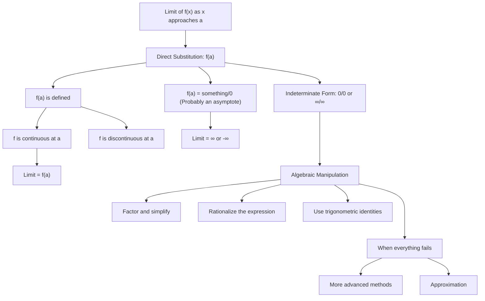

import { useMovablePoint, useStopwatch, vec } from "mafs";
import { lineLabel } from "@site/src/utilities/lines";
import { color } from "@site/src/utilities/colors"
import { useState } from "react";
import range from "lodash/range";
import { gamma } from "mathjs";
import TOCInline from '@theme/TOCInline';

# Evaluating Limits: Summary

In the previous sections, we discussed how to evaluate limits using different algebraic methods.
Of course, there are many more methods to evaluate limits, but the ones we discussed are the most common and useful.
Here is a summary of the methods we discussed:

In the next sections, we will explore the "more advanced methods" to evaluate limits, such as the Squeeze Theorem.
