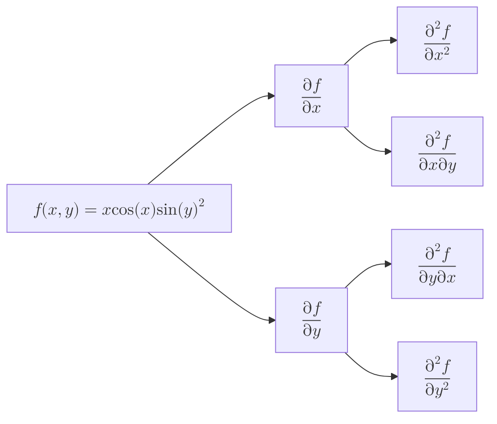

import { Mafs, Coordinates, Plot, Line, Circle, Theme, useMovablePoint, MovablePoint, useStopwatch, vec, Vector, LaTeX, Polygon, Transform, labelPi, Point } from "mafs";
import MathEquation from "@site/src/components/Math";
import { useState, useRef, useCallback, useMemo, memo, Fragment } from "react";
import { lineLabel } from "@site/src/utilities/lines";
import { color, getColorFromMagnitude, gradient } from "@site/src/utilities/colors"
import TOCInline from '@theme/TOCInline';
import * as MB from "mathbox-react"
import * as THREE from "three"
import range from "lodash/range"
import { OrbitControls } from "three/examples/jsm/controls/OrbitControls"
import { easeInOutCubic } from "js-easing-functions";

# Extending the Derivative: Part 1

From single-variable calculus, the derivative was defined for functions with a single input and a single output.
There are many functions in mathematics and physics that have multiple inputs and multiple outputs.
In this case, we can extend the concept of the derivative to functions of multiple variables.

## Table of Contents

<TOCInline toc={toc} />

## Partial Derivatives

Recall that one way to conceptualize the derivative is to think: "If I nudge the input a little bit, how much does the output change?"
So, for $f(x)$, you would change $x$ by a small amount $\Delta x$ and see how much $f(x)$ changes.

For functions with multiple inputs, what we can do is nudge each input separately and see how much the output changes.
So, for example, if we have a function $f(x, y)$, we can nudge $x$ by a small amount $\Delta x$ and see how much $f(x, y)$ changes.
This means that we treat $y$ as a constant while we nudge $x$.

This is known as the **partial derivative** of $f$ with respect to $x$, denoted in these ways:

- Leibniz notation: $\pdv{f}{x}$
- Lagrange notation: $f_x$
- Euler notation: $\partial_x f$

It's called a "partial" derivative because we're only considering one input at a time, so it's not a "complete" way to measure the rate of change.

### Example Problem: Evaluating a Simple Partial Derivative

> $f(x, y)$ is defined as follows:
>
> $$
> \begin{equation}
> f(x, y) = (x + y)^2
> \end{equation}
> $$
>
> Find $\pdv{f}{x}(2, 3)$.

We want to evaluate the rate of change of $f$ with respect to $x$ when $x = 2$ and $y = 3$.
So, keeping $y$ constant at $3$, we can differentiate $f(x, y)$ with respect to $x$:

$$
\begin{equation}
\begin{split}
\pdv{f}{x} &= \pdv{}{x} (x + 3)^2 \\
&= 2(x + 3) |_{x = 2} \\
&= 10
\end{split}
\end{equation}
$$

So, $\pdv{f}{x}(2, 3) = 10$.

### Formalizing Partial Derivatives

We can formally define the partial derivative so that it's mathematically rigorous.
Recall the definition of the derivative for a single-variable function:

$$
\begin{equation}
\dv{f}{x}(x) = \lim_{\Delta x \to 0} \frac{f(x + \Delta x) - f(x)}{\Delta x}
\end{equation}
$$

This is essentially a fancy way of calculating the rise over run.

Look at the $f(x + \Delta x)$ term - this is the output when we nudge the input by $\Delta x$.
For a function of multiple variables, we can nudge each input separately.
So, given a function $f(x, y)$, if we want to find the partial derivative with respect to $x$, we nudge $x$ by $\Delta x$ and keep $y$ constant; $f(x + \Delta x, y)$.

Everything else in the definition of the derivative remains the same. So, the partial derivative of $f$ with respect to $x$ is defined as:

$$
\begin{equation}
\pdv{f}{x}(x, y) = \lim_{\Delta x \to 0} \frac{f(x + \Delta x, y) - f(x, y)}{\Delta x}
\end{equation}
$$

## Visualizing Partial Derivatives

Let's visualize the concept of partial derivatives with a simple example.
Consider the function $f(x, y) = x^2 + \sin(y)$.

Suppose we want to find the partial derivative of $f$ with respect to $x$ at the point $(1, 2)$.
This means that $y$ is kept constant at $2$ while we nudge $x$. One way to think of this on a graph is to imagine a slice of the function where $y = 2$.

So first, here's the graph of $f(x, y) = x^2 + \sin(y)$:

<CustomMathbox>
    <MB.Cartesian
        scale={[
            0.1, 0.1, 0.1
        ]}
    >
        <MB.Axis axis="x" range={[-10, 10]} color={color("blue")} />
        <MB.Axis axis="y" range={[-10, 10]} color={color("green")} />
        <MB.Axis axis="z" range={[-10, 10]} color={color("yellow")} />
        <MB.Area
            id="graph"
            axes="xz"
            expr={(emit, x, z, i, t) => {
                emit(x, x ** 2 + Math.sin(z), z);
            }}
            width={64}
            height={64}
            channels={3}
            rangeX={[-10, 10]}
            rangeY={[-10, 10]}
        />
        <MB.Surface
            points="#graph"
            opacity={0.5}
            color={color("blue")}
        />

        <MB.Array
            items={1}
            id="point"
            data={[[1, 1 + Math.sin(2), 2]]}
            channels={3}
        />
        <MB.Point
            points="#point"
            color={color("red")}
            size={15}
        />
    </MB.Cartesian>
</CustomMathbox>

If we slice the function at $y = 2$, we get a parabola:

export function VisualizingPartialDerivatives({ variable }) {
    const f = (x, y) => x ** 2 + Math.sin(y);
    return (
        <CustomMathbox
            options={{
                plugins: ["core", "controls", "cursor"],
                controls: {
                    klass: OrbitControls,
                },
            }}
            containerStyle={{
                height: "500px"
            }}
        >
            <MB.Cartesian
                scale={[
                    0.1, 0.1, 0.1
                ]}
            >
                <MB.Axis axis="x" range={[-10, 10]} color={color("blue")} />
                <MB.Axis axis="y" range={[-10, 10]} color={color("green")} />
                <MB.Axis axis="z" range={[-10, 10]} color={color("yellow")} />
                <MB.Area
                    id="graph"
                    axes="xz"
                    expr={(emit, x, z, i, t) => {
                        {/* emit(x, x ** 2 + 2 ** 2, z); */}
                        emit(x, f(x, z), z);
                    }}
                    width={64}
                    height={64}
                    channels={3}
                    rangeX={variable === "x" ? [-10, 10] : [-10, 1]}
                    rangeY={variable === "x" ? [-10, 2] : [-10, 10]}
                />
                <MB.Surface
                    points="#graph"
                    opacity={0.5}
                    color={color("blue")}
                    zBias={-1}
                    zIndex={-1}
                />

                <MB.Area
                    id="slice_d_input"
                    axes={variable}
                    expr={(emit, x, i, t) => {
                        if (variable === "x") {
                            emit(x, f(x, 2), 2);
                        } else {
                            emit(1, f(1, x), x);
                        }
                    }}
                    width={64}
                    height={64}
                    channels={3}
                    rangeX={[-10, 10]}
                />
                <MB.Line
                    points="#slice_d_input"
                    color={color("red")}
                    width={10}
                />

                <MB.Array
                    items={1}
                    id="point"
                    data={[[1, f(1, 2), 2]]}
                    channels={3}
                />
                <MB.Point
                    points="#point"
                    color={color("red")}
                    size={15}
                />

                <MB.Array
                    items={2}
                    id="d_input"
                    data={variable === "x"
                        ? [[1, f(1, 2), 2], [2, f(1, 2), 2]]
                        : [[1, f(1, 2), 2], [1, f(1, 2), 3]]
                    }
                    channels={3}
                />
                <MB.Vector
                    points="#d_input"
                    color={color("green")}
                    width={5}
                    end={true}
                />
                <MB.Array
                    items={2}
                    id="dz"
                    data={variable === "x"
                        ? [[2, f(1, 2), 2], [2, f(2, 2), 2]]
                        : [[1, f(1, 2), 3], [1, f(1, 3), 3]]
                    }
                    channels={3}
                />
                <MB.Vector
                    points="#dz"
                    color={color("green")}
                    width={5}
                    end={true}
                />
            </MB.Cartesian>
        </CustomMathbox>
    )
}

<VisualizingPartialDerivatives variable="x" />

Then, the nudge in $x$ can be represented by an arrow on the graph. We can compute the partial derivative by finding the derivative of this slice at the point $(1, 2)$:

$$
\begin{equation}
\begin{split}
\pdv{f}{x} &= \pdv{}{x} (x^2 + \sin(2)) \\
&= 2x |_{x = 1} \\
&= 2
\end{split}
\end{equation}
$$

Likewise, we can slice the function in the $y$-direction to find the partial derivative with respect to $y$:

<VisualizingPartialDerivatives variable="y" />

The partial derivative with respect to $y$ at $(1, 2)$ is:

$$
\begin{equation}
\begin{split}
\pdv{f}{y} &= \pdv{}{y} (1^2 + \sin(y)) |_{y = 2} \\
&= \cos(y) |_{y = 2} \\
&= \cos(2)
\end{split}
\end{equation}
$$

## Second Partial Derivatives

We can take multiple partial derivatives of a function.

Consider the following function:

$$
\begin{equation}
f(x, y) = x\cos(x)\sin(y)^2
\end{equation}
$$

There are two partial derivatives, and for each of them, there are two more second partial derivatives.
Recall that the notation for a second normal derivative, at least in Leibniz notation, is $\dv[2]{f}{x}$.
For a second partial derivative:

- If it's the same variable for both derivatives, we write $\pdv[2]{f}{x}$.
- If it's different variables (say $x$ then $y$), we write it as sort of an expansion of $\pdv{y}(\pdv{f}{x})$, which is $\pdv{f}{y}{x}$.

We can show the different derivatives using a tree.

Let's first compute the first partial derivatives of $f(x, y)$. The things kept constant are shown in different colors to help understand the computation.

$$
\begin{equation}
\begin{split}
\pdv{f}{x} &= \pdv{}{x} (x\cos(x)\class{yellow}{\sin(y)^2}) \\
&= (\cos(x) - x\sin(x))\class{yellow}{\sin(y)^2} \\
&= \cos(x)\class{yellow}{\sin(y)^2} - x\sin(x)\class{yellow}{\sin(y)^2}
\end{split}
\end{equation}
$$

And the partial derivative with respect to $y$:

$$
\begin{equation}
\begin{split}
\pdv{f}{y} &= \pdv{}{y} (\class{blue}{x\cos(x)}\sin(y)^2) \\
&= 2\class{blue}{x\cos(x)}\sin(y)\cos(y)
\end{split}
\end{equation}
$$

Now, let's compute the second partial derivatives.

| Derivative | Computation |
|------------|-------------|
| $\pdv[2]{f}{x}$ | $(-2\sin(x) - x\cos(x))\sin(y)^2$ |
| $\pdv[2]{f}{y}$ | $2x\cos(x)(\cos(y)^2 - \sin(y)^2)$ |
| $\pdv{f}{y}{x}$ | $2\cos(x)\sin(y)\cos(y)$ |
| $\pdv{f}{x}{y}$ | $2\cos(x)\sin(y)\cos(y)$ |

Notice something interesting: $\pdv{f}{y}{x} = \pdv{f}{x}{y}$. This is a property that certain functions have, called the Symmetry of Second Derivatives.

There's a formal definition for this property called Schwarz's Theorem, which states that if the second partial derivatives of a function are continuous in a region, then the mixed partial derivatives are equal.
This theorem is discussed in the appendix.

## The Gradient

There's a few ways to think about the gradient of a function.

Purely computationally, the gradient is essentially a collection of all the partial derivatives of a function.

So for a function $f(x, y)$, the gradient is:

$$
\begin{equation}
\text{grad}(f) = \mqty[ \pdv{f}{x} \\ \pdv{f}{y} ]
\end{equation}
$$

Consider the function $f(x, y) = x^2 + 2y$. The gradient of $f$ is then:

$$
\begin{equation}
\text{grad}(f) = \mqty[ \pdv{f}{x} \\ \pdv{f}{y} ] = \mqty[ 2x \\ 2 ]
\end{equation}
$$

The gradient is often denoted as $\grad{f}$, which is pronounced "nabla f" or "del f".

Hence, to create a more general definition, we can define the gradient of a function $f: \mathbb{R}^n \to \mathbb{R}$ as:

$$
\begin{equation}
\grad{f(x_1, x_2, \ldots, x_n)} = \mqty[ \pdv{f}{x_1} \\ \pdv{f}{x_2} \\ \vdots \\ \pdv{f}{x_n} ]
\end{equation}
$$

Notice that the gradient is a vector, and its dimensions match the number of inputs to the function.
In terms of basis vectors, the gradient can be written as:

$$
\begin{equation}
\grad{f(x_1, x_2, \ldots, x_n)} = \pdv{f}{x_1} \vu{e}_1 + \pdv{f}{x_2} \vu{e}_2 + \ldots + \pdv{f}{x_n} \vu{e}_n = \sum_{i=1}^{n} \pdv{f}{x_i} \vu{e}_i
\end{equation}
$$

Recall that the partial derivative is an "incomplete" way to measure the rate of change.
In this sense, the gradient can be thought of as the "full" derivative of a function of multiple variables.

### The Nabla

One convenient way to think about the gradient is to consider the symbol $\vnabla$ as a vector of partial derivative operators.
It's easier to understand this with an example. For a function $f(x, y, z)$, $\vnabla$ is:

$$
\begin{equation}
\vnabla = \mqty[ \pdv{}{x} \\ \pdv{}{y} \\ \pdv{}{z} ]
\end{equation}
$$

Then, the gradient of $f$ is simply a vector multiplication:

$$
\begin{equation}
\grad{f} = \mqty[ \pdv{}{x} \\ \pdv{}{y} \\ \pdv{}{z} ] f = \mqty[ \pdv{f}{x} \\ \pdv{f}{y} \\ \pdv{f}{z} ]
\end{equation}
$$

### Gradients in the Context of Graphs

Outside of the computational context, there's a graphical way to think about the gradient.
Consider this simple function $f(x, y) = x^2 + y^2$, and its gradient:

$$
\begin{equation}
\grad{f} = \mqty [ \pdv{f}{x} \\ \pdv{f}{y} ] = \mqty[ 2x \\ 2y ]
\end{equation}
$$

We can plot this as a vector field.

<CustomMathbox>
    <MB.Cartesian
        scale={[
            0.1, 0.1, 0.1
        ]}
    >
        <MB.Axis axis="x" range={[-10, 10]} color={color("blue")} />
        <MB.Axis axis="y" range={[-10, 10]} color={color("green")} />
        <MB.Axis axis="z" range={[-10, 10]} color={color("yellow")} />
        <MB.Area
            id="graph"
            axes="xz"
            expr={(emit, x, z, i, t) => {
                emit(x, x ** 2 + z ** 2, z);
            }}
            width={64}
            height={64}
            channels={3}
            rangeX={[-10, 10]}
            rangeY={[-10, 10]}
        />
        <MB.Surface
            points="#graph"
            opacity={0.5}
            color={color("blue")}
            zBias={-1}
            zIndex={-1}
        />

        <MB.Area
            id="gradient_field"
            axes="xy"
            expr={(emit, x, y, i, t) => {
                // the original point
                emit(x, 0, y);
                // gradient
                {/* emit(x + 2 * x, 0, y + 2 * y); */}
                const gradient = [2 * x, 2 * y];
                const normalized = vec.normalize(gradient);
                emit(x + normalized[0], 0, y + normalized[1]);
            }}
            items={2}
            width={20}
            height={20}
            channels={3}
            rangeX={[-10, 10]}
            rangeY={[-10, 10]}
        />
        <MB.Area
            id="gradient_field_colors"
            axes="xy"
            expr={(emit, x, y, i, t) => {
                const gradient = [2 * x, 2 * y];
                const mag = vec.mag(gradient);

                const [r, g, b] = getColorFromMagnitude(mag, 0, 20);
                emit(r, g, b, 1.0);
            }}
            width={20}
            height={20}
            channels={4}
            rangeX={[-10, 10]}
            rangeY={[-10, 10]}
        />
        <MB.Vector
            points="#gradient_field"
            colors="#gradient_field_colors"
            width={5}
            end={true}
        />
    </MB.Cartesian>

</CustomMathbox>

In this graph, the gradient is represented as a vector field, more commonly known as a "gradient field".

One thing to note is that the gradient points in the "direction of the steepest ascent" of the function.
So if you were to walk along the surface of the function, you would be walking in the direction where the function increases the fastest.
This is not immediately obvious, but will become more apparent in light of directional derivatives.

### Gradient in Contour Plots

It's important to understand how the gradient relates to contour plots.

Consider the function $f(x, y) = xy/2$. The contour plot of this function is:

<Mafs>
    <Coordinates.Cartesian />
    {range(-10, 10, 0.5).map(i => (
        // Solve for f(x, y) = i
        // Which is xy/2 = i ==> y = 2i/x
        <Plot.OfX y={(x) => 2 * i / x} key={i} />
    ))}
</Mafs>

The gradient of $f$ is:

$$
\begin{equation}
\grad{f} = \mqty[ \pdv{f}{x} \\ \pdv{f}{y} ] = \mqty[ \frac{y}{2} \\ \frac{x}{2} ]
\end{equation}
$$

Like before, we can plot this as a gradient field along with the contour plot:

<Mafs>
    <Coordinates.Cartesian />
    {range(-10, 10, 0.5).map(i => (
        // Solve for f(x, y) = i
        // Which is xy/2 = i ==> y = 2i/x
        <Plot.OfX y={(x) => 2 * i / x} opacity={0.5} key={i} />
    ))}
    <Plot.VectorField
        xy={([x, y]) => [y / 2, x / 2]}
        step={0.5}
    />
</Mafs>

The important thing to notice is that the vector appears to point perpendicular to the contour lines.
To see why this is the case, zoom in on 2 contour lines:

<Mafs
    viewBox={{
        x: [1, 2],
        y: [1, 1.5]
    }}
>
    <Coordinates.Cartesian />
    <Plot.OfX y={(x) => 2 * 1 / x} />
    <LaTeX tex="f = 1" at={[2, 0.9]} />
    <Plot.OfX y={(x) => 2 * 1.1 / x} />
    <LaTeX tex="f = 1.1" at={[2, 1.25]} />
    <Vector
        tail={[2, 1]}
        tip={[2.05, 2 * 1.1 / 2.05]}
    />
</Mafs>

Recall that the gradient points in the direction of the steepest ascent.
Instead of thinking of the steepest ascent, consider which direction the function increases from $1$ to $1.1$ in the shortest distance.
This is essentially considering the shortest path between the two contour lines.
Since the contour lines are almost parallel to each other, the gradient vector will be perpendicular to the contour lines.

## The Directional Derivative

The directional derivative is somewhat of an extension or generalization of the partial derivative.

Consider a function $f(x, y)$ that outputs a single value.
It can be thought of as mapping a point in a 2D plane to a point in a number line.

When we consider the partial derivative with respect to $x$, we consider a change in $x$, and likewise for $y$.

<Mafs>
    <Coordinates.Cartesian
        xAxis={{ lines: false }}
        yAxis={{ lines: false }}
    />
    <Transform translate={[1, 1]}>
        <Point x={0} y={0} />
        <Vector tail={[0, 0]} tip={[1, 0]} />
        <LaTeX tex="\Delta x" at={[0.5, -0.5]} />

        <Vector tail={[0, 0]} tip={[0, 1]} />
        <LaTeX tex="\Delta y" at={[-0.5, 0.5]} />
    </Transform>
</Mafs>

Now, instead of thinking of these individually, consider a change in both $x$ and $y$ at the same time.
For instance, if $x$ and $y$ incremented by some vector $\va{v}$, how much would $f$ change?

Recall that the derivative takes a limit as this change approaches $0$.
So instead of thinking about an actual vector $\va{v}$, we're really thinking about some $h \va{v}$ where $h \to 0$.

For instance, consider this vector:

$$
\begin{equation}
\va{v} = \mqty[ 1 \\ -2 ]
\end{equation}
$$

Since we're considering $h \va{v}$, we can think of this as:

$$
\begin{equation}
h \va{v} = \mqty[ h \\ -2h ]
\end{equation}
$$

It can be thought of as a nudge in the $x$ direction and negative two nudges in the $y$ direction.
The notation for this includes:

- $\grad_{\va{v}}{f}$
- $D_{\va{v}} f$
- $\pdv{f}{\va{v}}$
- $\partial_{\va{v}} f$

To evaluate this directional derivative, we can use a combination of partial derivatives based on the components of $\va{v}$:

$$
\begin{equation}
\begin{split}
\grad_{\va{v}}{f} &= \pdv{f}{x} v_x + \pdv{f}{y} v_y \\
&= \pdv{f}{x} - 2\pdv{f}{y}
\end{split}
\end{equation}
$$

Notice that this resembles the dot product of the gradient and $\va{v}$:

$$
\begin{equation}
\grad_{\va{v}}{f} = \grad{f} \cdot \va{v} = \mqty[ \pdv{f}{x} \\ \pdv{f}{y} ] \cdot \mqty[ v_x \\ v_y ]
\end{equation}
$$

In order for the directional derivative to be the slope of the tangent line, then the vector $\va{v}$ must be a unit vector.
Otherwise, it would be scaled by the magnitude of $\va{v}$.

### Formalizing the Directional Derivative

We can formalize the directional derivative as a limit.
Recall that the partial derivative is defined as:

$$
\begin{equation}
\pdv{f}{x}(x, y) = \lim_{\Delta x \to 0} \frac{f(x + \Delta x, y) - f(x, y)}{\Delta x}
\end{equation}
$$

We can switch up the notation a bit to make it more general.
Instead of $x$ and $y$, we can use a vector $\va{w}$ as the input to $f$.
Then, the partial derivative is:

$$
\begin{equation}
\pdv{f}{x}(\va{w}) = \lim_{h \to 0} \frac{f(\va{w} + h\vu{i}) - f(\va{w})}{h}
\end{equation}
$$

Notice that our change in $x$ is now $h\vu{i}$, where $\vu{i}$ is the unit vector in the $x$ direction.
The reason we use this notation is to make it much easier to extend - all the information about the direction of the change is contained in $\vu{i}$, so we can easily change the direction of the derivative.

So, the directional derivative is defined as:

$$
\begin{equation}
\grad_{\va{v}}{f}(\va{w}) = \lim_{h \to 0} \frac{f(\va{w} + h\va{v}) - f(\va{w})}{h}
\end{equation}
$$

To visualize a directional derivative, consider once again, the input space of $f(x, y)$, which is a 2D plane.
Instead of the input being $(x, y)$, we can think of it as a vector $\va{w}$.
Then, the directional derivative is the rate of change of $f$ at $\va{w}$ in the direction of $\va{v}$:

<Mafs>
    <Coordinates.Cartesian
        xAxis={{ lines: false }}
        yAxis={{ lines: false }}
    />
    <Vector tip={[1, 1]} />
    <Transform translate={[1, 1]}>
        <Point x={0} y={0} />
        <LaTeX tex="\mathbf{\vec{w}}" at={[0, 0.5]} />
        <Vector tail={[0, 0]} tip={[1, -2]} color={color("yellow")} />
        <LaTeX tex="h\mathbf{\vec{v}}" at={lineLabel([0, 0], [1, -2], "left")} color={color("yellow")} />
    </Transform>
</Mafs>

### The Directional Derivative in the Context of Graphs

Recall that the partial derivative can be visualized as a slice of a surface in a 3D graph.
This slice can take two directions, $x$ and $y$.

In a similar way, the directional derivative can be visualized as a slice of the surface in a direction $\va{v}$.

Consider the following function:

$$
\begin{equation}
f(x, y) = xy^2
\end{equation}
$$

Suppose we want to find the directional derivative of $f$ at the point $(1, 2)$ in the direction of $\va{v} = \mqty[ 1 \\ 1 ]$.

Since derivatives are graphically represented as slopes, we need to make $\va{v}$ a unit vector. Hence:

$$
\begin{equation}
\va{v} = \frac{1}{\sqrt{2}} \mqty[ 1 \\ 1 ] = \mqty[ \frac{1}{\sqrt{2}} \\ \frac{1}{\sqrt{2}} ] = \mqty[ \frac{\sqrt{2}}{2} \\ \frac{\sqrt{2}}{2} ]
\end{equation}
$$

Let's slice the graph of $f(x, y) = xy^2$ at $x = 1, y = 2$, with the direction of $\va{v}$:

<CustomMathbox>

    <MB.Cartesian
        scale={[
            0.1, 0.1, 0.1
        ]}
    >
        <MB.Axis axis="x" range={[-10, 10]} color={color("blue")} />
        <MB.Axis axis="y" range={[-10, 10]} color={color("green")} />
        <MB.Axis axis="z" range={[-10, 10]} color={color("yellow")} />
        <MB.Area
            id="graph"
            axes="xz"
            expr={(emit, x, z, i, t) => {
                // check if x/z are within the slice
                // equation for slice line is x - y = -1
                if (x - z < -1) {
                    return;
                }
                emit(x, x * z ** 2, z);
            }}
            width={64}
            height={64}
            channels={3}
            rangeX={[-10, 10]}
            rangeY={[-10, 10]}
        />
        <MB.Surface
            points="#graph"
            opacity={0.5}
            color={color("blue")}
            zBias={-1}
            zIndex={-1}
        />

        <MB.Area
            id="slice_d_input"
            axes="xy"
            expr={(emit, x, y, i, t) => {
                const w = [1, 2];
                const distX = x - w[0];
                const newY = w[1] + distX;
                emit(x, x * newY ** 2, newY);
            }}
            width={64}
            height={64}
            channels={3}
            rangeX={[-10, 10]}
        />
        <MB.Line
            points="#slice_d_input"
            color={color("red")}
            width={10}
        />

        <MB.Array
            items={1}
            id="point"
            data={[[1, 4, 2]]}
            channels={3}
        />
        <MB.Point
            points="#point"
            color={color("red")}
            size={15}
        />

        <MB.Array
            items={2}
            id="d_input"
            data={[[1, 4, 2], [1 + Math.sqrt(2) / 2, 12.51, 2 + Math.sqrt(2) / 2]]}
            channels={3}
        />
        <MB.Vector
            points="#d_input"
            color={color("green")}
            width={5}
            end={true}
            zBias={1}
        />
    </MB.Cartesian>
</CustomMathbox>

We can evaluate the directional derivative by first finding the gradient of $f$ at $(1, 2)$:

$$
\begin{equation}
\begin{split}
\grad{f} &= \mqty[ \pdv{f}{x} \\ \pdv{f}{y} ] \\
&= \mqty[ y^2 \\ 2xy ]
\end{split}
\end{equation}
$$

Recall that the directional derivative is the dot product of the gradient and $\va{v}$:

$$
\begin{equation}
\grad_{\va{v}}{f} = \grad{f} \cdot \va{v} = \mqty[ 4 \\ 4 ] \cdot \mqty[ \frac{\sqrt{2}}{2} \\ \frac{\sqrt{2}}{2} ] = 4\sqrt{2}
\end{equation}
$$

To illustrate why the vector has to be a unit vector, consider the same directional derivative but with a different magnitude $\va{v} = [1, 1]$:

$$
\begin{equation}
\grad_{\va{v}}{f} = \grad{f} \cdot \va{v} = \mqty[ 4 \\ 4 ] \cdot \mqty[ 1 \\ 1 ] = 8
\end{equation}
$$

Therefore, the slope can be defined as the rate of change of the function in the direction of the _unit vector_ $\va{v}$:

$$
\begin{equation}
\text{slope} = \frac{\grad_{\va{v}}{f}}{\norm{\va{v}}} = \frac{\grad{f} \cdot \va{v}}{\norm{\va{v}}}
\end{equation}
$$

### The Gradient and the Directional Derivative

Recall the definition for the directional derivative:

$$
\begin{equation}
\grad_{\va{v}}{f} = \grad{f} \cdot \va{v}
\end{equation}
$$

Let's assume $\va{v}$ is a unit vector.
Then, consider the direction of the steepest ascent at some point $(x, y)$.
This can be thought of as finding a $\va{v}$ that maximizes $\grad{f(x, y)} \cdot \va{v}$ for all $\norm{\va{v}} = 1$.

Let's once again consider the input space of $f(x, y)$, which is a 2D plane.

Recall that the dot product of two vectors $\va{a}$ and $\va{b}$ is equal to:

$$
\begin{equation}
\va{a} \cdot \va{b} = \class{red}{\text{Projection of } \va{a} \text{ onto } \va{b}} \times \text{Magnitude of } \va{b}
\end{equation}
$$

export function TheGradientAndTheDirectionalDerivative() {
    const radius = 1;
    const point = useMovablePoint([1, 0], {
        constrain: ([x, y]) => {
            const angle = Math.atan2(y, x);
            return [radius * Math.cos(angle), radius * Math.sin(angle)];
        },
    });

    const grad = [2, 3]; // arbitrary
    const projected = vec.withMag(grad, vec.dot(grad, point.point) / vec.mag(grad));

    return (
        <Mafs>
            <Coordinates.Cartesian
                xAxis={{ lines: false }}
                yAxis={{ lines: false }}
            />
            <Vector tip={point.point} />
            <LaTeX tex="\mathbf{\vec{v}}" at={lineLabel([0, 0], point.point, "right")} />

            <Vector tip={[2, 3]} />
            <LaTeX tex="\boldsymbol{\nabla} f" at={lineLabel([0, 0], [2, 3], "right")} />
            <Vector tip={projected} color={color("red")} />

            <Line.Segment point1={point.point} point2={projected} style="dashed" />

            {point.element}
        </Mafs>
    )
}

<TheGradientAndTheDirectionalDerivative />

Therefore, to maximize the dot product, the projection of $\grad{f}$ onto $\va{v}$ must be maximized, which means that $\va{v}$ must be in the direction of $\grad{f}$.
Hence:

$$
\begin{equation}
\max_{\norm{\va{v}} = 1} \grad{f} \cdot \va{v} = \underbrace{\frac{\grad{f}}{\norm{\grad{f}}}}_{\va{w}}
\end{equation}
$$

This means:

$$
\begin{equation}
\grad_{\va{w}}{f} = \grad{f} \cdot \va{w} = \frac{\grad{f} \cdot \grad{f}}{\norm{\grad{f}}} = \frac{\norm{\grad{f}}^2}{\norm{\grad{f}}} = \norm{\grad{f}}
\end{equation}
$$

One important takeaway is that the gradient is a tool that can be used in conjunction with other things to analyze the behavior of a function.

## Differentiating Vector-Valued Functions

So far, we've been dealing with functions that output a single value.
Now, we consider functions that output a vector.

Consider the following parametric function:

$$
\begin{equation}
x = x(t), \quad y = y(t), a \leq t \leq b
\end{equation}
$$

This can be written as a vector-valued function:

$$
\begin{equation}
\va{r}(t) = x(t)\vu{i} + y(t)\vu{j}, \quad a \leq t \leq b
\end{equation}
$$

Vector-valued functions, like many functions, can be thought of as a transformation.
In this case, it transforms a point in a number line to a point in a 2D plane.

Consider taking the derivative of this function. Recall that by taking the derivative, you increase the input by a small amount, and see how the output changes.
A drawing of a parametric function can help illustrate this:

export function DifferentiatingVectorValuedFunctions({ showComponents = false }) {
    const x = (t) => Math.sqrt(t) * Math.cos(t);
    const y = (t) => Math.sin(t) + Math.cos(t);
    return (
        <Mafs>
            <Plot.Parametric
                xy={(t) => [x(t), y(t)]}
                t={[0, 2 * Math.PI]}
            />

            {/* t = 2 */}
            <Vector
                tip={[x(2), y(2)]}
            />
            <LaTeX
                tex="\mathbf{\vec{r}}(2)"
                at={[x(2) - 0.4, y(2)]}
            />

            {/* t = 2 + \Delta t, let \Delta t = 1 for the illustration */}
            <Vector
                tip={[x(3), y(3)]}
            />
            <LaTeX
                tex="\mathbf{\vec{r}}(2 + \Delta t)"
                at={[x(3) - 0.7, y(3)]}
            />

            {/* Difference vector */}
            <Vector
                tail={[x(2), y(2)]}
                tip={[x(3), y(3)]}
                color={color("red")}
            />
            <LaTeX
                tex="\Delta \mathbf{\vec{r}}"
                at={lineLabel(
                    [x(2), y(2)],
                    [x(3), y(3)],
                    "right"
                )}
                color={color("red")}
            />
            {showComponents && (
                <>
                    <Vector
                        tail={[x(2), y(2)]}
                        tip={[x(2), y(3)]}
                        color={color("yellow")}
                    />
                    <LaTeX
                        tex="\Delta y"
                        at={lineLabel(
                            [x(2), y(2)],
                            [x(2), y(3)],
                            "left"
                        )}
                        color={color("yellow")}
                    />

                    <Vector
                        tail={[x(2), y(3)]}
                        tip={[x(3), y(3)]}
                        color={color("blue")}
                    />
                    <LaTeX
                        tex="\Delta x"
                        at={lineLabel(
                            [x(2), y(3)],
                            [x(3), y(3)],
                            "left"
                        )}
                        color={color("blue")}
                    />
                </>
            )}
        </Mafs>
    )
}

<DifferentiatingVectorValuedFunctions />

The change in the input is $\Delta t$ and the change in the output is $\Delta \va{r}$.

Therefore, the derivative can be written as:

$$
\begin{equation}
\dv{\va{r}}{t} = \lim_{\Delta t \to 0} \frac{\Delta \va{r}}{\Delta t} = \lim_{\Delta t \to 0} \frac{\va{r}(t + \Delta t) - \va{r}(t)}{\Delta t}
\end{equation}
$$

Since $\va{r}(t) = x(t)\vu{i} + y(t)\vu{j}$, the derivative can be computed as:

$$
\begin{equation}
\dv{\va{r}}{t} = \dv{}{t} (x(t)\vu{i} + y(t)\vu{j}) = \dv{x}{t}(t)\vu{i} + \dv{y}{t}(t)\vu{j}
\end{equation}
$$

This is essentially the same as taking the derivative of a function that outputs a single value, but for each component of the vector.

Another way to think about this is to consider the change in $\va{r}$ visually:

<DifferentiatingVectorValuedFunctions showComponents={true} />

Since $\Delta \va{r} = \Delta x \vu{i} + \Delta y \vu{j}$, as $\Delta t \to 0$, $\Delta \va{r} \to \dd{\va{r}}$, and:

$$
\begin{equation}
\dd{\va{r}} = \dd{x}\vu{i} + \dd{y}\vu{j}
\end{equation}
$$

This can be thought of as the implicit differentiation of vector-valued functions.

### The Magnitude of the Parametric Derivative

The magnitude of the parametric derivative is the rate of change of the vector-valued function.
To illustrate this, consider two different vector-valued functions:

$$
\begin{equation}
\va{r}_1(t) = \mqty[ \sin(t) \\ \cos(t) ], \quad \va{r}_2(t) = \mqty[ \sin(2t) \\ \cos(2t) ]
\end{equation}
$$

First, let's graph $\va{r}_1(t)$:

<Mafs>
    <Plot.Parametric
        xy={(t) => [Math.sin(t), Math.cos(t)]}
        t={[0, Math.PI]}
    />
    {range(0, 3).map((i) => (
        <>
            <Point
                key={i}
                x={Math.sin(i * Math.PI / 2)}
                y={Math.cos(i * Math.PI / 2)}
            />
            <LaTeX
                key={i}
                tex={`t = ${i / 2}\\pi`}
                at={[Math.sin(i * Math.PI / 2) * 1.8, Math.cos(i * Math.PI / 2) * 1.3]}
            />
        </>
    ))}
</Mafs>

Notice that, at $t = \pi/2$, the curve goes halfway around the unit circle.
Now consider $\va{r}_2(t)$:

<Mafs>
    <Plot.Parametric
        xy={(t) => [Math.sin(2 * t), Math.cos(2 * t)]}
        t={[0, Math.PI / 2]}
    />
    {range(0, 2).map((i) => (
        <>
            <Point
                key={i}
                x={Math.sin(2 * i * Math.PI / 2)}
                y={Math.cos(2 * i * Math.PI / 2)}
            />
            <LaTeX
                key={i}
                tex={`t = ${i / 2}\\pi`}
                at={[Math.sin(2 * i * Math.PI / 2) * 1.8, Math.cos(2 * i * Math.PI / 2) * 1.3]}
            />
        </>
    ))}
</Mafs>

In this case, at $t = \pi/4$, the curve goes halfway around the unit circle.
So it's twice as fast as $\va{r}_1(t)$, if you consider $t$ as physical time.

Let's consider the derivatives of these functions:

$$
\begin{align}
\dv{\va{r}_1}{t} &= \mqty[ \cos(t) \\ -\sin(t) ] \\
\dv{\va{r}_2}{t} &= \mqty[ 2\cos(2t) \\ -2\sin(2t) ]
\end{align}
$$

Let's evaluate the derivatives at certain points and plot them:

{(() => {
    const point = useMovablePoint([1, 0], {
        constrain: ([x, y]) => {
            const angle = Math.atan2(y, Math.abs(x));
            return [Math.cos(angle), Math.sin(angle)];
        },
    });

    return (
        <Mafs>
            <Transform translate={[-3, 0]}>
                <Plot.Parametric
                    xy={(t) => [Math.sin(t) - 3, Math.cos(t)]}
                    t={[0, Math.PI]}
                />
                {range(0, 3).map((i) => (
                    <>
                        <Point
                            key={i}
                            x={Math.sin(i * Math.PI / 2)}
                            y={Math.cos(i * Math.PI / 2)}
                        />
                        <LaTeX
                            key={i}
                            tex={`t = ${i / 2}\\pi`}
                            at={[Math.sin(i * Math.PI / 2) * 1.8, Math.cos(i * Math.PI / 2) * 1.3]}
                        />
                    </>
                ))}
                <LaTeX
                    tex="\mathbf{\vec{r}}_1"
                    at={[0, -2]}
                />
                {/* Velocity */}
                <Vector
                    tail={point.point}
                    tip={[point.point[0] + point.point[1], point.point[1] - point.point[0]]}
                />
                {point.element}
            </Transform>
            <Transform translate={[3, 0]}>
                <Plot.Parametric
                    xy={(t) => [Math.sin(2 * t) + 3, Math.cos(2 * t)]}
                    t={[0, Math.PI / 2]}
                />
                {range(0, 2).map((i) => (
                    <>
                        <Point
                            key={i}
                            x={Math.sin(2 * i * Math.PI / 2)}
                            y={Math.cos(2 * i * Math.PI / 2)}
                        />
                        <LaTeX
                            key={i}
                            tex={`t = ${i / 2}\\pi`}
                            at={[Math.sin(2 * i * Math.PI / 2) * 1.8, Math.cos(2 * i * Math.PI / 2) * 1.3]}
                        />
                    </>
                ))}
                <LaTeX
                    tex="\mathbf{\vec{r}}_2"
                    at={[0, -2]}
                />
                {/* Velocity */}
                <Vector
                    tail={point.point}
                    tip={[point.point[0] + 2 * point.point[1], point.point[1] - 2 * point.point[0]]}
                />
                {point.element}
            </Transform>
        </Mafs>
    )
})()}

The important takeaway is that even if the slope appears the same, the _rate of change_ of the vector-valued function can be different.

## Multivariable Chain Rule

The chain rule is a fundamental concept in calculus, and it can be extended to multivariable functions.

Consider a function $f(x, y)$ and a pair of functions $x(t)$ and $y(t)$.

Then, consider applying $f$ to both:

$$
\begin{equation}
f(x(t), y(t))
\end{equation}
$$

This can be thought of as a series of transformations:

1. Start with a number line for $t$.
2. Transform to a plane with $x(t), y(t)$.
3. Transform to a number line with $f$.

Notice how, although a plane is involved, it still starts with a single number and ends with a single number.
Therefore, it is still a single-variable function.

Next, consider taking the derivative of $f(x(t), y(t))$. To do so, we can apply the chain rule.

We can start with an example:

$$
\begin{align}
f(x, y) &= xy^2 \\
x(t) &= \sin(t) \\
y(t) &= \cos(t)
\end{align}
$$

Then, consider the derivative of $f(x(t), y(t))$:

$$
\begin{equation}
\begin{split}
\dv{t} f(x(t), y(t)) &= \dv{t} f(\class{blue}{\sin(t)}, \class{yellow}{\cos(t)}) \\
&= \dv{t} (\class{blue}{\sin(t)} \cdot \class{yellow}{\cos(t)}^2) \\
&= \class{blue}{\cos(t)}\class{yellow}{\cos^2(t)} + \class{yellow}{2\cos(t)(-\sin(t))}\class{blue}{\sin(t)}
\end{split}
\end{equation}
$$

This is fine, but there's a more general way to think about this.

Consider the partial derivatives of $f$:

$$
\begin{align}
\pdv{f}{x} &= y^2 = \cos^2(t) \\
\pdv{f}{y} &= 2xy = 2\sin(t)\cos(t)
\end{align}
$$

Next, consider the derivative of each function $x(t)$ and $y(t)$:

$$
\begin{align}
\dv{x}{t} &= \cos(t) \\
\dv{y}{t} &= -\sin(t)
\end{align}
$$

Notice that the derivative of $f(x(t), y(t))$ can be written as:

$$
\begin{equation}
\begin{split}
\dv{t} f(x(t), y(t)) &= \underbrace{\cos^2(t)}_{\small \displaystyle \pdv{f}{x}}\overbrace{\cos(t)}^{\small \displaystyle \dv{x}{t}} + \underbrace{2\cos(t)\sin(t)}_{\small \displaystyle \pdv{f}{y}}\overbrace{(-\sin(t))}^{\small \displaystyle \dv{y}{t}} \\
&= \pdv{f}{x}\dv{x}{t} + \pdv{f}{y}\dv{y}{t}
\end{split}
\end{equation}
$$

This is known as the multivariable chain rule.

### Intuition for the Multivariable Chain Rule

We've just used one example and noticed a (possibly coincidental) pattern, but this should also make intuitive sense.

First, recall the intuition for the regular chain rule.

Consider a function $u(v(x))$. This is essentially two transformations:

1. Start with a number line for $x$.
2. Transform to a number line with $v(x)$.
3. Transform to a number line with $u(v(x))$.

Now, consider a change in $x$, $\dd{x}$, and consider how the change sort of "propagates" through the transformations:

1. The change in $x$ is $\dd{x}$.
2. The change in $v(x)$ is $\dv{v}{x}\dd{x}$, since the fraction essentially cancels out.
3. The change in $u(v(x))$ is $\dv{u}{v}\dd{v}$.

Then:

$$
\begin{equation}
\dd{u} = \dv{u}{v}\dv{v}{x}\dd{x}
\end{equation}
$$

And dividing by $\dd{x}$ gives the chain rule.

Let's extend this intuition to the multivariable case.

1. You start with a number line for $t$. The change in $t$ is $\dd{t}$.
2. The change in $t$ causes a change in $x$ and $y$. The change in $x$ is $\dv{x}{t}\dd{t}$ and the change in $y$ is $\dv{y}{t}\dd{t}$, due to the cancelling of differentials.
3. Both of these changes result in a change in $f(x, y)$. You could think of this as the sum of a change in $f$ due to a change in $x$ and a change in $f$ due to a change in $y$.
    - The change in $f$ due to a change in $x$ is $\pdv{f}{x}\dd{x}$.
    - The change in $f$ due to a change in $y$ is $\pdv{f}{y}\dd{y}$.

Then:

$$
\begin{equation}
\begin{split}
\dd{f} &= \pdv{f}{x}\dd{x} + \pdv{f}{y}\dd{y} \\
&= \pdv{f}{x}\dv{x}{t}\dd{t} + \pdv{f}{y}\dv{y}{t}\dd{t}
\end{split}
\end{equation}
$$

And dividing by $\dd{t}$ gives:

$$
\begin{equation}
\dv{f}{t} = \pdv{f}{x}\dv{x}{t} + \pdv{f}{y}\dv{y}{t}
\end{equation}
$$

### Vector Form of the Multivariable Chain Rule

The multivariable chain rule can be written in vector form.

We've used $f(x(t), y(t))$ as separate parameters, but we can also think of $f$ as a function that takes a vector $\va{r}(t)$ as input.

The vector $\va{r}(t)$ can be written as:

$$
\begin{equation}
\va{r}(t) = \mqty[ x(t) \\ y(t) ]
\end{equation}
$$

Then, the derivative of $\va{r}(t)$ can be written as:

$$
\begin{equation}
\dv{\va{r}}{t} = \mqty[ \dv{x}{t} \\ \dv{y}{t} ]
\end{equation}
$$

Recall the multivariable chain rule:

$$
\begin{equation}
\dv{f}{t} = \pdv{f}{x}\dv{x}{t} + \pdv{f}{y}\dv{y}{t}
\end{equation}
$$

Notice that this is basically a dot product:

$$
\begin{equation}
\begin{split}
\dv{f}{t} &= \class{red}{\pdv{f}{x}}\class{blue}{\dv{x}{t}} + \class{red}{\pdv{f}{y}}\class{blue}{\dv{y}{t}} \\
&= \class{red}{\mqty[ \pdv{f}{x} \\ \pdv{f}{y} ]} \cdot \class{blue}{\mqty[ \dv{x}{t} \\ \dv{y}{t} ]} \\
&= \class{red}{\grad{f}(\va{r}(t))} \cdot \class{blue}{\dv{\va{r}}{t}}
\end{split}
\end{equation}
$$

This should also make intuitive sense, as it is very similar to the regular chain rule:

$$
\begin{equation}
\dv{u}{t} = \dv{u}{v}\dv{v}{t} \iff \dv{f}{t} = \grad{f}(\va{r}(t)) \cdot \dv{\va{r}}{t}
\end{equation}
$$

- $\dv{u}{v}$ corresponds to $\grad{f}(\va{r}(t))$; the gradient is sort of an extension of the full derivative.
- $\dv{v}{t}$ corresponds to $\dv{\va{r}}{t}$.

### Duality of the Multivariable Chain Rule and the Directional Derivative

One thing to notice is that the multivariable chain rule looks very similar to the directional derivative.

Recall the directional derivative:

$$
\begin{equation}
\grad_{\va{w}}{f} = \grad{f} \cdot \va{w}
\end{equation}
$$

And the vector-form multivariable chain rule:

$$
\begin{equation}
\dv{f}{t} = \grad{f}(\va{r}(t)) \cdot \dv{\va{r}}{t}
\end{equation}
$$

The vector-form rule is essentially the directional derivative of $f$ in the direction of $\dv{\va{r}}{t}$:

$$
\begin{equation}
\dv{f}{t} = \grad_{\dv{\va{r}}{t}}{f}
\end{equation}
$$

Consider why this is the case. Recall that the composition of functions can be thought of as a series of transformations:

1. Start with a number line for $t$.
2. Transform to a plane with $x(t), y(t)$.
3. Transform to a number line with $f$.

When you increment a value by a vector in the plane, and measure the change in $f$, that's a directional derivative.

The vector in question is caused by the change in $t$. So, the directional derivative is in the direction of $\dv{\va{r}}{t}$.

### Formalizing the Multivariable Chain Rule

We have shown various ways to intuitively think about the multivariable chain rule, but let's treat it more formally now.

Recall that we used the cancellation of differentials to derive the chain rule.
This is not rigorous, but it is still helpful because it very closely resembles the formal treatment.

Recall the vector form of the multivariable chain rule:

$$
\begin{equation}
\dv{f}{t}(\va{r}(t)) = \grad{f}(\va{r}(t)) \cdot \dv{\va{r}}{t}
\end{equation}
$$

And the limit definition of the derivative (since this is a single-variable function):

$$
\begin{equation}
\dv{f}{t}(\class{blue}{\va{r}(t)}) = \lim_{\Delta t \to 0} \frac{f(\class{blue}{\va{r}}(t + \Delta t)) - f(\class{blue}{\va{r}}(t))}{\Delta t}
\end{equation}
$$

Recall our intuition for the chain rule: the change in $f$ is based on the change in $\va{r}$, which is based on the change in $t$.
As such, consider the derivative of $\va{r}$:

$$
\begin{equation}
\dv{\va{r}}{t} = \lim_{\Delta t \to 0} \frac{\va{r}(t + \Delta t) - \va{r}(t)}{\Delta t}
\end{equation}
$$

Now we're going to do something that might be unfamiliar, but we're going to rewrite the limit as a sum of two terms:

$$
\begin{equation}
\dv{\va{r}}{t} = \frac{\va{r}(t + \Delta t) - \va{r}(t)}{\Delta t} + \epsilon(\Delta t)
\end{equation}
$$

The $\epsilon(\Delta t)$ term represents the error term, which is the difference between the limit and the actual value.
It should approach zero as $\Delta t$ approaches zero.
This is common in epsilon-delta proofs in real analysis.

Multiply both sides by $\Delta t$:

$$
\begin{equation}
\dv{\va{r}}{t} \Delta t = \va{r}(t + \Delta t) - \va{r}(t) + \Delta t\epsilon(\Delta t)
\end{equation}
$$

Rewrite $\Delta t\epsilon(\Delta t)$ as $\va{o}(\Delta t)$.
This is a common notation in analysis, and all it represents is that $\frac{\norm{\va{o}(\Delta t)}}{\Delta t} \to 0$ as $\Delta t \to 0$.

Then, rewrite $\va{r}(t + \Delta t)$ as:

$$
\begin{equation}
\va{r}(t + \Delta t) = \va{r}(t) + \dv{\va{r}}{t}(t) \Delta t + \va{o}(\Delta t)
\end{equation}
$$

This is based on the definition of the derivative as a slope. We apply the slope to $\Delta t$ to get the change in $\va{r}$, and then add the error term.

Substitute this back into the definition of the derivative of $f$:

$$
\begin{equation}
\begin{split}
\dv{f}{t}(\va{r}(t)) &= \lim_{\Delta t \to 0} \frac{f(\va{r}(t + \Delta t)) - f(\va{r}(t))}{\Delta t} \\
&= \lim_{\Delta t \to 0} \frac{f(\va{r}(t) + \dv{\va{r}}{t}(t) \Delta t + \va{o}(\Delta t)) - f(\va{r}(t))}{\Delta t}
\end{split}
\end{equation}
$$

Since $\Delta t \to 0$ and $\va{o}(\Delta t)$ is small, we can cancel out the $\va{o}(\Delta t)$ term:

$$
\begin{equation}
\dv{f}{t}(\va{r}(t)) = \lim_{\Delta t \to 0} \frac{f(\va{r}(t) + \dv{\va{r}}{t}(t) \Delta t) - f(\va{r}(t))}{\Delta t}
\end{equation}
$$

Finally, recall the definition of the directional derivative:

$$
\begin{equation}
\grad_{\class{blue}{\va{v}}}{f(\class{yellow}{\va{a}})} = \lim_{h \to 0} \frac{f(\class{yellow}{\va{a}} + h\class{blue}{\va{v}}) - f(\class{yellow}{\va{a}})}{h}
\end{equation}
$$

Looks familiar? The multivariable chain rule is essentially the directional derivative of $f$ in the direction of $\dv{\va{r}}{t}$:

$$
\begin{equation}
\begin{split}
\dv{f}{t}(\class{yellow}{\va{r}(t)}) &= \lim_{\Delta t \to 0} \frac{f(\class{yellow}{\va{r}(t)} + \class{blue}{\dv{\va{r}}{t}(t)} \Delta t) - f(\class{yellow}{\va{r}(t)})}{\Delta t} \\
&= \grad_{\class{blue}{\dv{\va{r}}{t}}}{f(\class{yellow}{\va{r}(t)})} = \grad{f}(\va{r}(t)) \cdot \dv{\va{r}}{t}
\end{split}
\end{equation}
$$

This also illustrates the power of using vectors, as well as an interplay between intuition and formalization - our entire manipulation was to evaluate the different nudges in a formal way.

## Curvature

In an intuitive sense, curvature measures how much a curve deviates from a straight line.

A good way to think about curvature is to consider a circle for comparison.

Consider the following graph of this function:

$$
\begin{equation}
\va{r}(t) = \mqty[ t - \sin(t) \\ 1 - \cos(t) ]
\end{equation}
$$

export function CurvatureVisualizer({
    xy,
    dxy,
    ddxy,
    t,
    startT = 0.5,
    showTangent = false,
    fixedTangentPoints = [],
}) {
    // df ??= (x) => (f(x + 0.01) - f(x - 0.01)) / 0.02;
    // ddf ??= (x) => (df(x + 0.01) - df(x - 0.01)) / 0.02;
    dxy ??= (t) => [
        (xy(t + 0.01)[0] - xy(t - 0.01)[0]) / 0.02,
        (xy(t + 0.01)[1] - xy(t - 0.01)[1]) / 0.02,
    ];
    ddxy ??= (t) => [
        (dxy(t + 0.01)[0] - dxy(t - 0.01)[0]) / 0.02,
        (dxy(t + 0.01)[1] - dxy(t - 0.01)[1]) / 0.02,
    ];
    t ??= [-10, 10];

    // const curvature = (x) => {
    //     const num = Math.abs(ddf(x));
    //     const den = (1 + df(x) ** 2) ** 1.5;
    //     return num / den;
    // };
    const curvature = (t) => {
        const [dx, dy] = dxy(t);
        const [ddx, ddy] = ddxy(t);
        return Math.abs(dx * ddy - dy * ddx) / (dx ** 2 + dy ** 2) ** 1.5;
    };

    const radius = (t) => 1 / curvature(t);
    // const tangentVector = (x) => [1, df(x)];
    const tangentVector = (t) => vec.normalize(dxy(t));
    // const perpendicularVector = (x) => vec.rotate(tangentVector(x), -Math.PI / 2);
    const perpendicularVector = (t) => vec.rotate(tangentVector(t), -Math.PI / 2);
    // const circleOrigin = (x) => vec.add([x, f(x)], vec.withMag(perpendicularVector(x), radius(x)));
    const circleOrigin = (t) => vec.add(xy(t), vec.withMag(perpendicularVector(t), radius(t)));

    const cachedPoints = useMemo(() => {
        const points = [];
        for (let i = t[0]; i <= t[1]; i += 0.1) {
            points.push(xy(i));
        }
        return points;
    }, [xy, t]);

    const getClosestT = useCallback((point) => {
        let closest = t[0];
        let closestDist = vec.dist(point, xy(t[0]));
        for (let i = 1; i < cachedPoints.length; i++) {
            const dist = vec.dist(point, cachedPoints[i]);
            if (dist < closestDist) {
                closest = t[0] + i * 0.1;
                closestDist = dist;
            }
        }
        return closest;
    }, [cachedPoints, xy, t]);

    const movable = useMovablePoint(xy(startT), {
        // constrain: ([x, y]) => [x, f(x)],
        constrain: ([x, y]) => {
            // find closest point in cachedPoints.
            // also, given the closest point, create a path from the previous point to the next point, and find the closest point on that path.
            const closestT = getClosestT([x, y]);
            return xy(closestT);
        },
    });

    const T = getClosestT(movable.point);

    return (
        <Mafs>
            <Plot.Parametric
                xy={xy}
                t={t}
            />
            <Circle
                center={circleOrigin(T)}
                radius={radius(T)}
            />
            <Vector
                tail={circleOrigin(T)}
                tip={movable.point}
            />
            {movable.element}

            {showTangent && (
                <Transform translate={movable.point}>
                    <Vector
                        tip={tangentVector(T)}
                        color={color("red")}
                    />
                    <LaTeX
                        tex="\mathbf{\hat{T}}"
                        at={tangentVector(T)}
                        color={color("red")}
                    />
                </Transform>
            )}
            {fixedTangentPoints && (
                fixedTangentPoints.map((point) => (
                    <Transform translate={point}>
                        <Vector
                            tip={tangentVector(getClosestT(point))}
                            color={color("red")}
                        />
                    </Transform>
                ))
            )}
        </Mafs>
    )
}

<CurvatureVisualizer
    xy={(t) => [t - Math.sin(t), 1 - Math.cos(t)]}
/>

The radius of this circle, known as the **radius of curvature** is a way to measure how much the curve actually "curves".

The definition for curvature is the reciprocal of the radius of curvature.
Its symbol is $\kappa$ (kappa), and it is defined as:

$$
\begin{equation}
\kappa = \frac{1}{R}
\end{equation}
$$

The reason the reciprocal is taken is because as the radius increases, the line is more straight, so the curvature should decrease.

In other words, small radius, high curvature; large radius, low curvature.

Next, we shall describe this in a more quantitative manner.

### Deriving a Formula for Curvature

This will take quite a lot of work, but essentially it boils down to finding a unit tangent vector, then using the derivative with respect to arc length.

### Laying the Groundwork

Below is the same graph, this time with the tangent vector drawn in:

<CurvatureVisualizer
    xy={(t) => [t - Math.sin(t), 1 - Math.cos(t)]}
    showTangent={true}
/>

Since the tangent vector is a unit vector, it always has a magnitude of $\norm{\va{T}} = 1$.

To evaluate the curvature, consider how much the tangent vector changes as you move along the curve.

Plot $\va{T}$ in a separate graph:

<Mafs>
    {/* t = 0 */}
    <Vector
        tail={[0, 0]}
        tip={[1, 0]}
    />
    <LaTeX
        tex="\mathbf{\vec{T}}(0)"
        at={[1.5, 0]}
    />

    {/* t = 1 */}
    <Vector
        tail={[0, 0]}
        tip={[Math.cos(1), Math.sin(1)]}
    />
    <LaTeX
        tex="\mathbf{\vec{T}}(1)"
        at={[Math.cos(1) + 0.5, Math.sin(1)]}
    />
</Mafs>

It should make intuitive sense that a higher curvature means the tangent vector changes more rapidly.

Next, we need to quantize this change. One might think of the derivative of the tangent vector with respect to $t$:

$$
\begin{equation}
\dv{\va{T}}{t} \iff \text{Curvature}
\end{equation}
$$

This is a good start, but it's not quite right.

The thing is that curvature is based on space, not time. It shouldn't matter how fast you're moving along the curve, only how much the curve is curving.

Instead, consider the derivative of the tangent vector with respect to **arc length**, $s$:

$$
\begin{equation}
\dv{\va{T}}{s} \iff \text{Curvature}
\end{equation}
$$

So instead of considering how much the tangent vector changes as you increment $t$, consider how much it changes as you move along the curve at a constant speed.

Since curvature is a scalar, we should put a magnitude on this derivative:

$$
\begin{equation}
\kappa = \norm{\dv{\va{T}}{s}}
\end{equation}
$$

Now that we have dervied a formula for curvature, let's evaluate it for the curve $\va{r}(t)$.

### The Circle and the Tangent

Previously, we explained the relationship between the curvature and the circle of curvature.

We will consider the case of a simple function:

$$
\begin{equation}
\va{r}(t) = \mqty[ R\cos(t) \\ R\sin(t) ]
\end{equation}
$$

Which is just a circle of some radius $R$.

Simultaneously, we shall generalize our findings to any curve.

<Mafs>
    <Circle
        center={[0, 0]}
        radius={1}
    />
    <Vector
        tip={[Math.cos(1), Math.sin(1)]}
    />
    <Vector
        tail={[Math.cos(1), Math.sin(1)]}
        tip={[Math.cos(1) + Math.sin(1), Math.sin(1) - Math.cos(1)]}
        color={color("red")}
    />
    <LaTeX
        tex="\mathbf{\vec{T}}"
        at={[Math.cos(1) + Math.sin(1) * 1.3, Math.sin(1) - Math.cos(1) * 1.3]}
        color={color("red")}
    />
</Mafs>

We can find the unit tangent vector for this curve; recall that the tangent vector is the derivative of the curve with respect to $t$:

$$
\begin{equation}
\dv{\va{r}}{t} = \mqty[ -R\sin(t) \\ R\cos(t) ]
\end{equation}
$$

The tangent is then:

$$
\begin{equation}
\va{T} = \norm{\dv{\va{r}}{t}}
\end{equation}
$$

We need to normalize the derivative to get the _unit_ tangent vector:

$$
\begin{equation}
\va{T} = \frac{\dv{\va{r}}{t}}{\norm{\dv{\va{r}}{t}}} \iff \va{T} = \frac{1}{\norm{\mqty[ -R\sin(t) \\ R\cos(t) ]}} \mqty[ -R\sin(t) \\ R\cos(t) ]
\end{equation}
$$

We can evaluate the magnitude using the Pythagorean theorem:

$$
\begin{equation}
\begin{split}
\norm{\mqty[ -R\sin(t) \\ R\cos(t) ]} &= \sqrt{(-R\sin(t))^2 + (R\cos(t))^2} \\
&= \sqrt{R^2\sin^2(t) + R^2\cos^2(t)} \\
&= \sqrt{R^2(\sin^2(t) + \cos^2(t))} \\
&= \sqrt{R^2} = R
\end{split}
\end{equation}
$$

Plugging this back in:

$$
\begin{equation}
\va{T} = \frac{1}{R} \mqty[ -R\sin(t) \\ R\cos(t) ] = \mqty[ -\sin(t) \\ \cos(t) ] \label{eq:the_circle_and_the_tangent-unit_tangent_circle}
\end{equation}
$$

We can generalize this as well. Using the Pythagorean theorem, we can find the magnitude of the derivative of any curve:

$$
\begin{equation}
\norm{\dv{\va{r}}{t}} = \sqrt{\qty(\dv{x}{t})^2 + \qty(\dv{y}{t})^2}
\end{equation}
$$

Then, the unit tangent vector is:

$$
\begin{equation}
\va{T} = \frac{\dv{\va{r}}{t}}{\norm{\dv{\va{r}}{t}}} = \frac{1}{\sqrt{\qty(\dv{x}{t})^2 + \qty(\dv{y}{t})^2}} \mqty[ \dv{x}{t} \\ \dv{y}{t} ]
\end{equation}
$$

We have now found a general formula for the unit tangent vector.

Recall that the curvature is defined by $\norm{\dv*{\va{T}}{s}}$. Hence, in the next part, we shall evaluate $s$, the arc length.

### The Arc Length

The curvature is defined by this derivative:

$$
\begin{equation}
\kappa = \norm{\dv{\va{T}}{s}}
\end{equation}
$$

We can make use of some change-of-variables techniques to evaluate this derivative.

The derivative considers how changing the arc length affects the tangent vector.

Instead, consider how $t$ changes both the curve and the tangent vector, and then taking the ratio of these changes.

Hence:

$$
\begin{equation}
\kappa = \norm{\dv{\va{T}}{s}} = \frac{\norm{\dv*{\va{T}}{t}}}{\norm{\dv*{\va{r}}{t}}}
\end{equation}
$$

Recall the unit tangent vector for our circle example in Equation $\eqref{eq:the_circle_and_the_tangent-unit_tangent_circle}$:

$$
\begin{equation}
\va{T} = \mqty[ -\sin(t) \\ \cos(t) ]
\end{equation}
$$

We can find the derivative of this vector with respect to $t$:

$$
\begin{equation}
\dv{\va{T}}{t} = \mqty[ -\cos(t) \\ -\sin(t) ]
\end{equation}
$$

The magnitude of this derivative is:

$$
\begin{equation}
\norm{\dv{\va{T}}{t}} = \sqrt{(-\cos(t))^2 + (-\sin(t))^2} = \sqrt{\cos^2(t) + \sin^2(t)} = 1
\end{equation}
$$

Then, the curvature is:

$$
\begin{equation}
\begin{split}
\kappa &= \frac{\norm{\dv{\va{T}}{t}}}{\norm{\dv{\va{r}}{t}}} \\
&= \frac{1}{R} = \frac{1}{1} = 1
\end{split}
\end{equation}
$$

This is a very important result. The curvature of a circle is always 1.

With the curvature fully evaluated, we can now generalize this to any curve.

### Generalizing to All Curves

To do this final step, we shall bring together all the formulas we have derived.

First, recall the formula for the curvature:

$$
\begin{equation}
\kappa = \norm{\dv{\va{T}}{s}} = \frac{\norm{\dv*{\va{T}}{t}}}{\norm{\dv*{\va{r}}{t}}}
\end{equation}
$$

We have already found the unit tangent vector:

$$
\begin{equation}
\va{T} = \frac{\dv{\va{r}}{t}}{\norm{\dv{\va{r}}{t}}} = \frac{1}{\sqrt{\qty(\dv{x}{t})^2 + \qty(\dv{y}{t})^2}} \mqty[ \dv{x}{t} \\ \dv{y}{t} ]
\end{equation}
$$

We can rewrite this in a way that is easier to differentiate:

$$
\begin{equation}
\begin{split}
\va{T} &= \mqty[ \frac{\dv{x}{t}}{\sqrt{\qty(\dv{x}{t})^2 + \qty(\dv{y}{t})^2}} \\ \frac{\dv{y}{t}}{\sqrt{\qty(\dv{x}{t})^2 + \qty(\dv{y}{t})^2}} ] \\
&= \mqty[ \dv{x}{t} \qty(\qty(\dv{x}{t})^2 + \qty(\dv{y}{t})^2)^{-1/2} \\ \dv{y}{t} \qty(\qty(\dv{x}{t})^2 + \qty(\dv{y}{t})^2)^{-1/2} ]
\end{split}
\end{equation}
$$

Then, the derivative of the unit tangent vector is:

$$
\begin{equation}
\dv{\va{T}}{t} = \dv{t} \mqty[ \dv{x}{t} \qty(\qty(\dv{x}{t})^2 + \qty(\dv{y}{t})^2)^{-1/2} \\ \dv{y}{t} \qty(\qty(\dv{x}{t})^2 + \qty(\dv{y}{t})^2)^{-1/2} ]
\end{equation}
$$

Because of the lengthiness of the expression, we shall use Lagrange notation:

$$
\begin{align}
x' &= \dv{x}{t} \\
y' &= \dv{y}{t}
\end{align}
$$

Note that although a $(t)$ is not explicitly written, these are still functions of $t$.

Then, the derivative of the unit tangent vector is rewritten as:

$$
\begin{equation}
\dv{\va{T}}{t} = \dv{t} \mqty[ x' \qty(x'^2 + y'^2)^{-1/2} \\ y' \qty(x'^2 + y'^2)^{-1/2} ]
\end{equation}
$$

Since this is a very lengthy expression, we shall make the substitution $\beta = x'^2 + y'^2$ and $\beta' = 2x'x'' + 2y'y''$:

$$
\begin{equation}
\dv{\va{T}}{t} = \dv{t} \mqty[ x' \beta^{-1/2} \\ y' \beta^{-1/2} ]
\end{equation}
$$

Using the product rule, we can simplify this expression:

$$
\begin{equation}
\dv{\va{T}}{t} = \mqty[ x' \dv{t} \beta^{-1/2} + x'' \beta^{-1/2} \\ y' \dv{t} \beta^{-1/2} + y'' \beta^{-1/2} ]
\end{equation}
$$

By the chain rule:

$$
\begin{equation}
\dv{\va{T}}{t} = \mqty[ -\frac{1}{2} x' \beta^{-3/2} \beta' + x'' \beta^{-1/2} \\ -\frac{1}{2} y' \beta^{-3/2} \beta' + y'' \beta^{-1/2} ]
\end{equation}
$$

Now, we can evaluate the magnitude of this derivative:

$$
\begin{equation}
\norm{\dv{\va{T}}{t}} = \sqrt{\text{$x$-comp}^2 + \text{$y$-comp}^2}
\end{equation}
$$

We shall evaluate each component separately. The square of the $x$-component is:

$$
\begin{equation}
\begin{split}
\text{$x$-comp}^2 &= \qty( -\frac{1}{2} x' \beta^{-3/2} \beta' + x'' \beta^{-1/2} )^2 \\
&= \qty( -\frac{1}{2} x' \beta^{-3/2} \beta' )^2 + 2\qty( -\frac{1}{2} x' \beta^{-3/2} \beta' )\qty( x'' \beta^{-1/2} ) \\
    &\quad {}+ \qty( x'' \beta^{-1/2} )^2 \\
&= \frac{1}{4} x'^2 \beta^{-3} \beta'^2 - x'x'' \beta^{-2} \beta' + x''^2 \beta^{-1} \\
&= \frac{1}{4} \frac{x'^2 \beta'^2 - 4x'x''\beta\beta' + 4x''^2\beta^2}{\beta^3}
\end{split}
\end{equation}
$$

Similarly, the square of the $y$-component is:

$$
\begin{equation}
\text{$y$-comp}^2 = \frac{1}{4} \frac{y'^2 \beta'^2 - 4y'y''\beta\beta' + 4y''^2\beta^2}{\beta^3}
\end{equation}
$$

Then, the magnitude of the derivative is:

$$
\begin{equation}
\begin{split}
\norm{\dv{\va{T}}{t}} &= \sqrt{\text{$x$-comp}^2 + \text{$y$-comp}^2} \\
&= \sqrt{\frac{1}{4} \frac{x'^2 \beta'^2 - 4x'x''\beta\beta' + 4x''^2\beta^2}{\beta^3} + \frac{1}{4} \frac{y'^2 \beta'^2 - 4y'y''\beta\beta' + 4y''^2\beta^2}{\beta^3}} \\
&= \sqrt{\frac{1}{4\beta^3} \qty(x'^2 \beta'^2 - 4x'x''\beta\beta' + 4x''^2\beta^2 + y'^2 \beta'^2 - 4y'y''\beta\beta' + 4y''^2\beta^2)} \\
&= \sqrt{\frac{1}{4\beta^3} \qty(\class{blue}{\qty(x'^2 + y'^2)}\beta'^2 - 2\cdot\class{yellow}{2(x'x'' + y'y'')}\beta\beta' + 4(x''^2 + y''^2)\beta^2)} \\
&= \sqrt{\frac{1}{4\beta^3} \qty(\class{blue}{\beta}\beta'^2 - 2\class{yellow}{\beta'}\beta\beta' + 4(x''^2 + y''^2)\beta^2)} \\
&= \sqrt{\frac{1}{4\beta^2} \qty(-\beta'^2 + 4(x''^2 + y''^2)\beta)} \\
&= \sqrt{\frac{\qty(4(x''^2 + y''^2)\beta - \beta'^2)}{4\beta^2}} \\
&= \frac{\sqrt{4(x''^2 + y''^2)\beta - \beta'^2}}{2\beta}
\end{split}
\end{equation}
$$

That was a lot of work, but we're almost there. Recall the formula for curvature:

$$
\begin{equation}
\kappa = \norm{\dv{\va{T}}{s}} = \frac{\norm{\dv*{\va{T}}{t}}}{\norm{\dv*{\va{r}}{t}}}
\end{equation}
$$

We can evaluate the denominator using the Pythagorean theorem:

$$
\begin{equation}
\norm{\dv{\va{r}}{t}} = \sqrt{\qty(\dv{x}{t})^2 + \qty(\dv{y}{t})^2} = \sqrt{x'^2 + y'^2} = \sqrt{\beta}
\end{equation}
$$

Then, the curvature is:

$$
\begin{equation}
\begin{split}
\kappa &= \frac{\sqrt{4(x''^2 + y''^2)\beta - \beta'^2}}{2\beta} \cdot \frac{1}{\sqrt{\beta}} \\
&= \frac{\sqrt{4(x''^2 + y''^2)\beta - \beta'^2}}{2\beta^{3/2}}
\end{split}
\end{equation}
$$

Substituting back in the definition of $\beta = x'^2 + y'^2$ and $\beta' = 2x'x'' + 2y'y''$:

$$
\begin{equation}
\begin{split}
\kappa &= \frac{\sqrt{4(x''^2 + y''^2)(x'^2 + y'^2) - (2x'x'' + 2y'y'')^2}}{2(x'^2 + y'^2)^{3/2}} \\
&= \frac{\sqrt{\cancel{\class{red}{4x''^2x'^2}} + 4x''^2y'^2 + 4y''^2x'^2 + \cancel{\class{purple}{4y''^2y'^2}} - \cancel{\class{red}{4x'^2x''^2}} - \cancel{\class{purple}{4y'^2y''^2}} - 8x'x''y'y''}}{2(x'^2 + y'^2)^{3/2}} \\
&= \frac{2\sqrt{x''^2y'^2 + y''^2x'^2 - 2x'x''y'y''}}{2(x'^2 + y'^2)^{3/2}} = \frac{\sqrt{(y''x' - x''y')^2}}{(x'^2 + y'^2)^{3/2}} \\
&= \frac{\abs{y''x' - x''y'}}{(x'^2 + y'^2)^{3/2}}
\end{split}
\end{equation}
$$

If we were to write this out using proper notation for functions of $t$:

$$
\begin{equation}
\kappa = \frac{\abs{y''(t)x'(t) - x''(t)y'(t)}}{(x'(t)^2 + y'(t)^2)^{3/2}}
\end{equation}
$$

And we're done.

### Intuition for the Curvature Formula

The formula for curvature is quite complex, but it can be understood intuitively.

First, consider the numerator:

$$
\begin{equation}
\abs{y''(t)x'(t) - x''(t)y'(t)}
\end{equation}
$$

This is equivalent to a certain cross product. The magnitude of the cross product of two vectors $[a, b]$ and $[c, d]$ is $ad - bc$.

Hence:

$$
\begin{equation}
\abs{y''(t)x'(t) - x''(t)y'(t)} = \norm{\mqty[ x'(t) \\ y'(t) ] \times \mqty[ x''(t) \\ y''(t) ]} = \norm{\va{r}'(t) \times \va{r}''(t)}
\end{equation}
$$

Isn't the cross product a 3D operation?

The cross product is indeed a 3D operation, meaning it's only defined for vectors $\va{v} \in \mathbb{R}^3$.

However, the cross product can be generalized to 2D vectors by considering them as 3D vectors with a $z$-component of 0.

Hence, the proper way to write the cross product is:

$$
\begin{equation}
\va{a} \times \va{b} = \mqty[ a_1 \\ a_2 \\ 0 ] \times \mqty[ b_1 \\ b_2 \\ 0 ] = \mqty[ 0 \\ 0 \\ a_1b_2 - a_2b_1 ]
\end{equation}
$$

Instead of considering the cross product itself, which has a direction in 3D space, we consider the magnitude of the cross product, which is a scalar, and makes sense in 2D space.

We can consider what both $\va{r}'(t)$ and $\va{r}''(t)$ represent visually. Consider a curve of some parametric equation $\va{r}(t)$, and consider points on the curve:

<Mafs>
    <Coordinates.Cartesian />
    <Plot.OfX y={(x) => x ** 3 - x} />

    <Vector tip={[1.2, 1.2 ** 3 - 1.2]}/>
    <Vector tip={[1.5, 1.5 ** 3 - 1.5]}/>
    <Vector tip={[1.8, 1.8 ** 3 - 1.8]}/>

    <Vector
        tail={[1.2, 1.2 ** 3 - 1.2]}
        tip={[1.5, 1.5 ** 3 - 1.5]}
        color={color("red")}
    />
    <Vector
        tail={[1.5, 1.5 ** 3 - 1.5]}
        tip={[1.8, 1.8 ** 3 - 1.8]}
        color={color("red")}
    />
</Mafs>

For every point on the curve, consider a vector pointing there.
Then, the first derivative measures the movement in this vector.

If you were to do this for all points, then you get the tangent vector.

To visualize $\va{r}''(t)$, consider plotting the tangent vectors separately, placed at the origin. Then, consider the change in these tangent vectors.

<Mafs>
    <Coordinates.Cartesian />

    <Vector tip={vec.sub([1.5, 1.5 ** 3 - 1.5], [1.2, 1.2 ** 3 - 1.2])} color={color("red")} />
    <Vector tip={vec.sub([1.8, 1.8 ** 3 - 1.8], [1.5, 1.5 ** 3 - 1.5])} color={color("red")} />

    <Vector
        tail={vec.sub([1.5, 1.5 ** 3 - 1.5], [1.2, 1.2 ** 3 - 1.2])}
        tip={vec.sub([1.8, 1.8 ** 3 - 1.8], [1.5, 1.5 ** 3 - 1.5])}
        color={color("blue")}
    />
</Mafs>

In essence, the first derivative measures the change in the tip of the vector function, while the second derivative measures the change in the tangent vector.

Consider the cross product of these two vectors. To illustrate what it means, consider tangent vectors on a curve with high curvature:

<Mafs>
    <Transform translate={[-3, 0]}>
        <Plot.OfX y={(x) => -((x + 3) ** 2) + 2} /> {/* Have to manually transform with x -> x+3, since Transform doesn't support plots */}
        {range(-1, 1, 0.4).map((x) => {
            const y = -(x ** 2) + 2;
            const dy = -2 * (x);
            const percentageToMax = (x - (-1)) / (1 - (-1));
            const normTangent = vec.normalize([1, dy]);
            return (
                <Vector
                    key={x}
                    tail={[x, y]}
                    tip={vec.add([x, y], normTangent)}
                    color={gradient(color("red"), color("blue"), percentageToMax)}
                />
            );
        })}
    </Transform>
    <Transform translate={[3, 0]}>
        <Line.Segment point1={[-3, 0]} point2={[3, 0]} />
        <Line.Segment point1={[0, -3]} point2={[0, 3]} />
        {range(-1, 1, 0.4).map((x) => {
            const y = -(x ** 2) + 2;
            const dy = -2 * (x);
            const ddy = -2;
            const percentageToMax = (x - (-1)) / (1 - (-1));
            const normTangent = vec.normalize([1, dy]);
            return (
                <Vector
                    key={x}
                    tip={normTangent}
                    color={gradient(color("red"), color("blue"), percentageToMax)}
                />
            );
        })}
    </Transform>
</Mafs>

Notice how it's almost a rotation as $\Delta t$ approaches 0.
Hence, the acceleration of the tangent vector would approximately be perpendicular to the tangent vector.

In other words, the curvature is essentially how perpendicular the acceleration is to the tangent vector.

This should make you instantly think of the cross product, which is exactly what the curvature formula is.

Recall that geometrically, the magnitude of the cross product is the area of the parallelogram formed by the two vectors.

As such, if they're more perpendicular, the area is larger, and hence the curvature is higher, which is exactly what the formula evaluates.

So, the curvature can be described as:

$$
\begin{equation}
\kappa \overset{?}{=} \norm{\va{r}'(t) \times \va{r}''(t)}
\end{equation}
$$

There's a problem, however.

Recall that the curvature is defined as the rate of change _with respect to **arc length**_, since the curvature is a property of the curve itself, not the parameterization.
This would pose a problem to our makeshift formulation of the curvature, since a higher speed would imply a longer tangent vector, which would imply a higher curvature.

For instance, if you double the speed, the tangent vector would double in length, and so will the acceleration.

We can instead consider "shrinking" the tangent vector to a unit vector:

$$
\begin{equation}
\frac{\va{r}'(t)}{\norm{\va{r}'(t)}}
\end{equation}
$$

**However**, for the acceleration vector, we divide by the magnitude of the _velocity vector_, so that it corresponds to the tangent:

$$
\begin{equation}
\frac{\va{r}''(t)}{\norm{\va{r}'(t)}}
\end{equation}
$$

Recall that the second derivative tells you how much the tangent vector changes, and the first derivative tells you how much the curve changes.
If we want to express everything in terms of the tangent vector, we should divide by the magnitude of the tangent vector.

Then the cross product of these two vectors is:

$$
\begin{equation}
\frac{\va{r}'(t)}{\norm{\va{r}'(t)}} \times \frac{\va{r}''(t)}{\norm{\va{r}'(t)}} = \frac{\va{r}'(t) \times \va{r}''(t)}{\norm{\va{r}'(t)}^2}
\end{equation}
$$

This is actually equivalent to the derivative of the unit tangent vector with respect to time.

Recall that the curvature is defined as the ratio of this derivative and the derivative of the curve:

$$
\begin{equation}
\kappa = \frac{\norm{\dv{\va{T}}{t}}}{\norm{\dv{\va{r}}{t}}}
\end{equation}
$$

Hence, the curvature is:

$$
\begin{equation}
\kappa = \frac{\norm{\dv{\va{T}}{t}}}{\norm{\dv{\va{r}}{t}}} = \frac{\norm{\va{r}'(t) \times \va{r}''(t)}}{\norm{\va{r}'(t)}^3}
\end{equation}
$$

### Example Problem: Curvature of a 3D Helix

> Find the curvature of the helix given by this function:
>
> $$
> \begin{equation}
> \va{r}(t) = \mqty[ a\cos(t) \\ a\sin(t) \\ bt ]
> \end{equation}
> $$
>
> Where $b \in \mathbb{R}$ and $a > 0$.
>
> [(Source)](https://www.khanacademy.org/math/multivariable-calculus/multivariable-derivatives/curvature/v/curvature-of-a-helix-part-1)

Let's first visualize the helix:

<CustomMathbox>
    <MB.Cartesian
        scale={[
            0.1, 0.1, 0.1
        ]}
    >
        <MB.Axis axis="x" range={[-10, 10]} color={color("blue")} />
        <MB.Axis axis="y" range={[-10, 10]} color={color("green")} />
        <MB.Axis axis="z" range={[-10, 10]} color={color("yellow")} />
        <MB.Interval
            id="graph"
            expr={(emit, i, time, delta) => {
                emit(
                    3 * Math.cos(i),
                    i / 3,
                    3 * Math.sin(i),
                );
            }}
            width={512}
            range={[-10 * Math.PI, 10 * Math.PI]}
            channels={3}
        />
        <MB.Line
            points="#graph"
            color={color("red")}
            width={5}
        />
    </MB.Cartesian>
</CustomMathbox>

In essence, it is a circle in the $xy$-plane, with the $z$-component increasing linearly.

Let's compute it;

#### Find the Unit Tangent Vector

Recall the formula for the unit tangent vector:

$$
\begin{equation}
\va{T} = \frac{\dv{\va{r}}{t}}{\norm{\dv{\va{r}}{t}}}
\end{equation}
$$

Hence, we need to first find the derivative of the curve:

$$
\begin{equation}
\begin{split}
\dv{\va{r}}{t} &= \dv{t} \mqty[ a\cos(t) \\ a\sin(t) \\ bt ] \\
&= \mqty[ -a\sin(t) \\ a\cos(t) \\ b ]
\end{split}
\end{equation}
$$

Then, the magnitude of this derivative is:

$$
\begin{equation}
\begin{split}
\norm{\dv{\va{r}}{t}} &= \sqrt{(-a\sin(t))^2 + (a\cos(t))^2 + b^2} \\
&= \sqrt{a^2\sin^2(t) + a^2\cos^2(t) + b^2} \\
&= \sqrt{a^2 + b^2}
\end{split}
\end{equation}
$$

Therefore, the unit tangent vector is:

$$
\begin{equation}
\va{T} = \frac{\mqty[ -a\sin(t) \\ a\cos(t) \\ b ]}{\sqrt{a^2 + b^2}} = \mqty[ -\frac{a}{\sqrt{a^2 + b^2}}\sin(t) \\ \frac{a}{\sqrt{a^2 + b^2}}\cos(t) \\ \frac{b}{\sqrt{a^2 + b^2}} ]
\end{equation}
$$

#### Find the Derivative of the Unit Tangent Vector

We need to take what we have found and differentiate it with respect to $t$.

We can make a substitution to simplify calculations:

$$
\begin{equation}
\frac{a}{\sqrt{a^2 + b^2}} = c
\end{equation}
$$

Then, the derivative is:

$$
\begin{equation}
\begin{split}
\dv{\va{T}}{t} &= \dv{t} \mqty[ -c\sin(t) \\ c\cos(t) \\ \frac{b}{\sqrt{a^2 + b^2}} ] \\
&= \mqty[ -c\cos(t) \\ -c\sin(t) \\ 0 ]
\end{split}
\end{equation}
$$

#### Find the Magnitude of the Derivative

The magnitude of this derivative can be found using the Pythagorean theorem:

$$
\begin{equation}
\begin{split}
\norm{\dv{\va{T}}{t}} &= \sqrt{(-c\cos(t))^2 + (-c\sin(t))^2 + 0} \\
&= \sqrt{c^2\cos^2(t) + c^2\sin^2(t)} \\
&= \sqrt{c^2} = c
\end{split}
\end{equation}
$$

#### Divide by the Magnitude of the Derivative of the Curve

Recall that the curvature is defined as:

$$
\begin{equation}
\kappa = \frac{\norm{\dv{\va{T}}{t}}}{\norm{\dv{\va{r}}{t}}}
\end{equation}
$$

The denominator can be evaluated by taking the magnitude of the derivative of the curve:

$$
\begin{equation}
\begin{split}
\norm{\dv{\va{r}}{t}} &= \sqrt{(-a\sin(t))^2 + (a\cos(t))^2 + b^2} \\
&= \sqrt{a^2\sin^2(t) + a^2\cos^2(t) + b^2} \\
&= \sqrt{a^2 + b^2}
\end{split}
\end{equation}
$$

Hence, the final curvature is:

$$
\begin{equation}
\begin{split}
\kappa &= \frac{c}{\sqrt{a^2 + b^2}} \\
&= \frac{\frac{a}{\sqrt{a^2 + b^2}}}{\sqrt{a^2 + b^2}} \\
&= \frac{a}{a^2 + b^2}
\end{split}
\end{equation}
$$

### Example Problem: Curvature of a Cycloid

> The cycloid is a curve traced by a point on the rim of a circular wheel as the wheel rolls along a straight line.
> The equation of the cycloid is given by:
>
> $$
> \begin{equation}
> \va{r}(t) = \mqty[ R(t - \sin(t)) \\ R(1 - \cos(t)) ]
> \end{equation}
> $$
>
> Find the curvature of the cycloid.

We will first visualize the cycloid:

<Mafs>
    <Plot.Parametric
        xy={(t) => [t - Math.sin(t), 1 - Math.cos(t)]}
        t={[-10, 10]}
    />
</Mafs>

This tiem we will use the explicit formula for the curvature:

$$
\begin{equation}
\kappa = \frac{\abs{y''(t)x'(t) - x''(t)y'(t)}}{(x'(t)^2 + y'(t)^2)^{3/2}}
\end{equation}
$$

Individually finding the derivatives:

$$
\begin{align}
x(t) &= R(t - \sin(t)) \\
y(t) &= R(1 - \cos(t)) \\
x'(t) &= R(1 - \cos(t)) \\
y'(t) &= R\sin(t) \\
x''(t) &= R\sin(t) \\
y''(t) &= R\cos(t)
\end{align}
$$

Plugging these into the curvature formula:

$$
\begin{equation}
\begin{split}
\kappa &= \frac{\abs{R\cos(t)R\sin(t) - R\sin(t)R(1 - \cos(t))}}{(R(1 - \cos(t))^2 + R\sin(t)^2)^{3/2}} \\
&= \frac{\abs{R^2\cos(t)\sin(t) - R\sin(t)R(1 - \cos(t))}}{(R(1 - \cos(t))^2 + R\sin(t)^2)^{3/2}} \\
&= \frac{\abs{R^2\cos(t)\sin(t) - R^2\sin(t) + R^2\sin(t)\cos(t)}}{(R(1 - \cos(t))^2 + R\sin(t)^2)^{3/2}} \\
&= \frac{\abs{2R^2\cos(t)\sin(t) - R^2\sin(t)}}{(R(1 - \cos(t))^2 + R\sin(t)^2)^{3/2}} \\
\end{split}
\end{equation}
$$

## Partial Derivatives of Vector-Valued Functions

In the previous sections, we have discussed the partial derivatives of a scalar-valued function.

In this section, we shall discuss the partial derivatives of a vector-valued function.

### Partial Derivatives of Parametric Surfaces

Consider the following function $\va{f}(t, s)$:

$$
\begin{equation}
\va{f}(t, s) = \mqty[ t^2 - s^2 \\ st \\ ts^2 - st^2 ]
\end{equation}
$$

We can find the partial derivatives of this function with respect to $t$ and $s$.
For instance, the partial derivative with respect to $t$ can be evaluated by keeping $s$ constant:

$$
\begin{equation}
\begin{split}
\pdv{t} \va{f}(t, s) &= \pdv{t} \mqty[ t^2 - s^2 \\ st \\ ts^2 - st^2 ] \\
&= \mqty[ 2t \\ s \\ s^2 - 2st ]
\end{split}
\end{equation}
$$

Carefully consider the dimensions for both the input and output of the function;
The input is a 2D vector, and the output is a 3D vector.

Of course, we can't visualize the entire input-output relationship in a single graph, since that would require a 5D space.

However, it can be visualized in by mapping inputs in a 2D plane to outputs in a 3D space.
This results in a **surface** in 3D space.

One common way to make this more convenient is to, instead of using a separate 2D plane, "override" the 2D plane into the $xy$-plane in 3D space.

<ParametricSurfaceTransformVisualizer />

Here, we start with a 2D plane in the $xy$-plane, and then transform each point to the output of the function.
This is visualized by moving the input plane to form the surface.

Next, consider one singular point on the surface, say $(t, s) = (1, 1)$.

This point is visualized by seeing how a point on the input plane is transformed in the output surface.
We can evaluate the output of the function at this point:

$$
\begin{equation}
\va{f}(1, 1) = \mqty[ 1^2 + 0 \\ 2 \cdot 1 - 0^2 \\ 3 \cdot 0^2 - 2 \cdot 0^2 ] = \mqty[ 1 \\ 2 \\ 0 ]
\end{equation}
$$

<ParametricSurfaceTransformVisualizer showPoint={[1, 1]} />

Next, recall the partial derivative with respect to $t$:

$$
\begin{equation}
\pdv{t} \va{f}(t, s) = \mqty[ 2t \\ s \\ s^2 - 2st ]
\end{equation}
$$

Since the partial derivative with respect to $t$ means keeping $s$ constant, we can think of a line in the input plane where $s$ is constant:

<ParametricSurfaceTransformVisualizer showLines={["y"]} showPoint={[1, 1]} />

This visualization gives an idea of how the output of the function changes as $t$ changes, while keeping $s$ constant.
The entire line is essentially a line where $s$ is unchanged, whereas $t$ varies along the line.

For a different $s$ constant, you would get a different curve along the surface.

For the partial derivative, we visualize it by incrementing $t$ by a small amount, and seeing how the output changes.
In the visualization, the increment is shown by a vector, and you can see the change in the output by seeing how the vector gets transformed:

<ParametricSurfaceTransformVisualizer showLines={["y"]} showPoint={[1, 1]} showNudge={true} />

Before the transformation, the vector represents the nudge in $t$, $\Delta t$.

After the transformation, it represents the change in the output, $\Delta \va{f}$.

Taking the ratio, you get $\frac{\Delta \va{f}}{\Delta t}$, and as $\Delta s \to 0$, it becomes $\pdv{\va{f}}{t}$.

The magnitude of the output-change vector represents the magnitude of the derivative, i.e. how fast you are moving along the curve.

Using the above visualization, we can intuitively guess what the partial derivative is.
By playing the animation and looking at the direction of the vector, we can see that it is pointing in the $+x$, $+y$, and $-z$ directions.

Hence, the partial derivative at the point $(1, 1)$ is:

$$
\begin{equation}
\pdv{t} \va{f}(1, 1) = \mqty[ >0 \\ >0 \\ <0 ]
\end{equation}
$$

We can now compute the partial derivative with respect to $t$ at this point:

$$
\begin{equation}
\begin{split}
\pdv{t} \va{f}(1, 1) &= \mqty[ 2t \\ s \\ s^2 - 2st ]_{(1, 1)} \\
&= \mqty[ 2 \cdot 1 \\ 1 \\ 1^2 - 2 \cdot 1 \cdot 1 ] \\
&= \mqty[ 2 \\ 1 \\ -1 ]
\end{split}
\end{equation}
$$

This aligns with the intuition we had from the visualization.

Likewise, we can find the partial derivative with respect to $s$ by keeping $t$ constant:

$$
\begin{equation}
\pdv{s} \va{f}(t, s) = \mqty[ -2s \\ t \\ 2ts - t^2 ]
\end{equation}
$$

Plugging in the values at $(1, 1)$:

$$
\begin{equation}
\begin{split}
\pdv{s} \va{f}(1, 1) &= \mqty[ -2 \cdot 1 \\ 1 \\ 2 \cdot 1 \cdot 1 - 1^2 ] \\
&= \mqty[ -2 \\ 1 \\ 1 ]
\end{split}
\end{equation}
$$

The visualization for both partial derivatives is shown below:

<ParametricSurfaceTransformVisualizer showLines={["x", "y"]} showPoint={[1, 1]} showNudge={true} />

Hopefully this provides an intuitive understanding of how partial derivatives work for parametric surfaces beyond just the algebraic manipulation.

### Partial Derivatives of Vector Fields

Another way to express a vector-valued function is as a vector field.
Recall that a vector field is a function that assigns a vector to each point in space.

For instance, consider the following vector field:

$$
\begin{equation}
\va{F}(x, y) = \mqty[ xy \\ -2x + y ]
\end{equation}
$$

This vector field can be visualized by plotting the vectors at each point in the $xy$-plane:

<Mafs>
    <Coordinates.Cartesian />
    <Plot.VectorField xy={([x, y]) => [x * y, -2 * x + y]} />
</Mafs>

Consider a point in the space, $(x, y) = (1, 1)$. The vector at this point is:

$$
\begin{equation}
\va{F}(1, 1) = \mqty[ 1 \cdot 1 \\ -2 \cdot 1 + 1 ] = \mqty[ 1 \\ -1 ]
\end{equation}
$$

<Mafs>
    <Coordinates.Cartesian />
    <Point x={1} y={1} />
    <Vector tail={[1, 1]} tip={[1 + 1, 1 - 1]} />
</Mafs>

Consider the partial derivative of this vector field with respect to $x$:

$$
\begin{equation}
\pdv{x} \va{F}(x, y) = \mqty[ y \\ -2 ]
\end{equation}
$$

Recall that we can conceptualize the partial derivative as the rate of change of the vector field as $x$ changes, while keeping $y$ constant.
We increment $x$ by a small amount, and see how the vector field changes, and keep decreasing the increment until it becomes infinitesimally small.

Incrementing $x$ in this case means moving in the $+x$ direction in the field, and drawing a new vector at that point:

<Mafs>
    <Coordinates.Cartesian />
    <Point x={1} y={1} />
    <Vector tail={[1, 1]} tip={[1 + 1, 1 - 1]} />

    <Point x={1.5} y={1} />
    <Vector tail={[1.5, 1]} tip={[1.5 + 1.5 * 1, 1 - 2 * 1.5 + 1]} color={color("blue")} />

    <Vector tail={[1, 1]} tip={[1.5, 1]} color={color("blue")} />
    <LaTeX
        tex="\Delta x"
        at={lineLabel([1, 1], [1.5, 1], "left")}
        color={color("blue")}
    />
</Mafs>

To find the difference in the output, the first step is to put the two vectors in a new space such that they are both at the origin:

<Mafs>
    <Coordinates.Cartesian />
    <Vector tail={[0, 0]} tip={[1, -1]} />
    <Vector tail={[0, 0]} tip={[1.5, -2.5]} color={color("blue")} />

    <Vector tail={[1, -1]} tip={[1.5, -2.5]} color={color("red")} />
    <LaTeX
        tex="\Delta \mathbf{\vec{F}}"
        at={lineLabel([1, -1], [1.5, -2.5], "left")}
        color={color("red")}
    />
</Mafs>

One way to think about this is that:

$$
\begin{equation}
\va{F}(1, 1) + \Delta \va{F} = \va{F}(1 + \Delta x, 1)
\end{equation}
$$

As $\Delta x \to 0$, the ratio of $\Delta \va{F}$ to $\Delta x$ becomes the partial derivative:

$$
\begin{equation}
\pdv{x} \va{F}(1, 1) = \lim_{\Delta x \to 0} \frac{\Delta \va{F}}{\Delta x}
\end{equation}
$$

One way to further conceptualize this is to treat each output component as a separate scalar function:

$$
\begin{equation}
\va{F}(x, y) = \mqty[ xy \\ -2x + y ] = \mqty[ \class{blue}{p}(x, y) \\ \class{yellow}{q}(x, y) ]
\end{equation}
$$

Where:

$$
\begin{align}
\class{blue}{p}(x, y) &= xy \\
\class{yellow}{q}(x, y) &= -2x + y
\end{align}
$$

We can write each component's respective partial derivative:

$$
\begin{align}
\pdv{x} \class{blue}{p}(x, y) &= y & \pdv{x} \class{yellow}{q}(x, y) &= -2 \\
\pdv{y} \class{blue}{p}(x, y) &= x & \pdv{y} \class{yellow}{q}(x, y) &= 1
\end{align}
$$

Next, once again, consider the point $(1, 1)$. The partial derivatives evaluated at this point are:

$$
\begin{align}
\pdv{x} \class{blue}{p}(1, 1) &= 1 & \pdv{x} \class{yellow}{q}(1, 1) &= -2 \\
\pdv{y} \class{blue}{p}(1, 1) &= 1 & \pdv{y} \class{yellow}{q}(1, 1) &= 1
\end{align}
$$
