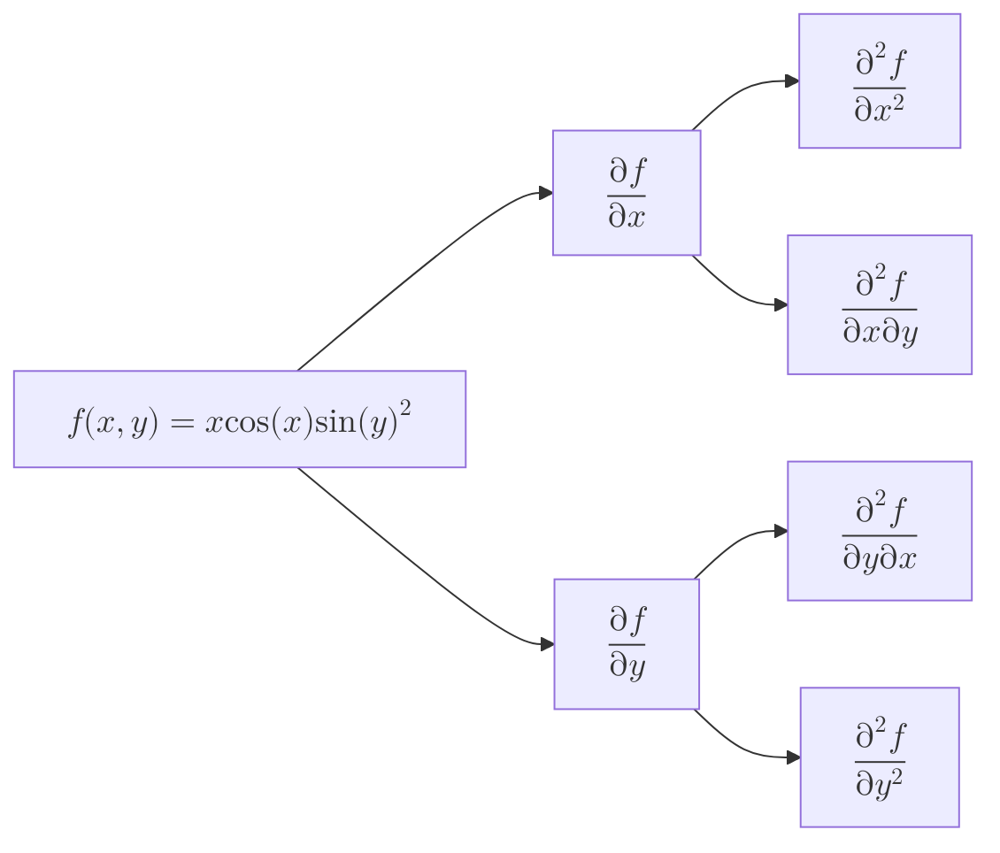

import { Mafs, Coordinates, Plot, Line, Circle, Theme, useMovablePoint, useStopwatch, vec, Vector, LaTeX, Polygon, Transform, labelPi, Point } from "mafs";
import MathEquation from "@site/src/components/Math";
import { useState, useCallback } from "react";
import { lineLabel } from "@site/src/utilities/lines";
import { color, getColorFromMagnitude } from "@site/src/utilities/colors"
import TOCInline from '@theme/TOCInline';
import * as MB from "mathbox-react"
import * as THREE from "three"
import range from "lodash/range"
import { OrbitControls } from "three/examples/jsm/controls/OrbitControls"

# Extending the Derivative

From single-variable calculus, the derivative was defined for functions with a single input and a single output.
There are many functions in mathematics and physics that have multiple inputs and multiple outputs.
In this case, we can extend the concept of the derivative to functions of multiple variables.

## Table of Contents

<TOCInline toc={toc} />

## Partial Derivatives

Recall that one way to conceptualize the derivative is to think: "If I nudge the input a little bit, how much does the output change?"
So, for $f(x)$, you would change $x$ by a small amount $\Delta x$ and see how much $f(x)$ changes.

For functions with multiple inputs, what we can do is nudge each input separately and see how much the output changes.
So, for example, if we have a function $f(x, y)$, we can nudge $x$ by a small amount $\Delta x$ and see how much $f(x, y)$ changes.
This means that we treat $y$ as a constant while we nudge $x$.

This is known as the **partial derivative** of $f$ with respect to $x$, denoted in these ways:

- Leibniz notation: $\pdv{f}{x}$
- Lagrange notation: $f_x$
- Euler notation: $\partial_x f$

It's called a "partial" derivative because we're only considering one input at a time, so it's not a "complete" way to measure the rate of change.

### Example Problem: Evaluating a Simple Partial Derivative

> $f(x, y)$ is defined as follows:
>
> $$
> \begin{equation}
> f(x, y) = (x + y)^2
> \end{equation}
> $$
>
> Find $\pdv{f}{x}(2, 3)$.

We want to evaluate the rate of change of $f$ with respect to $x$ when $x = 2$ and $y = 3$.
So, keeping $y$ constant at $3$, we can differentiate $f(x, y)$ with respect to $x$:

$$
\begin{equation}
\begin{split}
\pdv{f}{x} &= \pdv{}{x} (x + 3)^2 \\
&= 2(x + 3) |_{x = 2} \\
&= 10
\end{split}
\end{equation}
$$

So, $\pdv{f}{x}(2, 3) = 10$.

### Formalizing Partial Derivatives

We can formally define the partial derivative so that it's mathematically rigorous.
Recall the definition of the derivative for a single-variable function:

$$
\begin{equation}
\dv{f}{x}(x) = \lim_{\Delta x \to 0} \frac{f(x + \Delta x) - f(x)}{\Delta x}
\end{equation}
$$

This is essentially a fancy way of calculating the rise over run.

Look at the $f(x + \Delta x)$ term - this is the output when we nudge the input by $\Delta x$.
For a function of multiple variables, we can nudge each input separately.
So, given a function $f(x, y)$, if we want to find the partial derivative with respect to $x$, we nudge $x$ by $\Delta x$ and keep $y$ constant; $f(x + \Delta x, y)$.

Everything else in the definition of the derivative remains the same. So, the partial derivative of $f$ with respect to $x$ is defined as:

$$
\begin{equation}
\pdv{f}{x}(x, y) = \lim_{\Delta x \to 0} \frac{f(x + \Delta x, y) - f(x, y)}{\Delta x}
\end{equation}
$$

## Visualizing Partial Derivatives

Let's visualize the concept of partial derivatives with a simple example.
Consider the function $f(x, y) = x^2 + \sin(y)$.

Suppose we want to find the partial derivative of $f$ with respect to $x$ at the point $(1, 2)$.
This means that $y$ is kept constant at $2$ while we nudge $x$. One way to think of this on a graph is to imagine a slice of the function where $y = 2$.

So first, here's the graph of $f(x, y) = x^2 + \sin(y)$:

<MB.ContainedMathbox
    options={{
        plugins: ["core", "controls", "cursor"],
        controls: {
            klass: OrbitControls,
        },
    }}
    containerStyle={{
        height: "500px"
    }}
>
    <MB.Cartesian
        scale={[
            0.1, 0.1, 0.1
        ]}
    >
        <MB.Axis axis="x" range={[-10, 10]} color={color("blue")} />
        <MB.Axis axis="y" range={[-10, 10]} color={color("green")} />
        <MB.Axis axis="z" range={[-10, 10]} color={color("yellow")} />
        <MB.Area
            id="graph"
            axes="xz"
            expr={(emit, x, z, i, t) => {
                emit(x, x ** 2 + Math.sin(z), z);
            }}
            width={64}
            height={64}
            channels={3}
            rangeX={[-10, 10]}
            rangeY={[-10, 10]}
        />
        <MB.Surface
            points="#graph"
            opacity={0.5}
            color={color("blue")}
        />

        <MB.Array
            items={1}
            id="point"
            data={[[1, 1 + Math.sin(2), 2]]}
            channels={3}
        />
        <MB.Point
            points="#point"
            color={color("red")}
            size={15}
        />
    </MB.Cartesian>
</MB.ContainedMathbox>

If we slice the function at $y = 2$, we get a parabola:

export function VisualizingPartialDerivatives({ variable }) {
    const f = (x, y) => x ** 2 + Math.sin(y);
    return (
        <MB.ContainedMathbox
            options={{
                plugins: ["core", "controls", "cursor"],
                controls: {
                    klass: OrbitControls,
                },
            }}
            containerStyle={{
                height: "500px"
            }}
        >
            <MB.Cartesian
                scale={[
                    0.1, 0.1, 0.1
                ]}
            >
                <MB.Axis axis="x" range={[-10, 10]} color={color("blue")} />
                <MB.Axis axis="y" range={[-10, 10]} color={color("green")} />
                <MB.Axis axis="z" range={[-10, 10]} color={color("yellow")} />
                <MB.Area
                    id="graph"
                    axes="xz"
                    expr={(emit, x, z, i, t) => {
                        {/* emit(x, x ** 2 + 2 ** 2, z); */}
                        emit(x, f(x, z), z);
                    }}
                    width={64}
                    height={64}
                    channels={3}
                    rangeX={variable === "x" ? [-10, 10] : [-10, 1]}
                    rangeY={variable === "x" ? [-10, 2] : [-10, 10]}
                />
                <MB.Surface
                    points="#graph"
                    opacity={0.5}
                    color={color("blue")}
                    zBias={-1}
                    zIndex={-1}
                />

                <MB.Area
                    id="slice_d_input"
                    axes={variable}
                    expr={(emit, x, i, t) => {
                        if (variable === "x") {
                            emit(x, f(x, 2), 2);
                        } else {
                            emit(1, f(1, x), x);
                        }
                    }}
                    width={64}
                    height={64}
                    channels={3}
                    rangeX={[-10, 10]}
                />
                <MB.Line
                    points="#slice_d_input"
                    color={color("red")}
                    width={10}
                />

                <MB.Array
                    items={1}
                    id="point"
                    data={[[1, f(1, 2), 2]]}
                    channels={3}
                />
                <MB.Point
                    points="#point"
                    color={color("red")}
                    size={15}
                />

                <MB.Array
                    items={2}
                    id="d_input"
                    data={variable === "x"
                        ? [[1, f(1, 2), 2], [2, f(1, 2), 2]]
                        : [[1, f(1, 2), 2], [1, f(1, 2), 3]]
                    }
                    channels={3}
                />
                <MB.Vector
                    points="#d_input"
                    color={color("green")}
                    width={5}
                    end={true}
                />
                <MB.Array
                    items={2}
                    id="dz"
                    data={variable === "x"
                        ? [[2, f(1, 2), 2], [2, f(2, 2), 2]]
                        : [[1, f(1, 2), 3], [1, f(1, 3), 3]]
                    }
                    channels={3}
                />
                <MB.Vector
                    points="#dz"
                    color={color("green")}
                    width={5}
                    end={true}
                />
            </MB.Cartesian>
        </MB.ContainedMathbox>
    )
}

<VisualizingPartialDerivatives variable="x" />

Then, the nudge in $x$ can be represented by an arrow on the graph. We can compute the partial derivative by finding the derivative of this slice at the point $(1, 2)$:

$$
\begin{equation}
\begin{split}
\pdv{f}{x} &= \pdv{}{x} (x^2 + \sin(2)) \\
&= 2x |_{x = 1} \\
&= 2
\end{split}
\end{equation}
$$

Likewise, we can slice the function in the $y$-direction to find the partial derivative with respect to $y$:

<VisualizingPartialDerivatives variable="y" />

The partial derivative with respect to $y$ at $(1, 2)$ is:

$$
\begin{equation}
\begin{split}
\pdv{f}{y} &= \pdv{}{y} (1^2 + \sin(y)) |_{y = 2} \\
&= \cos(y) |_{y = 2} \\
&= \cos(2)
\end{split}
\end{equation}
$$

## Second Partial Derivatives

We can take multiple partial derivatives of a function.

Consider the following function:

$$
\begin{equation}
f(x, y) = x\cos(x)\sin(y)^2
\end{equation}
$$

There are two partial derivatives, and for each of them, there are two more second partial derivatives.
Recall that the notation for a second normal derivative, at least in Leibniz notation, is $\dv[2]{f}{x}$.
For a second partial derivative:

- If it's the same variable for both derivatives, we write $\pdv[2]{f}{x}$.
- If it's different variables (say $x$ then $y$), we write it as sort of an expansion of $\pdv{y}(\pdv{f}{x})$, which is $\pdv{f}{y}{x}$.

We can show the different derivatives using a tree.

Let's first compute the first partial derivatives of $f(x, y)$. The things kept constant are shown in different colors to help understand the computation.

$$
\begin{equation}
\begin{split}
\pdv{f}{x} &= \pdv{}{x} (x\cos(x)\class{yellow}{\sin(y)^2}) \\
&= (\cos(x) - x\sin(x))\class{yellow}{\sin(y)^2} \\
&= \cos(x)\class{yellow}{\sin(y)^2} - x\sin(x)\class{yellow}{\sin(y)^2}
\end{split}
\end{equation}
$$

And the partial derivative with respect to $y$:

$$
\begin{equation}
\begin{split}
\pdv{f}{y} &= \pdv{}{y} (\class{blue}{x\cos(x)}\sin(y)^2) \\
&= 2\class{blue}{x\cos(x)}\sin(y)\cos(y)
\end{split}
\end{equation}
$$

Now, let's compute the second partial derivatives.

| Derivative | Computation |
|------------|-------------|
| $\pdv[2]{f}{x}$ | $(-2\sin(x) - x\cos(x))\sin(y)^2$ |
| $\pdv[2]{f}{y}$ | $2x\cos(x)(\cos(y)^2 - \sin(y)^2)$ |
| $\pdv{f}{y}{x}$ | $2\cos(x)\sin(y)\cos(y)$ |
| $\pdv{f}{x}{y}$ | $2\cos(x)\sin(y)\cos(y)$ |

Notice something interesting: $\pdv{f}{y}{x} = \pdv{f}{x}{y}$. This is a property that certain functions have, called the Symmetry of Second Derivatives.

There's a formal definition for this property called Schwarz's Theorem, which states that if the second partial derivatives of a function are continuous in a region, then the mixed partial derivatives are equal.
This theorem is discussed in the appendix.

## The Gradient

There's a few ways to think about the gradient of a function.

Purely computationally, the gradient is essentially a collection of all the partial derivatives of a function.

So for a function $f(x, y)$, the gradient is:

$$
\begin{equation}
\text{grad}(f) = \mqty[ \pdv{f}{x} \\ \pdv{f}{y} ]
\end{equation}
$$

Consider the function $f(x, y) = x^2 + 2y$. The gradient of $f$ is then:

$$
\begin{equation}
\text{grad}(f) = \mqty[ \pdv{f}{x} \\ \pdv{f}{y} ] = \mqty[ 2x \\ 2 ]
\end{equation}
$$

The gradient is often denoted as $\nabla f$, which is pronounced "nabla f" or "del f".

Hence, to create a more general definition, we can define the gradient of a function $f: \mathbb{R}^n \to \mathbb{R}$ as:

$$
\begin{equation}
\nabla f(x_1, x_2, \ldots, x_n) = \mqty[ \pdv{f}{x_1} \\ \pdv{f}{x_2} \\ \vdots \\ \pdv{f}{x_n} ]
\end{equation}
$$

Notice that the gradient is a vector, and its dimensions match the number of inputs to the function.
In terms of basis vectors, the gradient can be written as:

$$
\begin{equation}
\nabla f = \pdv{f}{x_1} \vu{e}_1 + \pdv{f}{x_2} \vu{e}_2 + \ldots + \pdv{f}{x_n} \vu{e}_n = \sum_{i=1}^{n} \pdv{f}{x_i} \vu{e}_i
\end{equation}
$$

Recall that the partial derivative is an "incomplete" way to measure the rate of change.
In this sense, the gradient can be thought of as the "full" derivative of a function of multiple variables.

### The Nabla

One convenient way to think about the gradient is to consider the symbol $\nabla$ as a vector of partial derivative operators.
It's easier to understand this with an example. For a function $f(x, y, z)$, $\nabla$ is:

$$
\begin{equation}
\nabla = \mqty[ \pdv{}{x} \\ \pdv{}{y} \\ \pdv{}{z} ]
\end{equation}
$$

Then, the gradient of $f$ is simply a vector multiplication:

$$
\begin{equation}
\nabla f = \mqty[ \pdv{}{x} \\ \pdv{}{y} \\ \pdv{}{z} ] f = \mqty[ \pdv{f}{x} \\ \pdv{f}{y} \\ \pdv{f}{z} ]
\end{equation}
$$

### Gradients in the Context of Graphs

Outside of the computational context, there's a graphical way to think about the gradient.
Consider this simple function $f(x, y) = x^2 + y^2$, and its gradient:

$$
\begin{equation}
\nabla f = \mqty [ \pdv{f}{x} \\ \pdv{f}{y} ] = \mqty[ 2x \\ 2y ]
\end{equation}
$$

We can plot this as a vector field.

<MB.ContainedMathbox
    options={{
        plugins: ["core", "controls", "cursor"],
        controls: {
            klass: OrbitControls,
        },
    }}
    containerStyle={{
        height: "500px"
    }}
>
    <MB.Cartesian
        scale={[
            0.1, 0.1, 0.1
        ]}
    >
        <MB.Axis axis="x" range={[-10, 10]} color={color("blue")} />
        <MB.Axis axis="y" range={[-10, 10]} color={color("green")} />
        <MB.Axis axis="z" range={[-10, 10]} color={color("yellow")} />
        <MB.Area
            id="graph"
            axes="xz"
            expr={(emit, x, z, i, t) => {
                emit(x, x ** 2 + z ** 2, z);
            }}
            width={64}
            height={64}
            channels={3}
            rangeX={[-10, 10]}
            rangeY={[-10, 10]}
        />
        <MB.Surface
            points="#graph"
            opacity={0.5}
            color={color("blue")}
            zBias={-1}
            zIndex={-1}
        />

        <MB.Area
            id="gradient_field"
            axes="xy"
            expr={(emit, x, y, i, t) => {
                // the original point
                emit(x, 0, y);
                // gradient
                {/* emit(x + 2 * x, 0, y + 2 * y); */}
                const gradient = [2 * x, 2 * y];
                const normalized = vec.normalize(gradient);
                emit(x + normalized[0], 0, y + normalized[1]);
            }}
            items={2}
            width={20}
            height={20}
            channels={3}
            rangeX={[-10, 10]}
            rangeY={[-10, 10]}
        />
        <MB.Area
            id="gradient_field_colors"
            axes="xy"
            expr={(emit, x, y, i, t) => {
                const gradient = [2 * x, 2 * y];
                const mag = vec.mag(gradient);

                const [r, g, b] = getColorFromMagnitude(mag, 0, 20);
                emit(r, g, b, 1.0);
            }}
            width={20}
            height={20}
            channels={4}
            rangeX={[-10, 10]}
            rangeY={[-10, 10]}
        />
        <MB.Vector
            points="#gradient_field"
            colors="#gradient_field_colors"
            width={5}
            end={true}
        />
    </MB.Cartesian>

</MB.ContainedMathbox>

In this graph, the gradient is represented as a vector field, more commonly known as a "gradient field".

One thing to note is that the gradient points in the "direction of the steepest ascent" of the function.
So if you were to walk along the surface of the function, you would be walking in the direction where the function increases the fastest.
This is not immediately obvious, but will become more apparent in light of directional derivatives.

### Gradient in Contour Plots

It's important to understand how the gradient relates to contour plots.

Consider the function $f(x, y) = xy/2$. The contour plot of this function is:

<Mafs>
    <Coordinates.Cartesian />
    {range(-10, 10, 0.5).map(i => (
        // Solve for f(x, y) = i
        // Which is xy/2 = i ==> y = 2i/x
        <Plot.OfX y={(x) => 2 * i / x} key={i} />
    ))}
</Mafs>

The gradient of $f$ is:

$$
\begin{equation}
\nabla f = \mqty[ \pdv{f}{x} \\ \pdv{f}{y} ] = \mqty[ \frac{y}{2} \\ \frac{x}{2} ]
\end{equation}
$$

Like before, we can plot this as a gradient field along with the contour plot:

<Mafs>
    <Coordinates.Cartesian />
    {range(-10, 10, 0.5).map(i => (
        // Solve for f(x, y) = i
        // Which is xy/2 = i ==> y = 2i/x
        <Plot.OfX y={(x) => 2 * i / x} opacity={0.5} key={i} />
    ))}
    <Plot.VectorField
        xy={([x, y]) => [y / 2, x / 2]}
        step={0.5}
    />
</Mafs>

The important thing to notice is that the vector appears to point perpendicular to the contour lines.
To see why this is the case, zoom in on 2 contour lines:

<Mafs
    viewBox={{
        x: [1, 2],
        y: [1, 1.5]
    }}
>
    <Coordinates.Cartesian />
    <Plot.OfX y={(x) => 2 * 1 / x} />
    <LaTeX tex="f = 1" at={[2, 0.9]} />
    <Plot.OfX y={(x) => 2 * 1.1 / x} />
    <LaTeX tex="f = 1.1" at={[2, 1.25]} />
    <Vector
        tail={[2, 1]}
        tip={[2.05, 2 * 1.1 / 2.05]}
    />
</Mafs>

Recall that the gradient points in the direction of the steepest ascent.
Instead of thinking of the steepest ascent, consider which direction the function increases from $1$ to $1.1$ in the shortest distance.
This is essentially considering the shortest path between the two contour lines.
Since the contour lines are almost parallel to each other, the gradient vector will be perpendicular to the contour lines.

## The Directional Derivative

The directional derivative is somewhat of an extension or generalization of the partial derivative.

Consider a function $f(x, y)$ that outputs a single value.
It can be thought of as mapping a point in a 2D plane to a point in a number line.

When we consider the partial derivative with respect to $x$, we consider a change in $x$, and likewise for $y$.

<Mafs>
    <Coordinates.Cartesian
        xAxis={{ lines: false }}
        yAxis={{ lines: false }}
    />
    <Transform translate={[1, 1]}>
        <Point x={0} y={0} />
        <Vector tail={[0, 0]} tip={[1, 0]} />
        <LaTeX tex="\Delta x" at={[0.5, -0.5]} />

        <Vector tail={[0, 0]} tip={[0, 1]} />
        <LaTeX tex="\Delta y" at={[-0.5, 0.5]} />
    </Transform>
</Mafs>

Now, instead of thinking of these individually, consider a change in both $x$ and $y$ at the same time.
For instance, if $x$ and $y$ incremented by some vector $\va{v}$, how much would $f$ change?

Recall that the derivative takes a limit as this change approaches $0$.
So instead of thinking about an actual vector $\va{v}$, we're really thinking about some $h \va{v}$ where $h \to 0$.

For instance, consider this vector:

$$
\begin{equation}
\va{v} = \mqty[ 1 \\ -2 ]
\end{equation}
$$

Since we're considering $h \va{v}$, we can think of this as:

$$
\begin{equation}
h \va{v} = \mqty[ h \\ -2h ]
\end{equation}
$$

It can be thought of as a nudge in the $x$ direction and negative two nudges in the $y$ direction.
The notation for this includes:

- $\nabla_{\va{v}} f$
- $D_{\va{v}} f$
- $\pdv{f}{\va{v}}$
- $\partial_{\va{v}} f$

To evaluate this directional derivative, we can use a combination of partial derivatives based on the components of $\va{v}$:

$$
\begin{equation}
\begin{split}
\nabla_{\va{v}} f &= \pdv{f}{x} v_x + \pdv{f}{y} v_y \\
&= \pdv{f}{x} - 2\pdv{f}{y}
\end{split}
\end{equation}
$$

Notice that this resembles the dot product of the gradient and $\va{v}$:

$$
\begin{equation}
\nabla_{\va{v}} f = \nabla f \cdot \va{v} = \mqty[ \pdv{f}{x} \\ \pdv{f}{y} ] \cdot \mqty[ v_x \\ v_y ]
\end{equation}
$$

In order for the directional derivative to be the slope of the tangent line, then the vector $\va{v}$ must be a unit vector.
Otherwise, it would be scaled by the magnitude of $\va{v}$.

### Formalizing the Directional Derivative

We can formalize the directional derivative as a limit.
Recall that the partial derivative is defined as:

$$
\begin{equation}
\pdv{f}{x}(x, y) = \lim_{\Delta x \to 0} \frac{f(x + \Delta x, y) - f(x, y)}{\Delta x}
\end{equation}
$$

We can switch up the notation a bit to make it more general.
Instead of $x$ and $y$, we can use a vector $\va{w}$ as the input to $f$.
Then, the partial derivative is:

$$
\begin{equation}
\pdv{f}{x}(\va{w}) = \lim_{h \to 0} \frac{f(\va{w} + h\vu{i}) - f(\va{w})}{h}
\end{equation}
$$

Notice that our change in $x$ is now $h\vu{i}$, where $\vu{i}$ is the unit vector in the $x$ direction.
The reason we use this notation is to make it much easier to extend - all the information about the direction of the change is contained in $\vu{i}$, so we can easily change the direction of the derivative.

So, the directional derivative is defined as:

$$
\begin{equation}
\nabla_{\va{v}} f(\va{w}) = \lim_{h \to 0} \frac{f(\va{w} + h\va{v}) - f(\va{w})}{h}
\end{equation}
$$

To visualize a directional derivative, consider once again, the input space of $f(x, y)$, which is a 2D plane.
Instead of the input being $(x, y)$, we can think of it as a vector $\va{w}$.
Then, the directional derivative is the rate of change of $f$ at $\va{w}$ in the direction of $\va{v}$:

<Mafs>
    <Coordinates.Cartesian
        xAxis={{ lines: false }}
        yAxis={{ lines: false }}
    />
    <Vector tip={[1, 1]} />
    <Transform translate={[1, 1]}>
        <Point x={0} y={0} />
        <LaTeX tex="\mathbf{\vec{w}}" at={[0, 0.5]} />
        <Vector tail={[0, 0]} tip={[1, -2]} color={color("yellow")} />
        <LaTeX tex="h\mathbf{\vec{v}}" at={lineLabel([0, 0], [1, -2], "left")} color={color("yellow")} />
    </Transform>
</Mafs>

### The Directional Derivative in the Context of Graphs

Recall that the partial derivative can be visualized as a slice of a surface in a 3D graph.
This slice can take two directions, $x$ and $y$.

In a similar way, the directional derivative can be visualized as a slice of the surface in a direction $\va{v}$.

Consider the following function:

$$
\begin{equation}
f(x, y) = xy^2
\end{equation}
$$

Suppose we want to find the directional derivative of $f$ at the point $(1, 2)$ in the direction of $\va{v} = \mqty[ 1 \\ 1 ]$.

Since derivatives are graphically represented as slopes, we need to make $\va{v}$ a unit vector. Hence:

$$
\begin{equation}
\va{v} = \frac{1}{\sqrt{2}} \mqty[ 1 \\ 1 ] = \mqty[ \frac{1}{\sqrt{2}} \\ \frac{1}{\sqrt{2}} ] = \mqty[ \frac{\sqrt{2}}{2} \\ \frac{\sqrt{2}}{2} ]
\end{equation}
$$

Let's slice the graph of $f(x, y) = xy^2$ at $x = 1, y = 2$, with the direction of $\va{v}$:

<MB.ContainedMathbox
    options={{
        plugins: ["core", "controls", "cursor"],
        controls: {
            klass: OrbitControls,
        },
    }}
    containerStyle={{
        height: "500px"
    }}
>

    <MB.Cartesian
        scale={[
            0.1, 0.1, 0.1
        ]}
    >
        <MB.Axis axis="x" range={[-10, 10]} color={color("blue")} />
        <MB.Axis axis="y" range={[-10, 10]} color={color("green")} />
        <MB.Axis axis="z" range={[-10, 10]} color={color("yellow")} />
        <MB.Area
            id="graph"
            axes="xz"
            expr={(emit, x, z, i, t) => {
                // check if x/z are within the slice
                // equation for slice line is x - y = -1
                if (x - z < -1) {
                    return;
                }
                emit(x, x * z ** 2, z);
            }}
            width={64}
            height={64}
            channels={3}
            rangeX={[-10, 10]}
            rangeY={[-10, 10]}
        />
        <MB.Surface
            points="#graph"
            opacity={0.5}
            color={color("blue")}
            zBias={-1}
            zIndex={-1}
        />

        <MB.Area
            id="slice_d_input"
            axes="xy"
            expr={(emit, x, y, i, t) => {
                const w = [1, 2];
                const distX = x - w[0];
                const newY = w[1] + distX;
                emit(x, x * newY ** 2, newY);
            }}
            width={64}
            height={64}
            channels={3}
            rangeX={[-10, 10]}
        />
        <MB.Line
            points="#slice_d_input"
            color={color("red")}
            width={10}
        />

        <MB.Array
            items={1}
            id="point"
            data={[[1, 4, 2]]}
            channels={3}
        />
        <MB.Point
            points="#point"
            color={color("red")}
            size={15}
        />

        <MB.Array
            items={2}
            id="d_input"
            data={[[1, 4, 2], [1 + Math.sqrt(2) / 2, 12.51, 2 + Math.sqrt(2) / 2]]}
            channels={3}
        />
        <MB.Vector
            points="#d_input"
            color={color("green")}
            width={5}
            end={true}
            zBias={1}
        />
    </MB.Cartesian>
</MB.ContainedMathbox>

We can evaluate the directional derivative by first finding the gradient of $f$ at $(1, 2)$:

$$
\begin{equation}
\begin{split}
\nabla f &= \mqty[ \pdv{f}{x} \\ \pdv{f}{y} ] \\
&= \mqty[ y^2 \\ 2xy ]
\end{split}
\end{equation}
$$

Recall that the directional derivative is the dot product of the gradient and $\va{v}$:

$$
\begin{equation}
\nabla_{\va{v}} f = \nabla f \cdot \va{v} = \mqty[ 4 \\ 4 ] \cdot \mqty[ \frac{\sqrt{2}}{2} \\ \frac{\sqrt{2}}{2} ] = 4\sqrt{2}
\end{equation}
$$

To illustrate why the vector has to be a unit vector, consider the same directional derivative but with a different magnitude $\va{v} = [1, 1]$:

$$
\begin{equation}
\nabla_{\va{v}} f = \nabla f \cdot \va{v} = \mqty[ 4 \\ 4 ] \cdot \mqty[ 1 \\ 1 ] = 8
\end{equation}
$$

Therefore, the slope can be defined as the rate of change of the function in the direction of the _unit vector_ $\va{v}$:

$$
\begin{equation}
\text{slope} = \frac{\nabla_{\va{v}} f}{\norm{\va{v}}} = \frac{\nabla f \cdot \va{v}}{\norm{\va{v}}}
\end{equation}
$$

### The Gradient and the Directional Derivative

Recall the definition for the directional derivative:

$$
\begin{equation}
\nabla_{\va{v}} f = \nabla f \cdot \va{v}
\end{equation}
$$

Let's assume $\va{v}$ is a unit vector.
Then, consider the direction of the steepest ascent at some point $(x, y)$.
This can be thought of as finding a $\va{v}$ that maximizes $\nabla f(x, y) \cdot \va{v}$ for all $\norm{\va{v}} = 1$.

Let's once again consider the input space of $f(x, y)$, which is a 2D plane.

Recall that the dot product of two vectors $\va{a}$ and $\va{b}$ is equal to:

$$
\begin{equation}
\va{a} \cdot \va{b} = \class{red}{\text{Projection of } \va{a} \text{ onto } \va{b}} \times \text{Magnitude of } \va{b}
\end{equation}
$$

export function TheGradientAndTheDirectionalDerivative() {
    const radius = 1;
    const point = useMovablePoint([1, 0], {
        constrain: ([x, y]) => {
            const angle = Math.atan2(y, x);
            return [radius * Math.cos(angle), radius * Math.sin(angle)];
        },
    });

    const grad = [2, 3]; // arbitrary
    const projected = vec.withMag(grad, vec.dot(grad, point.point) / vec.mag(grad));

    return (
        <Mafs>
            <Coordinates.Cartesian
                xAxis={{ lines: false }}
                yAxis={{ lines: false }}
            />
            <Vector tip={point.point} />
            <LaTeX tex="\mathbf{\vec{v}}" at={lineLabel([0, 0], point.point, "right")} />

            <Vector tip={[2, 3]} />
            <LaTeX tex="\nabla f" at={lineLabel([0, 0], [2, 3], "right")} />
            <Vector tip={projected} color={color("red")} />

            <Line.Segment point1={point.point} point2={projected} style="dashed" />

            {point.element}
        </Mafs>
    )
}

<TheGradientAndTheDirectionalDerivative />

Therefore, to maximize the dot product, the projection of $\nabla f$ onto $\va{v}$ must be maximized, which means that $\va{v}$ must be in the direction of $\nabla f$.
Hence:

$$
\begin{equation}
\max_{\norm{\va{v}} = 1} \nabla f \cdot \va{v} = \underbrace{\frac{\nabla f}{\norm{\nabla f}}}_{\va{w}}
\end{equation}
$$

This means:

$$
\begin{equation}
\nabla_{\va{w}} f = \nabla f \cdot \va{w} = \frac{\nabla f \cdot \nabla f}{\norm{\nabla f}} = \frac{\norm{\nabla f}^2}{\norm{\nabla f}} = \norm{\nabla f}
\end{equation}
$$

One important takeaway is that the gradient is a tool that can be used in conjunction with other things to analyze the behavior of a function.
