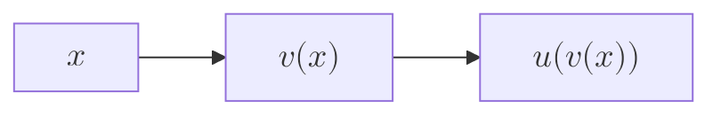
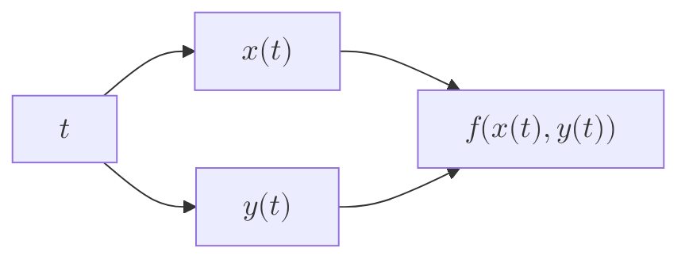

import { useMovablePoint, useStopwatch, vec } from "mafs";
import { useState, useRef, useCallback, useMemo, memo, Fragment } from "react";
import { lineLabel } from "@site/src/utilities/lines";
import { color, getColorFromMagnitude, gradient } from "@site/src/utilities/colors"
import TOCInline from '@theme/TOCInline';
import * as MB from "mathbox-react"
import * as THREE from "three"
import range from "lodash/range"
import { OrbitControls } from "three/examples/jsm/controls/OrbitControls"
import { easeInOutCubic } from "js-easing-functions";

# Multivariable Chain Rule

The chain rule is a fundamental concept in calculus, and it can be extended to multivariable functions.

## Table of Contents

<TOCInline toc={toc} />

## Definition

Consider a function $f(x, y)$ and a pair of functions $x(t)$ and $y(t)$.

Then, consider applying $f$ to both:

$$
\begin{equation}
f(x(t), y(t))
\end{equation}
$$

This can be thought of as a series of transformations:

1. Start with a number line for $t$.
2. Transform to a plane with $x(t), y(t)$.
3. Transform to a number line with $f$.

Notice how, although a plane is involved, it still starts with a single number and ends with a single number.
Therefore, it is still a single-variable function.

Next, consider taking the derivative of $f(x(t), y(t))$. To do so, we can apply the chain rule.

We can start with an example:

$$
\begin{align}
f(x, y) &= xy^2 \\
x(t) &= \sin(t) \\
y(t) &= \cos(t)
\end{align}
$$

Then, consider the derivative of $f(x(t), y(t))$:

$$
\begin{equation}
\begin{split}
\dv{t} f(x(t), y(t)) &= \dv{t} f(\class{blue}{\sin(t)}, \class{yellow}{\cos(t)}) \\
&= \dv{t} (\class{blue}{\sin(t)} \cdot \class{yellow}{\cos(t)}^2) \\
&= \class{blue}{\cos(t)}\class{yellow}{\cos^2(t)} + \class{yellow}{2\cos(t)(-\sin(t))}\class{blue}{\sin(t)}
\end{split}
\end{equation}
$$

This is fine, but there's a more general way to think about this.

Consider the partial derivatives of $f$:

$$
\begin{align}
\pdv{f}{x} &= y^2 = \cos^2(t) \\
\pdv{f}{y} &= 2xy = 2\sin(t)\cos(t)
\end{align}
$$

Next, consider the derivative of each function $x(t)$ and $y(t)$:

$$
\begin{align}
\dv{x}{t} &= \cos(t) \\
\dv{y}{t} &= -\sin(t)
\end{align}
$$

Notice that the derivative of $f(x(t), y(t))$ can be written as:

$$
\begin{equation}
\begin{split}
\dv{t} f(x(t), y(t)) &= \underbrace{\cos^2(t)}_{\small \displaystyle \pdv{f}{x}}\overbrace{\cos(t)}^{\small \displaystyle \dv{x}{t}} + \underbrace{2\cos(t)\sin(t)}_{\small \displaystyle \pdv{f}{y}}\overbrace{(-\sin(t))}^{\small \displaystyle \dv{y}{t}} \\
&= \pdv{f}{x}\dv{x}{t} + \pdv{f}{y}\dv{y}{t}
\end{split}
\end{equation}
$$

This is known as the multivariable chain rule.

## Intuition for the Multivariable Chain Rule

We've just used one example and noticed a (possibly coincidental) pattern, but this should also make intuitive sense.

First, recall the intuition for the regular chain rule.

Consider a function $u(v(x))$. This is essentially two transformations:

1. Start with a number line for $x$.
2. Transform to a number line with $v(x)$.
3. Transform to a number line with $u(v(x))$.

Now, consider a change in $x$, $\dd{x}$, and consider how the change sort of "propagates" through the transformations:

1. The change in $x$ is $\dd{x}$.
2. The change in $v(x)$ is $\dv{v}{x}\dd{x}$, since the fraction essentially cancels out.
3. The change in $u(v(x))$ is $\dv{u}{v}\dd{v}$.

Then:

$$
\begin{equation}
\dd{u} = \dv{u}{v}\dv{v}{x}\dd{x}
\end{equation}
$$

And dividing by $\dd{x}$ gives the chain rule.

Let's extend this intuition to the multivariable case.

1. You start with a number line for $t$. The change in $t$ is $\dd{t}$.
2. The change in $t$ causes a change in $x$ and $y$. The change in $x$ is $\dv{x}{t}\dd{t}$ and the change in $y$ is $\dv{y}{t}\dd{t}$, due to the cancelling of differentials.
3. Both of these changes result in a change in $f(x, y)$. You could think of this as the sum of a change in $f$ due to a change in $x$ and a change in $f$ due to a change in $y$.
    - The change in $f$ due to a change in $x$ is $\pdv{f}{x}\dd{x}$.
    - The change in $f$ due to a change in $y$ is $\pdv{f}{y}\dd{y}$.

Then:

$$
\begin{equation}
\begin{split}
\dd{f} &= \pdv{f}{x}\dd{x} + \pdv{f}{y}\dd{y} \\
&= \pdv{f}{x}\dv{x}{t}\dd{t} + \pdv{f}{y}\dv{y}{t}\dd{t}
\end{split}
\end{equation}
$$

And dividing by $\dd{t}$ gives:

$$
\begin{equation}
\dv{f}{t} = \pdv{f}{x}\dv{x}{t} + \pdv{f}{y}\dv{y}{t}
\end{equation}
$$

## Vector Form of the Multivariable Chain Rule

The multivariable chain rule can be written in vector form.

We've used $f(x(t), y(t))$ as separate parameters, but we can also think of $f$ as a function that takes a vector $\va{r}(t)$ as input.

The vector $\va{r}(t)$ can be written as:

$$
\begin{equation}
\va{r}(t) = \mqty[ x(t) \\ y(t) ]
\end{equation}
$$

Then, the derivative of $\va{r}(t)$ can be written as:

$$
\begin{equation}
\dv{\va{r}}{t} = \mqty[ \dv{x}{t} \\ \dv{y}{t} ]
\end{equation}
$$

Recall the multivariable chain rule:

$$
\begin{equation}
\dv{f}{t} = \pdv{f}{x}\dv{x}{t} + \pdv{f}{y}\dv{y}{t}
\end{equation}
$$

Notice that this is basically a dot product:

$$
\begin{equation}
\begin{split}
\dv{f}{t} &= \class{red}{\pdv{f}{x}}\class{blue}{\dv{x}{t}} + \class{red}{\pdv{f}{y}}\class{blue}{\dv{y}{t}} \\
&= \class{red}{\mqty[ \pdv{f}{x} \\ \pdv{f}{y} ]} \cdot \class{blue}{\mqty[ \dv{x}{t} \\ \dv{y}{t} ]} \\
&= \class{red}{\grad{f}(\va{r}(t))} \cdot \class{blue}{\dv{\va{r}}{t}}
\end{split}
\end{equation}
$$

This should also make intuitive sense, as it is very similar to the regular chain rule:

$$
\begin{equation}
\dv{u}{t} = \dv{u}{v}\dv{v}{t} \iff \dv{f}{t} = \grad{f}(\va{r}(t)) \cdot \dv{\va{r}}{t}
\end{equation}
$$

- $\dv{u}{v}$ corresponds to $\grad{f}(\va{r}(t))$; the gradient is sort of an extension of the full derivative.
- $\dv{v}{t}$ corresponds to $\dv{\va{r}}{t}$.

## Duality of the Multivariable Chain Rule and the Directional Derivative

One thing to notice is that the multivariable chain rule looks very similar to the directional derivative.

Recall the directional derivative:

$$
\begin{equation}
\grad_{\va{w}}{f} = \grad{f} \cdot \va{w}
\end{equation}
$$

And the vector-form multivariable chain rule:

$$
\begin{equation}
\dv{f}{t} = \grad{f}(\va{r}(t)) \cdot \dv{\va{r}}{t}
\end{equation}
$$

The vector-form rule is essentially the directional derivative of $f$ in the direction of $\dv{\va{r}}{t}$:

$$
\begin{equation}
\dv{f}{t} = \grad_{\dv{\va{r}}{t}}{f}
\end{equation}
$$

Consider why this is the case. Recall that the composition of functions can be thought of as a series of transformations:

1. Start with a number line for $t$.
2. Transform to a plane with $x(t), y(t)$.
3. Transform to a number line with $f$.

When you increment a value by a vector in the plane, and measure the change in $f$, that's a directional derivative.

The vector in question is caused by the change in $t$. So, the directional derivative is in the direction of $\dv{\va{r}}{t}$.

## Formalizing the Multivariable Chain Rule

We have shown various ways to intuitively think about the multivariable chain rule, but let's treat it more formally now.

Recall that we used the cancellation of differentials to derive the chain rule.
This is not rigorous, but it is still helpful because it very closely resembles the formal treatment.

Recall the vector form of the multivariable chain rule:

$$
\begin{equation}
\dv{f}{t}(\va{r}(t)) = \grad{f}(\va{r}(t)) \cdot \dv{\va{r}}{t}
\end{equation}
$$

And the limit definition of the derivative (since this is a single-variable function):

$$
\begin{equation}
\dv{f}{t}(\class{blue}{\va{r}(t)}) = \lim_{\Delta t \to 0} \frac{f(\class{blue}{\va{r}}(t + \Delta t)) - f(\class{blue}{\va{r}}(t))}{\Delta t}
\end{equation}
$$

Recall our intuition for the chain rule: the change in $f$ is based on the change in $\va{r}$, which is based on the change in $t$.
As such, consider the derivative of $\va{r}$:

$$
\begin{equation}
\dv{\va{r}}{t} = \lim_{\Delta t \to 0} \frac{\va{r}(t + \Delta t) - \va{r}(t)}{\Delta t}
\end{equation}
$$

Now we're going to do something that might be unfamiliar, but we're going to rewrite the limit as a sum of two terms:

$$
\begin{equation}
\dv{\va{r}}{t} = \frac{\va{r}(t + \Delta t) - \va{r}(t)}{\Delta t} + \epsilon(\Delta t)
\end{equation}
$$

The $\epsilon(\Delta t)$ term represents the error term, which is the difference between the limit and the actual value.
It should approach zero as $\Delta t$ approaches zero.
This is common in epsilon-delta proofs in real analysis.

Multiply both sides by $\Delta t$:

$$
\begin{equation}
\dv{\va{r}}{t} \Delta t = \va{r}(t + \Delta t) - \va{r}(t) + \Delta t\epsilon(\Delta t)
\end{equation}
$$

Rewrite $\Delta t\epsilon(\Delta t)$ as $\va{o}(\Delta t)$.
This is a common notation in analysis, and all it represents is that $\frac{\norm{\va{o}(\Delta t)}}{\Delta t} \to 0$ as $\Delta t \to 0$.

Then, rewrite $\va{r}(t + \Delta t)$ as:

$$
\begin{equation}
\va{r}(t + \Delta t) = \va{r}(t) + \dv{\va{r}}{t}(t) \Delta t + \va{o}(\Delta t)
\end{equation}
$$

This is based on the definition of the derivative as a slope. We apply the slope to $\Delta t$ to get the change in $\va{r}$, and then add the error term.

Substitute this back into the definition of the derivative of $f$:

$$
\begin{equation}
\begin{split}
\dv{f}{t}(\va{r}(t)) &= \lim_{\Delta t \to 0} \frac{f(\va{r}(t + \Delta t)) - f(\va{r}(t))}{\Delta t} \\
&= \lim_{\Delta t \to 0} \frac{f(\va{r}(t) + \dv{\va{r}}{t}(t) \Delta t + \va{o}(\Delta t)) - f(\va{r}(t))}{\Delta t}
\end{split}
\end{equation}
$$

Since $\Delta t \to 0$ and $\va{o}(\Delta t)$ is small, we can cancel out the $\va{o}(\Delta t)$ term:

$$
\begin{equation}
\dv{f}{t}(\va{r}(t)) = \lim_{\Delta t \to 0} \frac{f(\va{r}(t) + \dv{\va{r}}{t}(t) \Delta t) - f(\va{r}(t))}{\Delta t}
\end{equation}
$$

Finally, recall the definition of the directional derivative:

$$
\begin{equation}
\grad_{\class{blue}{\va{v}}}{f(\class{yellow}{\va{a}})} = \lim_{h \to 0} \frac{f(\class{yellow}{\va{a}} + h\class{blue}{\va{v}}) - f(\class{yellow}{\va{a}})}{h}
\end{equation}
$$

Looks familiar? The multivariable chain rule is essentially the directional derivative of $f$ in the direction of $\dv{\va{r}}{t}$:

$$
\begin{equation}
\begin{split}
\dv{f}{t}(\class{yellow}{\va{r}(t)}) &= \lim_{\Delta t \to 0} \frac{f(\class{yellow}{\va{r}(t)} + \class{blue}{\dv{\va{r}}{t}(t)} \Delta t) - f(\class{yellow}{\va{r}(t)})}{\Delta t} \\
&= \grad_{\class{blue}{\dv{\va{r}}{t}}}{f(\class{yellow}{\va{r}(t)})} = \grad{f}(\va{r}(t)) \cdot \dv{\va{r}}{t}
\end{split}
\end{equation}
$$

This also illustrates the power of using vectors, as well as an interplay between intuition and formalization - our entire manipulation was to evaluate the different nudges in a formal way.
