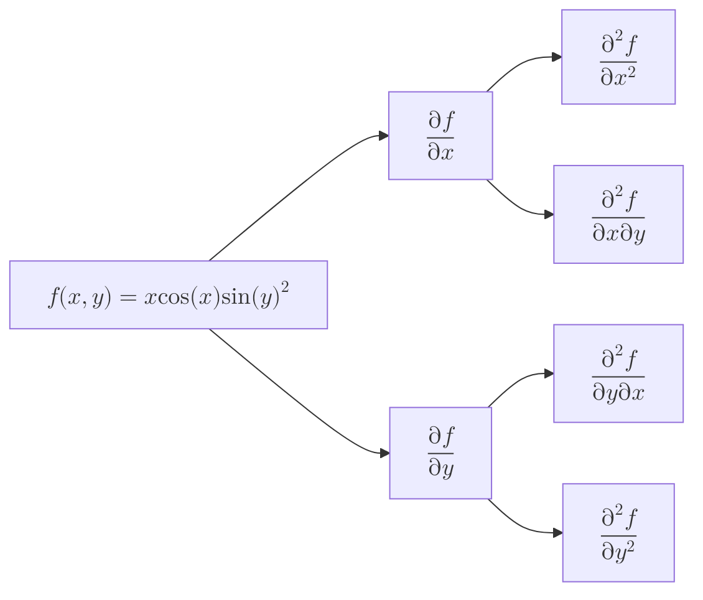

import { useMovablePoint, useStopwatch, vec } from "mafs";
import { useState, useRef, useCallback, useMemo, memo, Fragment } from "react";
import { lineLabel } from "@site/src/utilities/lines";
import { color, getColorFromMagnitude, gradient } from "@site/src/utilities/colors"
import TOCInline from '@theme/TOCInline';
import * as MB from "mathbox-react"
import * as THREE from "three"
import range from "lodash/range"
import { OrbitControls } from "three/examples/jsm/controls/OrbitControls"
import { easeInOutCubic } from "js-easing-functions";

# Second Partial Derivatives

Just like how we can take second derivatives of functions of one variable, we can also take second derivatives of functions of two variables.
However, it is much more complicated to visualize and understand second derivatives in two dimensions.

## Table of Contents

<TOCInline toc={toc} />

## Introduction

We can take multiple partial derivatives of a function.

Consider the following function:

$$
\begin{equation}
f(x, y) = x\cos(x)\sin(y)^2
\end{equation}
$$

There are two partial derivatives, and for each of them, there are two more second partial derivatives.
Recall that the notation for a second normal derivative, at least in Leibniz notation, is $\dv[2]{f}{x}$.
For a second partial derivative:

- If it's the same variable for both derivatives, we write $\pdv[2]{f}{x}$.
- If it's different variables (say $x$ then $y$), we write it as sort of an expansion of $\pdv{y}(\pdv{f}{x})$, which is $\pdv{f}{y}{x}$.

We can show the different derivatives using a tree.

Let's first compute the first partial derivatives of $f(x, y)$. The things kept constant are shown in different colors to help understand the computation.

$$
\begin{equation}
\begin{split}
\pdv{f}{x} &= \pdv{}{x} (x\cos(x)\class{yellow}{\sin(y)^2}) \\
&= (\cos(x) - x\sin(x))\class{yellow}{\sin(y)^2} \\
&= \cos(x)\class{yellow}{\sin(y)^2} - x\sin(x)\class{yellow}{\sin(y)^2}
\end{split}
\end{equation}
$$

And the partial derivative with respect to $y$:

$$
\begin{equation}
\begin{split}
\pdv{f}{y} &= \pdv{}{y} (\class{blue}{x\cos(x)}\sin(y)^2) \\
&= 2\class{blue}{x\cos(x)}\sin(y)\cos(y)
\end{split}
\end{equation}
$$

Now, let's compute the second partial derivatives.

| Derivative | Computation |
|------------|-------------|
| $\pdv[2]{f}{x}$ | $(-2\sin(x) - x\cos(x))\sin(y)^2$ |
| $\pdv[2]{f}{y}$ | $2x\cos(x)(\cos(y)^2 - \sin(y)^2)$ |
| $\pdv{f}{y}{x}$ | $2\cos(x)\sin(y)\cos(y)$ |
| $\pdv{f}{x}{y}$ | $2\cos(x)\sin(y)\cos(y)$ |

Notice something interesting: $\pdv{f}{y}{x} = \pdv{f}{x}{y}$. This is a property that certain functions have, called the Symmetry of Second Derivatives.

There's a formal definition for this property called Schwarz's Theorem, which states that if the second partial derivatives of a function are continuous in a region, then the mixed partial derivatives are equal.
This theorem is discussed in the appendix.
