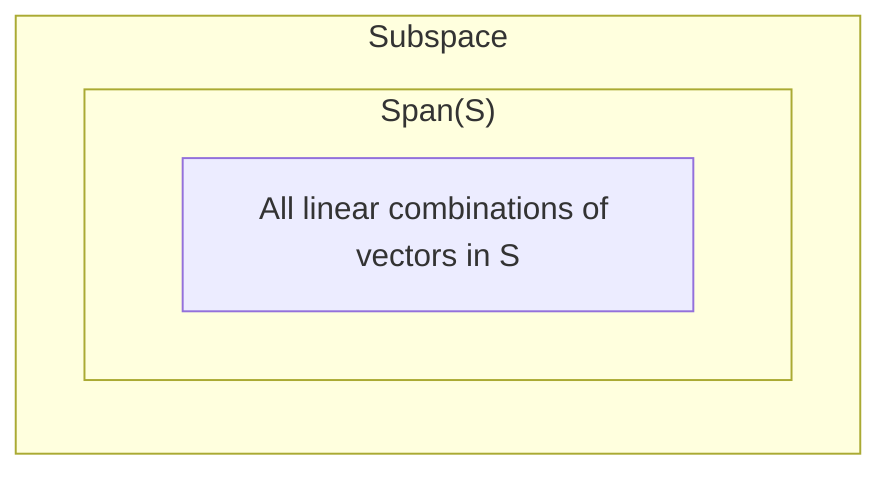

import { Mafs, Coordinates, Plot, Line, Circle, Theme, useMovablePoint, useStopwatch, vec, Vector, LaTeX, Polygon, Transform, labelPi, Point } from "mafs";

import { useState, useCallback, createElement } from "react";
import { lineLabel } from "@site/src/utilities/lines";
import { color } from "@site/src/utilities/colors"
import TOCInline from '@theme/TOCInline';
import * as MB from "mathbox-react"
import * as THREE from "three"
import { OrbitControls } from "three/examples/jsm/controls/OrbitControls"

# Span, Linear Independence, and Basis

In this section, we will explore the concepts of span, linear independence, and basis in the context of vectors and vector spaces.
This has a clear parallel to [this page](../../Linear%20Algebra/Vectors/Linear%20Combinations%20and%20Related%20Concepts), where we discussed the same topics.
However, this page will delve deeper into the concepts and provide a more advanced and abstract understanding of these topics.

## Table of Contents

<TOCInline toc={toc} />

## Linear Combinations and Span

A linear combination of vectors $\va{v}_1, \va{v}_2, \ldots, \va{v}_n$ is a way to combine these vectors by multiplying each vector by a scalar and adding them together.
For example, given vectors $\va{v}_1 = \mqty[1 \\ 0]$ and $\va{v}_2 = \mqty[0 \\ 1]$, the linear combination $2\va{v}_1 + 3\va{v}_2$ is equal to $\mqty[2 \\ 3]$.
Formally, we can define a linear combination as:

<Boxed>
A **linear combination** of vectors $\va{v}_1, \va{v}_2, \ldots, \va{v}_n \in V$, where $V$ is a vector space over a field $\mathbb{F}$, is a vector of the form:

$$
\begin{equation}
a_1\va{v}_1 + a_2\va{v}_2 + \ldots + a_n\va{v}_n
\end{equation}
$$

where $a_1, a_2, \ldots, a_n \in \mathbb{F}$.
</Boxed>

The set of all possible linear combinations of a set of vectors $\va{v}_1, \va{v}_2, \ldots, \va{v}_n$ is called the **span** of those vectors.
Intuitively, it describes how far you can reach by moving in different directions defined by the vectors.

There's another way to think about the span of a set of vectors. Let $S \subseteq V$ be a subset of vectors.
Then, consider all subspaces of $V$ that contain $S$ - they would contain all possible linear combinations of the vectors in $S$, since they are closed under addition and scalar multiplication.
But they can also contain other vectors that are not in $S$. Hence, we can take the intersection of all such subspaces to get the span of $S$:

<Boxed>
The **span** of a set of vectors $\va{v}_1, \va{v}_2, \ldots, \va{v}_n \in V$ is the set of all possible linear combinations of these vectors.
It is denoted by $\text{span}(\va{v}_1, \va{v}_2, \ldots, \va{v}_n)$.

Alternatively, the span of a set of vectors can be defined as the intersection of all subspaces of $V$ that contain the set of vectors.

$$
\begin{equation}
\text{span}(\va{v}_1, \va{v}_2, \ldots, \va{v}_n) \equiv \bigcap_{\substack{W \supseteq S}} W
\end{equation}
$$

Where $W$ is a subspace of $V$.
</Boxed>

The two different definitions differ in philosophical approach; the definition from linear combinations is a "bottom-up" approach from the vectors themselves, while the subspace definition is a "top-down" approach from sets bigger than the vectors.

### Proof of Equivalence of Definitions

We can prove that the two definitions of span are equivalent.
First, let's lay out our definitions:

Let $S = \{\va{v}_1, \va{v}_2, \ldots, \va{v}_n\}$ be a set of vectors in a vector space $V$ over a field $\mathbb{F}$.
Then, the span of $S$ is defined as:

1. The set of all possible linear combinations of the vectors in $S$:

    $$
    \begin{equation}
    \text{span}(S) \equiv \qty{a_1\va{v}_1 + a_2\va{v}_2 + \ldots + a_n\va{v}_n \mid a_1, a_2, \ldots, a_n \in \mathbb{F}}
    \end{equation}
    $$

2. The intersection of all subspaces of $V$ that contain $S$:

    $$
    \begin{equation}
    \text{span}(S) \equiv \bigcap_{\substack{W \supseteq S}} W
    \end{equation}
    $$

Generally, in order to show that two sets $A$ and $B$ are equal, we need to show that $A \subseteq B$ and $B \subseteq A$.
As such, we need to show that $\text{span}(S)$ defined by linear combinations is a subset of $\text{span}(S)$ defined by subspaces, and vice versa.

1. **Linear Combinations $\subseteq$ Subspaces**:

    Let $\va{w} \in \text{span}(S)$ be a vector in the span of $S$ defined by linear combinations.
    Then, $\va{w}$ can be written as a linear combination of the vectors in $S$:

    $$
    \begin{equation}
    \va{w} = a_1\va{v}_1 + a_2\va{v}_2 + \ldots + a_n\va{v}_n
    \end{equation}
    $$

    Since $S \subseteq \text{span}(S)$, the vectors in $S$ are in the span of $S$.
    By definition, all the subspaces on the right-hand side of the second definition contain $S$.
    And since they are subspaces, they are closed under addition and scalar multiplication, meaning any linear combination of vectors in $S$ is in the subspace.
    Hence, $\va{w} \in W$ for all subspaces $W$ that contain $S$.

2. **Subspaces $\subseteq$ Linear Combinations**:

    This is a bit more abstract because we don't actually know what the subspaces are, so we cannot construct a concrete value for $\va{w}$.
    Nevertheless, a key insight can help us here.

    Consider some sets $A$, $B$, and $C$, and their intersection $A \cap B \cap C$.
    If $x \in A \cap B \cap C$, then $x$ is in all three sets.
    This means that $A \cap B \cap C$ is a subset of $A$, $B$, and $C$.
    Then, $A$ contains all the elements in $A \cap B \cap C$, and similarly for $B$ and $C$.

    Let's apply that here. The right-hand side with the subspaces contains the intersection of all subspaces that contain $S$.
    Call these subspaces $W_1, W_2, \ldots, W_k$.
    Now, the key insight is that the span of $S$ is another subspace that contains $S$; denote it as $W_{k + 1}$.
    Then, the span is just $W_1 \cap W_2 \cap \ldots \cap W_k \cap W_{k + 1}$.
    But since the intersection must be contained in each subspace, it is also contained in the span.

    Thus, $\text{span}(S)$ defined by subspaces is a subset of $\text{span}(S)$ defined by linear combinations.

Hence, we have shown that the two definitions of span are equivalent. $\blacksquare$

## Linear Independence

A set of vectors $\va{v}_1, \va{v}_2, \ldots, \va{v}_n$ is said to be **linearly independent** if no vector in the set can be written as a linear combination of the other vectors.
In other words, a set of vectors is linearly independent if the only way to write the zero vector as a linear combination of the vectors is by setting all the coefficients to zero.

<Boxed>
A set of vectors $\va{v}_1, \va{v}_2, \ldots, \va{v}_n$ is **linearly independent** if the only solution to the equation:

$$
\begin{equation}
a_1\va{v}_1 + a_2\va{v}_2 + \ldots + a_n\va{v}_n = \va{0}
\end{equation}
$$

is $a_1 = a_2 = \ldots = a_n = 0$.
</Boxed>

### Lemma: Span and Linear Independence

There is a close relationship between the concepts of span and linear independence.
In particular:

<Boxed>
If a vector space $V$ is defined by $V \equiv \text{span}(\va{v}_1, \va{v}_2, \ldots, \va{v}_n)$, and given a subset of linearly independent vectors $\va{w}_1, \va{w}_2, \ldots, \va{w}_m \subseteq V$, then it follows that $m \leq n$.
</Boxed>

Before we prove this lemma, let's understand the intuition behind it.

