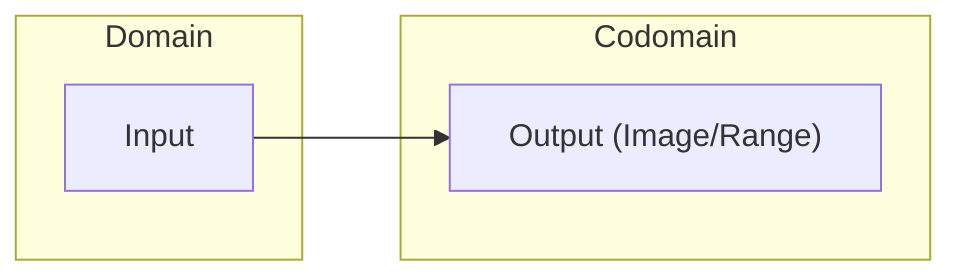
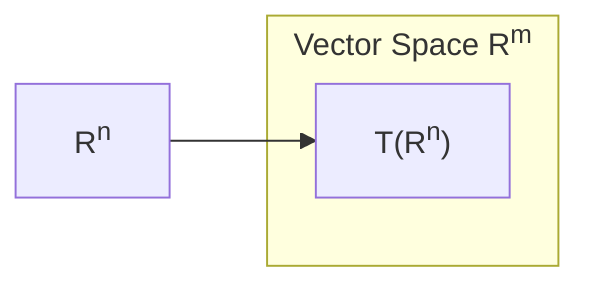
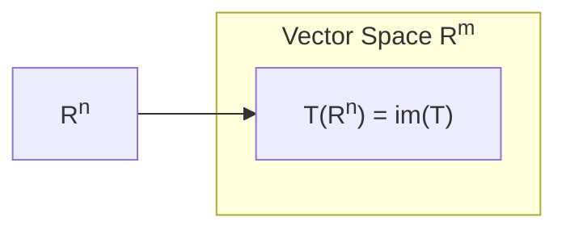

import { Mafs, Coordinates, Plot, Line, Circle, Theme, useMovablePoint, useStopwatch, vec, Vector, LaTeX, Polygon, Transform, MovablePoint } from "mafs";

import { useState, useEffect, Fragment, useRef } from "react";
import { lineLabel } from "@site/src/utilities/lines";
import { color } from "@site/src/utilities/colors"
import TOCInline from '@theme/TOCInline';
import { easeInOutCubic } from "js-easing-functions"
import { range, clamp } from "lodash";

# Linear Transformations

A linear transformation is a function that maps vectors to vectors in a way that preserves the vector space structure.
In simpler terms, a linear transformation preserves vector addition and scalar multiplication.
One way to conceptualize this is to think of a linear transformation as a function that stretches, compresses, rotates, or reflects vectors in a vector space.
The transformation has to preserve the structure of the space, which means that it cannot "tear" or "break" vectors in the process.

A result of this is that after applying a linear transformation, the gridlines in the vector space will remain parallel and evenly spaced.
This property is crucial in many applications of linear algebra, such as computer graphics, physics, and engineering.

A more formal way to define a linear transformation is to say that a function $T: V \to U$ is a linear transformation if it satisfies the following two properties:

1. **Additivity**: $T(\va{u} + \va{v}) = T(\va{u}) + T(\va{v})$ for all vectors $\va{u}, \va{v} \in V$.
2. **Homogeneity**: $T(c\va{v}) = cT(\va{v})$ for all vectors $\va{v} \in V$ and all scalars $c$.

## Table of Contents

<TOCInline toc={toc} />

## Conceptual Introduction

To understand linear transformations better, let's consider a simple example.

Consider a 2D vector space, $\mathbb{R}^2$, with the standard basis vectors $\ihatc = \mqty[ 1 \\ 0 ]$ and $\jhatc = \mqty[ 0 \\ 1 ]$.

To describe a linear transformation, we can't possibly describe how it affects every single vector in the space.
Instead, due to the linearity of the transformation, it suffices to describe how it affects the basis vectors.

So, if you know how it affects $\ihatc$ and $\jhatc$, you can figure out how it affects any vector in the space.

Consider a transformation that maps $\ihatc$ to $\mqty[ 1 \\ 1 ]$ and $\jhatc$ to $\mqty[ 1 \\ -1 ]$.
Let's first visualize this transformation:

<LinearTransformationVisualizer
    to={{
        ihat: [1, 1],
        jhat: [1, -1]
    }}
/>

Recall that a vector in $\mathbb{R}^2$ can be written as a linear combination of the basis vectors $\ihatc$ and $\jhatc$.
So, any vector $\va{v} = \mqty[ x \\ y ]$ can be written as $x\ihatc + y\jhatc$.

To find how the transformation affects $\va{v}$, we can find how it affects $\ihatc$ and $\jhatc$ and then combine the results.
For example, if $\va{v} = \mqty[ 2 \\ 3 ]$, then:

$$
\begin{equation}
\begin{split}
\va{v} &= 2\ihatc + 3\jhatc \\
T(\va{v}) &= 2T(\ihatc) + 3T(\jhatc) \\
&= 2\mqty[ 1 \\ 1 ] + 3\mqty[ 1 \\ -1 ] \\
&= \mqty[ 2 \\ 2 ] + \mqty[ 3 \\ -3 ] \\
&= \mqty[ 5 \\ -1 ]
\end{split}
\end{equation}
$$

<LinearTransformationVisualizer
    to={{
        ihat: [1, 1],
        jhat: [1, -1]
    }}
    transformedItems={(
        <>
            <Vector tail={[0, 0]} tip={[2, 3]} />
            <LaTeX at={[2.2, 3.2]} tex="\mathbf{\vec{v}}" />

            <Vector tail={[0, 0]} tip={[1, 0]} color={color("blue")} />
            <Vector tail={[1, 0]} tip={[2, 0]} color={color("blue")} />

            <Vector tail={[2, 0]} tip={[2, 1]} color={color("yellow")} />
            <Vector tail={[2, 1]} tip={[2, 2]} color={color("yellow")} />
            <Vector tail={[2, 2]} tip={[2, 3]} color={color("yellow")} />
        </>
    )}
/>

Notice how we were able to find the transformation of $\va{v}$ by only knowing how the transformation affects the basis vectors.
This relies on the linearity of the transformation, which will be proven later.

## Terminology and Notation

Before we dive deeper into linear transformations, let's define some things.

The notation we use for representing functions can be a bit confusing.

Consider a function $f: S_1 \to S_2$.

- The **domain** of the function is the set that you input to the function - in this case, $S_1$.
- The **codomain** of the function is the set that the function outputs - in this case, $S_2$.
- The **image** or **range** of a set $S$ under the function is the set of all outputs of the function when you input elements of $S$.

$$
\begin{equation}
\underset{\underset{\text{Function}}{\downarrow}}{f}: \underset{\underset{\text{Domain}}{\downarrow}}{S_1} \to \underset{\underset{\text{Codomain}}{\downarrow}}{S_2}
\end{equation}
$$

Functions have unique outputs for each input, so the image of a set under a function is unique.

Next, we need to clarify on the difference between the image and codomain of a function.

- The **image** or **range** of a function is the set of all possible outputs of the function.
- The **codomain** of a function is the set that the function outputs to. It is where the range "lives".

To illustrate this difference, consider a function $f(x) = x^2$.

Its **codomain** is $\mathbb{R}$, as the function outputs real numbers.
However, the **image** of the function is $[0, \infty)$, as the function only outputs non-negative real numbers.

In this way, the image is a subset of the codomain.

{/* box 1 for domain, box 2 for codomain, and an arrow pointing from 1 to 2. smaller box inside box 2 for range */}



## Matrix Representation

Since linear transformations are so important in linear algebra, it's useful to have a way to represent them in a more compact form.
This is where matrices come in.

Let $T: \mathbb{R}^2 \to \mathbb{R}^2$ be a linear transformation that maps $\vu{i}$ to $\mqty[ a \\ b ]$ and $\vu{j}$ to $\mqty[ c \\ d ]$.
Then, the transformation can be represented by the matrix:

$$
\begin{equation}
T = \mqty[ \class{blue}{a} & \class{yellow}{c} \\ \class{blue}{b} & \class{yellow}{d} ]
\end{equation}
$$

A matrix is, fundamentally, simply a two-dimensional array of numbers.

The columns of the matrix represent the basis vectors after the transformation.
So, the first column represents $T(\vu{i})$ and the second column represents $T(\vu{j})$.

Recall that you can find the transformation of any vector by finding how the transformation affects the basis vectors and then combining the results.
So, for any vector $\va{v} = \mqty[ x \\ y ]$, the transformation of $\va{v}$ can be found by:

$$
\begin{equation}
T(\va{v}) = xT(\vu{i}) + yT(\vu{j}) = x\mqty[ \class{blue}{a} \\ \class{blue}{b} ] + y\mqty[ \class{yellow}{c} \\ \class{yellow}{d} ]
\end{equation}
$$

Another way to notate it is to have the matrix written before the vector:

$$
\begin{equation}
T(\va{v}) = \mqty[ \class{blue}{a} & \class{yellow}{c} \\ \class{blue}{b} & \class{yellow}{d} ] \mqty[ x \\ y ]
\end{equation}
$$

We can formulate a general equation for such transformation as:

$$
\begin{equation}
T(\va{v}) = \mqty[ \class{blue}{a} & \class{yellow}{c} \\ \class{blue}{b} & \class{yellow}{d} ] \mqty[ x \\ y ] = x\mqty[ \class{blue}{a} \\ \class{blue}{b} ] + y\mqty[ \class{yellow}{c} \\ \class{yellow}{d} ] = \mqty[ \class{blue}{a}x + \class{yellow}{c}y \\ \class{blue}{b}x + \class{yellow}{d}y ]
\end{equation}
$$

### Generalizing to Higher Dimensions

The concept of linear transformations, like basically everything in Linear Algebra, can be extended to higher dimensions.

For example, in $\mathbb{R}^3$, a linear transformation can be represented by a $3 \times 3$ matrix.

Let $T: \mathbb{R}^m \to \mathbb{R}^n$ be a linear transformation between two vector spaces of dimensions $m$ and $n$.
Then $T$ can be represented by an $n \times m$ matrix.

Each column will represent the image of the corresponding basis vector in the domain space.
This idea can be written as:

$$
\begin{equation}
T(\va{v}) = \mqty[ {a_{1,1}} & {a_{1,2}} & \cdots & {a_{1,m}} \\ {a_{2,1}} & {a_{2,2}} & \cdots & {a_{2,m}} \\ \vdots & \vdots & \ddots & \vdots \\ {a_{n,1}} & {a_{n,2}} & \cdots & {a_{n,m}} ] \mqty[ v_1 \\ v_2 \\ \vdots \\ v_m ]
\end{equation}
$$

Where the $a_{i,j}$ are the elements of the matrix representing the transformation, and $v_1, v_2, \ldots, v_m$ are the components of the vector $\va{v}$.
The basis vectors can be represented as:

$$
\begin{equation}
\vu{i} = \mqty[ 1 \\ 0 \\ \vdots \\ 0 ], \vu{j} = \mqty[ 0 \\ 1 \\ \vdots \\ 0 ], \ldots, \vu{k} = \mqty[ 0 \\ 0 \\ \vdots \\ 1 ]
\end{equation}
$$

Then, the transformation of any vector $\va{v} = \mqty[ v_1 \\ v_2 \\ \vdots \\ v_m ]$ can be found by:

$$
\begin{equation}
\begin{split}
T(\va{v}) &= \mqty[ {a_{1,1}} & {a_{1,2}} & \cdots & {a_{1,m}} \\ {a_{2,1}} & {a_{2,2}} & \cdots & {a_{2,m}} \\ \vdots & \vdots & \ddots & \vdots \\ {a_{n,1}} & {a_{n,2}} & \cdots & {a_{n,m}} ] \mqty[ v_1 \\ v_2 \\ \vdots \\ v_m ] \\
&= v_1\mqty[ {a_{1,1}} \\ {a_{2,1}} \\ \vdots \\ {a_{n,1}} ] + v_2\mqty[ {a_{1,2}} \\ {a_{2,2}} \\ \vdots \\ {a_{n,2}} ] + \cdots + v_m\mqty[ {a_{1,m}} \\ {a_{2,m}} \\ \vdots \\ {a_{n,m}} ] \\
&= \mqty[ {a_{1,1}}v_1 + {a_{1,2}}v_2 + \cdots + {a_{1,m}}v_m \\ {a_{2,1}}v_1 + {a_{2,2}}v_2 + \cdots + {a_{2,m}}v_m \\ \vdots \\ {a_{n,1}}v_1 + {a_{n,2}}v_2 + \cdots + {a_{n,m}}v_m ]
\end{split}
\end{equation}
$$

## Common Linear Transformations

There are several common linear transformations that are frequently encountered in linear algebra.

### Scaling

A scaling transformation stretches or compresses vectors along a particular direction.

This is quite simple - you just multiply all the basis vectors by a scalar.

For example, consider the transformation $T: \mathbb{R}^2 \to \mathbb{R}^2$ defined by:

$$
\begin{equation}
T = \mqty[ 2 & 0 \\ 0 & 3 ]
\end{equation}
$$

$\vu{i}$ goes from $[1, 0]$ to $[2, 0]$, and $\vu{j}$ goes from $[0, 1]$ to $[0, 3]$.
Hence, the transformation scales the space by a factor of 2 in the $x$-direction and 3 in the $y$-direction.

### Rotation

A rotation transformation rotates vectors in the vector space.

This is a bit more complex than scaling, but it can still be represented by a matrix.

Essentially, you rotate the basis vectors by a certain angle. To do so, we need to use some trigonometry.

Consider the transformation $T: \mathbb{R}^2 \to \mathbb{R}^2$ that rotates vectors by an angle $\theta$ counterclockwise.
It transforms $\vu{i}$ to $\vu{i}'$. To find $\vu{i}'$, we can observe it geometrically:

<Mafs
    viewBox={{
        x: [0, 1],
        y: [0,  0.5]
    }}
>
    {/* ihat */}
    <Vector
        tail={[0, 0]}
        tip={[1, 0]}
        color={color("blue")}
    />

    {/* ihat prime */}
    <Vector
        tail={[0, 0]}
        tip={[Math.cos(Math.PI / 5), Math.sin(Math.PI / 5)]}
        color={color("red")}
    />

    {/*
        Mafs uses KaTeX while the rest of the site uses MathJax.
        So the macros we defined in the site config won't work here.
    */}
    <LaTeX
        tex="\mathbf{\hat{i}}"
        at={lineLabel([0, 0], [1, 0], "right", { sideOffset: 0.1 })}
    />
    <LaTeX
        tex="\mathbf{\hat{i'}}"
        at={lineLabel([0, 0], [Math.cos(Math.PI / 5), Math.sin(Math.PI / 5)], "left", { sideOffset: 0.1 })}
    />

    <Angle
        at={[0, 0]}
        fromRad={0}
        toRad={Math.PI / 5}
        label="\theta"
        radius={0.2}
    />
</Mafs>

(More coming soon)

## Proving the Properties of Linear Transformations

To prove that a function is a linear transformation, you need to show that it satisfies the two properties mentioned earlier: additivity and homogeneity.

Consider this matrix:

$$
\begin{equation}
A = \mqty[ \va{v_1} \va{v_2} \cdots \va{v_n} ]
\end{equation}
$$

Each vector $\va{v_i}$ is a column vector in the matrix $A$ and has $m$ components, so $A$ is an $m \times n$ matrix.

Let $T: \mathbb{R}^n \to \mathbb{R}^m$ be a function defined by $T(\va{x}) = \vb{A}\va{x}$.

We can express $\va{x}$ as $[x_1, x_2, \ldots, x_n]^T$ and, hence, $\vb{A}\va{x}$ as:

$$
\begin{equation}
T(\va{x}) = \mqty[ \va{v_1} \va{v_2} \cdots \va{v_n} ] \mqty[ x_1 \\ x_2 \\ \vdots \\ x_n ] = x_1\va{v_1} + x_2\va{v_2} + \cdots + x_n\va{v_n}
\end{equation}
$$

To show that $T$ is a linear transformation, we need to show that it satisfies the two properties.

- **Additivity**: $T(\va{u} + \va{v}) = T(\va{u}) + T(\va{v})$ for all vectors $\va{u}, \va{v} \in \mathbb{R}^n$.
- **Homogeneity**: $T(c\va{v}) = cT(\va{v})$ for all vectors $\va{v} \in \mathbb{R}^n$ and all scalars $c$.

### Proving the Linear Transformation's Additivity

To show that $T$ is additive, we need to show that $T(\va{u} + \va{v}) = T(\va{u}) + T(\va{v})$.

Let $\va{u} = [u_1, u_2, \ldots, u_n]^T$ and $\va{v} = [v_1, v_2, \ldots, v_n]^T$. Let $A$ be some matrix that defines the transformation $T$.
Then, $T(\va{u} + \va{v})$ is:

$$
\begin{equation}
\begin{split}
T(\va{u} + \va{v}) &= \vb{A}(\va{u} + \va{v}) \\
&= \vb{A}\va{u} + \vb{A}\va{v} \\
&= T(\va{u}) + T(\va{v})
\end{split}
\end{equation}
$$

Hence, $T$ is additive.

### Proving the Linear Transformation's Homogeneity

To show that $T$ is homogeneous, we need to show that $T(c\va{v}) = cT(\va{v})$.

Let $\va{v} = [v_1, v_2, \ldots, v_n]^T$ and $c$ be some scalar. Let $A$ be some matrix that defines the transformation $T$.
Then, $T(c\va{v})$ is:

$$
\begin{equation}
\begin{split}
T(c\va{v}) &= \vb{A}(c\va{v}) \\
&= \mqty[ \va{v_1} \va{v_2} \cdots \va{v_n} ] \mqty[ cv_1 \\ cv_2 \\ \vdots \\ cv_n ] \\
&= \va{v_1}cv_1 + \va{v_2}cv_2 + \cdots + \va{v_n}cv_n \\
&= c(\va{v_1}v_1 + \va{v_2}v_2 + \cdots + \va{v_n}v_n) \\
&= cT(\va{v})
\end{split}
\end{equation}
$$

Thus, $T$ is both additive and homogeneous, and hence a linear transformation.

This shows that any transformation defined via matrix multiplication is a linear transformation.

## The Identity Matrix and Standard Basis Vectors

Consider a $n \times n$ matrix like this:

$$
\begin{equation}
I_n = \mqty[ 1 & 0 & 0 & \cdots & 0 \\ 0 & 1 & 0 & \cdots & 0 \\ 0 & 0 & 1 & \cdots & 0 \\ \vdots & \vdots & \vdots & \ddots & \vdots \\ 0 & 0 & 0 & \cdots & 1 ]
\end{equation}
$$

This is known as the identity matrix, and to show why it's called that, consider a vector $\va{v} = [v_1, v_2, v_3, \ldots, v_n]$.

Then, the product $I_n\va{v}$ is:

$$
\begin{equation}
\begin{split}
I_n\va{v} &= \mqty[ 1 & 0 & 0 & \cdots & 0 \\ 0 & 1 & 0 & \cdots & 0 \\ 0 & 0 & 1 & \cdots & 0 \\ \vdots & \vdots & \vdots & \ddots & \vdots \\ 0 & 0 & 0 & \cdots & 1 ] \mqty[ v_1 \\ v_2 \\ v_3 \\ \vdots \\ v_n ] \\
&= v_1\mqty[ 1 \\ 0 \\ \vdots \\ 0 ] + v_2\mqty[ 0 \\ 1 \\ \vdots \\ 0 ] + \cdots + v_n\mqty[ 0 \\ 0 \\ \vdots \\ 1 ] \\
&= v_1\vu{i} + v_2\vu{j} + \cdots + v_n\vu{k} \\
&= \va{v}
\end{split}
\end{equation}
$$

So, the identity matrix doesn't change the vector it multiplies.

We can also see this without applying the matrix multiplication.
Recall that a transformation is defined by how it affects the basis vectors.
On the first column, the identity matrix has a $1$ in the first row and a $0$ in the rest. This means that the first basis vector is unchanged.
Same for the second, third, and so on.

This is why the identity matrix is called the identity matrix - it doesn't change the vector it multiplies.

The subscript $n$ in $I_n$ denotes that the matrix is of size $n \times n$. For instance:

$$
\begin{align}
I_2 &= \mqty[ 1 & 0 \\ 0 & 1 ] \\
I_3 &= \mqty[ 1 & 0 & 0 \\ 0 & 1 & 0 \\ 0 & 0 & 1 ]
\end{align}
$$

Consider each column of $I_n$ again. We can asign names to the columns of $I_n$ as $\va{e}_1, \va{e}_2, \ldots, \va{e}_n$:

$$
\begin{equation}
\begin{split}
I_n &= \mqty[ 1 & 0 & 0 & \cdots & 0 \\ 0 & 1 & 0 & \cdots & 0 \\ 0 & 0 & 1 & \cdots & 0 \\ \vdots & \vdots & \vdots & \ddots & \vdots \\ 0 & 0 & 0 & \cdots & 1 ] \\
&= \mqty[ \va{e}_1 & \va{e}_2 & \va{e}_3 \cdots & \va{e}_n ]
\end{split}
\end{equation}
$$

These vectors $\va{e}_1, \va{e}_2, \ldots, \va{e}_n$ are the **standard basis vectors** in $\mathbb{R}^n$.
Recall the criteria for a set of basis vectors: they must be linearly independent and span the entire space.

For the first criteria, it's clear that the standard basis vectors are linearly independent.
In the first row, only the first element is non-zero, and hence cannot be written as a linear combination of the other vectors.
The same applies to the second row, and so on.

For the second criteria, consider any vector $\va{v} = [v_1, v_2, \ldots, v_n]$.
Then, $\va{v}$ can be written as:

$$
\begin{equation}
\va{v} = v_1\va{e}_1 + v_2\va{e}_2 + \cdots + v_n\va{e}_n
\end{equation}
$$

This shows that the standard basis vectors span the entire space.

## Linear Transformations as Matrix Vector Products

Previously, we derived the matrix representation of a linear transformation.
However, we did not prove that _any_ linear transformation can be represented as a matrix-vector product.

Recall that any vector can be written as a linear combination of the basis vectors:

$$
\begin{equation}
\va{v} = v_1\va{e}_1 + v_2\va{e}_2 + \cdots + v_n\va{e}_n
\end{equation}
$$

Now, consider applying a linear transformation $T$ to $\va{v}$:

$$
\begin{equation}
T(\va{v}) = T(v_1\va{e}_1 + v_2\va{e}_2 + \cdots + v_n\va{e}_n)
\end{equation}
$$

Using the linearity and homogeneity of $T$, we can write this as:

$$
\begin{equation}
T(\va{v}) = v_1T(\va{e}_1) + v_2T(\va{e}_2) + \cdots + v_nT(\va{e}_n)
\end{equation}
$$

We can represent this as a matrix-vector product.

Recall that a transformation on a vector can be evaluated by multiplying each basis vector by the corresponding component of the vector and summing the results.

$$
\begin{equation}
T(\va{v}) = \mqty[ T(\va{e}_1) & T(\va{e}_2) & \cdots & T(\va{e}_n) ] \mqty[ v_1 \\ v_2 \\ \vdots \\ v_n ] = \mqty[ T(\va{e}_1) & T(\va{e}_2) & \cdots & T(\va{e}_n) ] \va{v}
\end{equation}
$$

Hence showing that any linear transformation can be represented as a matrix-vector product.

:::info Approaches to Reasoning

We have just proven that any linear transformation can be represented as a matrix-vector product.

However, it's also important to notice that we have just shown this in two different ways:

1. In the conceptual introduction, we reasoned through it using intuition. It was easy to understand how the transformation affects the basis vectors and then how it affects any vector.
2. In the proof, we reasoned through it using the properties of linear transformations. We showed that the transformation satisfies the properties of additivity and homogeneity, and hence is a linear transformation.

Both approaches are valid and useful in different contexts. The conceptual approach is great for understanding the idea behind linear transformations, while the proof is useful for formalizing the concept.

This is a common theme in mathematics.

:::

### Example Problem: Deriving the Matrix Representation of a Linear Transformation

> Consider a linear transformation $T: \mathbb{R}^2 \to \mathbb{R}^3$:
>
> $$
> \begin{equation}
> T\qty(\mqty[ v_1 \\ v_2 ]) = \mqty[ v_1 + 2v_2 \\ 3v_1 - v_2 \\ 2v_1 + 3v_2 ]
> \end{equation}
> $$
>
> Find the matrix representation of this transformation.

To find the matrix representation of this transformation, we need to find how it affects the standard basis vectors.

Let $\va{e}_1 = \mqty[ 1 \\ 0 ]$ and $\va{e}_2 = \mqty[ 0 \\ 1 ]$.
Then, $T(\va{e}_1)$ is:

$$
\begin{equation}
T(\va{e}_1) = T\qty(\mqty[ \class{blue}{1} \\ \class{yellow}{0} ]) = \mqty[ \class{blue}{1} + 2 \cdot \class{yellow}{0} \\ 3 \cdot \class{blue}{1} - \class{yellow}{0} \\ 2 \cdot \class{blue}{1} + 3 \cdot \class{yellow}{0} ] = \mqty[ 1 \\ 3 \\ 2 ]
\end{equation}
$$

Similarly, $T(\va{e}_2)$ is:

$$
\begin{equation}
T(\va{e}_2) = T\qty(\mqty[ \class{blue}{0} \\ \class{yellow}{1} ]) = \mqty[ \class{blue}{0} + 2 \cdot \class{yellow}{1} \\ 3 \cdot \class{blue}{0} - \class{yellow}{1} \\ 2 \cdot \class{blue}{0} + 3 \cdot \class{yellow}{1} ] = \mqty[ 2 \\ -1 \\ 3 ]
\end{equation}
$$

Hence, the matrix representation of the transformation is:

$$
\begin{equation}
T = \mqty[  \overbrace{1}^{T(\va{e}_1)} &  \overbrace{2}^{T(\va{e}_2)} \\ 3 & -1 \\ 2 & 3 ]
\end{equation}
$$

And,

$$
\begin{equation}
T\qty(\mqty[ v_1 \\ v_2 ]) = \mqty[ 1 & 2 \\ 3 & -1 \\ 2 & 3 ] \mqty[ v_1 \\ v_2 ]
\end{equation}
$$

This shows that the transformation can be represented as a matrix-vector product.

## Linear Transformations of Subsets

We've seen how linear transformations affect individual vectors.
This can be extended to subsets of vectors, and we can see how linear transformations affect entire regions of the vector space.

Consider three vectors $\va{v}_1, \va{v}_2, \va{v}_3$ in $\mathbb{R}^2$:

$$
\begin{align}
\class{green}{\va{v}_1} &= \mqty[ 3 \\ -2 ] \\
\class{yellow}{\va{v}_2} &= \mqty[ 3 \\ 2 ] \\
\class{purple}{\va{v}_3} &= \mqty[ -3 \\ 2 ]
\end{align}
$$

export function ImageOfSubsetsUnderLinearTransformations({
    /** @type {(1 | 2 | 3)[]} */
    showLines = [],
    showMovablePoints = true,
    onTChange = () => {},
}) {
    const v1 = [3, -2], v2 = [3, 2], v3 = [-3, 2];
    const vectors = [v1, v2, v3];
    const [t, setT] = useState(0);

    useEffect(() => {
        onTChange(t);
    }, [t]);

    const eqn = (t, v_i, v_f) => {
        const x = v_i[0] + t * (v_f[0] - v_i[0]);
        const y = v_i[1] + t * (v_f[1] - v_i[1]);
        return [x, y];
    }
    const getT = (v_i, v_f) => (([x, y]) => {
        if (v_i[0] === v_f[0]) {
            return (y - v_i[1]) / (v_f[1] - v_i[1]);
        }
        return (x - v_i[0]) / (v_f[0] - v_i[0]);
    });

    const getColorClass = (l) => {
        return ["green", "yellow", "purple"][l - 1];
    }

    const getColor = (l) => {
        return color(getColorClass(l));
    }

    return (
        <>
            <Vector
                tip={v1}
                color={getColor(1)}
            />
            <Vector
                tip={v2}
                color={getColor(2)}
            />
            <Vector
                tip={v3}
                color={getColor(3)}
            />
            {showLines.map((l) => {
                const v_i = vectors[(l - 1) % 3];
                const v_f = vectors[l % 3];
                const point = eqn(t, v_i, v_f);
                const displayPrev = l - 1 === 0 ? 3 : l - 1;
                return (
                    <Fragment key={l}>
                        {showMovablePoints && <MovablePoint
                            point={point}
                            onMove={(point) => {
                                setT(clamp(getT(v_i, v_f)(point), 0, 1));
                            }}
                            color={getColor(l)}
                        />}
                        <Line.Segment
                            point1={v_i}
                            point2={v_f}
                            style="dashed"
                        />
                        {t > 0 && (
                            <>
                                <Vector
                                    tail={v_i}
                                    tip={point}
                                    weight={4}
                                />
                                <LaTeX
                                    // The 4 is intentional in the mod
                                    tex={`t(\\mathbf{\\vec{v}_{${l}}} - \\mathbf{\\vec{v}_{${displayPrev}}})`}
                                    at={lineLabel(v_i, point, "right", { sideOffset: 0.9 })}
                                />
                            </>
                        )}
                    </Fragment>
                )
            })}
        </>
    )
}

export function ImageOfSubsetsUnderLinearTransformationsWrapped() {
    const timeRef = useRef(0);
    const [t, setT] = useState(0);

    return (
        <div className="card">
            <div className="card__body">
                <Mafs>
                    <Coordinates.Cartesian />
                    <ImageOfSubsetsUnderLinearTransformations
                        showLines={[1, 2, 3]}
                        onTChange={(t) => {
                            timeRef.current = t;
                            setT(t);
                        }}
                    />
                </Mafs>
            </div>
            <div className="card__footer">
                <MathEquation>
                    {`t = ${t.toFixed(2)}`}
                </MathEquation>
            </div>
        </div>
    )
}

<ImageOfSubsetsUnderLinearTransformationsWrapped />

Consider a line segment connecting $\class{green}{\va{v}_1}$ and $\class{yellow}{\va{v}_2}$.

To construct an expression of this line, consider:

1. Starting at $\class{green}{\va{v}_1}$.
2. Moving in the direction of $\class{yellow}{\va{v}_2} - \class{green}{\va{v}_1}$.
3. Doing this for all points $t$ in the interval $[0, 1]$ - at $t = 0$, you're at $\class{green}{\va{v}_1}$, and at $t = 1$, you're at $\class{yellow}{\va{v}_2}$.

Hence, the line segment can be expressed as:

$$
\begin{equation}
L_{12} = \qty{ \class{green}{\va{v}_1} + t(\class{yellow}{\va{v}_2} - \class{green}{\va{v}_1}) \mid t \in [0, 1] }
\end{equation}
$$

A visual representation of this line segment is shown below:

<ImageOfSubsetsUnderLinearTransformationsWrapped showLines={[1]} />

Doing this for all three vectors:

$$
\begin{align}
L_{12} &= \qty{ \class{green}{\va{v}_1} + t(\class{yellow}{\va{v}_2} - \class{green}{\va{v}_1}) \mid t \in [0, 1] } \\
L_{23} &= \qty{ \class{yellow}{\va{v}_2} + t(\class{purple}{\va{v}_3} - \class{yellow}{\va{v}_2}) \mid t \in [0, 1] } \\
L_{31} &= \qty{ \class{purple}{\va{v}_3} + t(\class{green}{\va{v}_1} - \class{purple}{\va{v}_3}) \mid t \in [0, 1] }
\end{align}
$$

The visualization of these line segments is shown below:

<ImageOfSubsetsUnderLinearTransformationsWrapped showLines={[1, 2, 3]} />

We can asign a set, $S$, to be the union of these line segments:

$$
\begin{equation}
S = L_{12} \cup L_{23} \cup L_{31}
\end{equation}
$$

Now imagine applying a linear transformation to each of these line segments.

Recall that these line segments are defined in terms of certain vectors and a parameter $t$.
So, to transform this whole set, we need to transform each of these vectors and keep the parameter $t$ intact.

Below is the visualization for the following transformation:

$$
\begin{equation}
T(S) = \mqty[ \class{blue}{1} & \class{yellow}{2} \\ \class{blue}{3} & \class{yellow}{-1} ]S
\end{equation}
$$

<LinearTransformationVisualizer
    to={{
        ihat: [1, 3],
        jhat: [2, -1]
    }}
    transformedItems={
        <ImageOfSubsetsUnderLinearTransformations showLines={[1, 2, 3]} showMovablePoints={false} />
    }
    mafsProps={{
        viewBox: {
            x: [-9, 9],
            y: [-11, 11],
        }
    }}
/>

Before doing the calculation, let's understand this from an intuitive perspective.

Notice how, in the transformed space, the line segments are still line segments.
Recall that visually, linear transformations preserve line distances and line parallelism. This is a visual representation of that.

Additionally, notice how, both in the original and transformed spaces, the line segments are still connected at the endpoints, and the endpoints are the transformed vectors.
This means that to create the new set of line segments, we only need to transform the endpoints of the original line segments.

Next, let's prove this mathematically.

First, apply the transformation to $L_{12}$. Using the additivity of linear transformations:

$$
\begin{equation}
\begin{split}
T(L_{12}) &= \qty{ T\qty(\qty(\class{green}{\va{v}_1}) + t\qty(\class{yellow}{\va{v}_2} - \class{green}{\va{v}_1})) \mid t \in [0, 1] } \\
&= \qty{ T\qty(\class{green}{\va{v}_1}) + T\qty(t \qty(\class{yellow}{\va{v}_2} - \class{green}{\va{v}_1})) \mid t \in [0, 1] }
\end{split}
\end{equation}
$$

Then, using the homogeneity of linear transformations:

$$
\begin{equation}
T(L_{12}) = \qty{ T\qty(\class{green}{\va{v}_1}) + tT\qty(\class{yellow}{\va{v}_2} - \class{green}{\va{v}_1}) \mid t \in [0, 1] }
\end{equation}
$$

And using the additivity again:

$$
\begin{equation}
T(L_{12}) = \qty{ T\qty(\class{green}{\va{v}_1}) + t\qty(T\qty(\class{yellow}{\va{v}_2}) - T\qty(\class{green}{\va{v}_1})) \mid t \in [0, 1] }
\end{equation}
$$

This is known as the image of the line segment $L_{12}$ under the transformation $T$.

Similarly, we can find the image of $L_{23}$ and $L_{31}$ under the transformation $T$:

$$
\begin{align}
T(L_{23}) &= \qty{ T\qty(\class{yellow}{\va{v}_2}) + t\qty(T\qty(\class{purple}{\va{v}_3}) - T\qty(\class{yellow}{\va{v}_2})) \mid t \in [0, 1] } \\
T(L_{31}) &= \qty{ T\qty(\class{purple}{\va{v}_3}) + t\qty(T\qty(\class{green}{\va{v}_1}) - T\qty(\class{purple}{\va{v}_3})) \mid t \in [0, 1] }
\end{align}
$$

Notice what we've done here - we have a set of infinite vectors that span some line segment.
Instead of applying the transformation to every single one of these vectors (which is impossible), we've applied the transformation just to the endpoints of the line segment and then used the linearity of the transformation to find the transformation of the entire line segment.

This reflects a powerful property of linear transformations which we have already shown many times - you don't need to know how it affects every single vector in the space.

## Linear Transformations of Subspaces

We've seen how linear transformations affect individual vectors and subsets of vectors.
Now, we can extend this to subspaces of the vector space.

Recall what a subspace is - it's a subset of the vector space that is itself a vector space.
It contains the zero vector, is closed under addition, and is closed under scalar multiplication.

This means that, for any $\va{v}_1, \va{v}_2$ in the subspace:

1. $c\va{v}_1$ is in the subspace.
2. $\va{v}_1 + \va{v}_2$ is in the subspace.
3. The zero vector is in the subspace.

What we now want to prove is as follows:

> If $S$ is a subspace of $\mathbb{R}^n$ and $T: \mathbb{R}^n \to \mathbb{R}^m$ is a linear transformation, then $T(S)$ is a subspace of $\mathbb{R}^m$.

To show that $T(S)$ is a subspace, we need to show that it satisfies the three properties of a subspace.

### Proving Closure Under Addition for T(S)

Let $\va{v}_1, \va{v}_2 \in S$. Then, $T(\va{v}_1), T(\va{v}_2) \in T(S)$.

By the additivity of linear transformations:

$$
\begin{equation}
T(\va{v}_1 + \va{v}_2) = T(\va{v}_1) + T(\va{v}_2)
\end{equation}
$$

By the definition of a subspace, $\va{v}_1 + \va{v}_2 \in S$. Hence, $T(\va{v}_1 + \va{v}_2) \in T(S)$, thus showing that $T(S)$ is closed under addition.

### Proving Closure Under Scalar Multiplication for T(S)

Let $\va{v} \in S$ and $c$ be a scalar.

By definition, $T(\va{v}) \in T(S)$. If we multiply $\va{v}$ by $c$, we get $c\va{v}$, which is in $S$.

Applying the homogeneity of linear transformations:

$$
\begin{equation}
T(c\va{v}) = cT(\va{v})
\end{equation}
$$

Since subspaces are closed under scalar multiplication, $c\va{v} \in S$.
Hence, $T(c\va{v}) \in T(S)$, showing that $T(S)$ is closed under scalar multiplication.

### Proving the Zero Vector is in T(S)

This property is actually quite interesting.

Recall that subspaces are closed under scalar multiplication. That is, for any $\va{v} \in S$, $c\va{v} \in S$ for any scalar $c$.
That means we can just take $c = 0$ and get the zero vector.

Hence, the zero vector is in $S$ and $T(\va{0}) = \va{0}$, so the zero vector is in $T(S)$.

This completes the proof that $T(S)$ is a subspace of $\mathbb{R}^m$.

This is a powerful result - it shows that linear transformations preserve the structure of subspaces.

## Linear Transformations of the Entire Vector Space

We've sort of "gone up" in terms of the subsets we've been considering:

1. We started with individual vectors.
2. We then moved to subsets of vectors.
3. We then moved to subspaces of the vector space.

Now we're going to consider the entire vector space.

Consider a linear transformation $T: \mathbb{R}^n \to \mathbb{R}^m$.
Then, consider the image of the entire vector space under this transformation, $T(\mathbb{R}^n)$.

The range of $T$ can be defined as:

$$
\begin{equation}
\text{range}(T) = \qty{ T(\va{v}) \mid \va{v} \in \mathbb{R}^n }
\end{equation}
$$

The range of $T$ is the set of all possible outputs of $T$. It is a subset of the codomain, $\mathbb{R}^m$.
All points from $\mathbb{R}^n$ are mapped to points in the range of $T$.

Hence, $T(\mathbb{R}^n)$ is the set of all possible outputs of $T$.



Since this is every possible output of $T$, it's just called the image of $T$, or $\text{im}(T)$.



Recall that any linear transformation can be represented as a matrix-vector product. Hence:

$$
\begin{equation}
\text{Image of } \mathbb{R}^n \text{ under } T = \text{Image of } T = \text{im}(T) = T(\mathbb{R}^n) = \qty{ \vb{A}\va{x} \mid \va{x} \in \mathbb{R}^n }
\end{equation}
$$

Recall that a linear transformation is defined by how it affects the basis vectors.
Since the basis vectors span the entire vector space, the image of the entire vector space is the span of the transformed basis vectors.
This is known as the **column space** of the matrix representation of the linear transformation.

Hence, the image of the entire vector space under a linear transformation is the column space of the matrix representation of the transformation:

$$
\begin{equation}
\text{im}(T) = C(\vb{A})
\end{equation}
$$

Since the column space contains all possible outputs of the transformation, it can be used to determine whether certain equations have solutions.

For example, consider the equation $\vb{A}\va{x} = \va{b}$.

IF $\va{b} \notin C(\vb{A})$, this means $\va{b}$ is not in the image of the transformation, and hence the equation has no solution.

## Algebraic Uses of Matrices

In the most fundamental sense, a matrix is a rectangular array of numbers.

A matrix might look like this:

$$
\begin{equation}
\vb{A} = \mqty[ 1 & 2 & 3 \\ 4 & 5 & 6 ]
\end{equation}
$$

Arrays like these are used to represent data in a structured way.
We can use matrices to represent a wide variety of data and perform operations.
For instance, we can use matrices to represent the coefficients of a system of equations.

### Example Problem: Solving a System of Equations Using Matrices

> The following system of equations is given:
>
> $$
> \begin{align}
> x_1 + 2x_2 + x_3 + x_4 &= 7 \\
> x_1 + 2x_2 + 2x_3 - x_4 &= 12 \\
> 2x_1 + 4x_2 + 6x_4 &= 4
> \end{align}
> $$
>
> Solve the system of equations for $x_1$, $x_2$, $x_3$, and $x_4$.
>
> [(Source)](https://www.khanacademy.org/math/linear-algebra/vectors-and-spaces/matrices-elimination/v/matrices-reduced-row-echelon-form-1)

Firstly, take note that there are four unknowns and three equations.
This means that there are multiple solutions to the system of equations.

Instead of solving the equations for exact values, we will end up with a general solution with constraints.

The **coefficient matrix** is the matrix of the coefficients of the variables in the system of equations:

$$
\begin{align}
1x_1 + 2x_2 + 1x_3 + 1x_4 &= 7 \\
1x_1 + 2x_2 + 2x_3 - 1x_4 &= 12 \\
2x_1 + 4x_2 + 0x_3 + 6x_4 &= 4
\end{align}
$$

The coefficient matrix is:

$$
\begin{equation}
\mqty[ 1 & 2 & 1 & 1 \\ 1 & 2 & 2 & -1 \\ 2 & 4 & 0 & 6 ]
\end{equation}
$$

We can **augment** the coefficient matrix with the right-hand side of the equations:

$$
\begin{equation}
\vb{A} = \qty[\mqty{ 1 & 2 & 1 & 1 \\ 1 & 2 & 2 & -1 \\ 2 & 4 & 0 & 6 } \class{green}{\left| \mqty{ 7 \\ 12 \\ 4 } \right.} ]
\end{equation}
$$

It might not be immediately clear why we're doing this - we could've just solved the equations directly.

One reason is that it just saves time; we won't have to write $x_1$, $x_2$, $x_3$, and $x_4$ every time.

We can apply the same operations to the augmented matrix as we would to the system of equations.
For example, we can add a multiple of one row to another, or swap two rows.

The leading entry in a row is the first non-zero element in the row.
We want to make all leading entries 1, and all other entries in the column 0.

Additionally, for every row with a leading 1, all other entries in the column should be 0.

For example, this is a matrix that satisfies the conditions:

$$
\begin{equation}
\mqty[ 1 & 0 & 0 & 0 \\ 0 & 1 & 0 & 0 \\ 0 & 0 & 1 & 0 ]
\end{equation}
$$

This is called the **reduced row-echelon form** (RREF) of the matrix.
The RREF of a matrix is denoted as $\operatorname{rref}(\vb{A})$.

Recall our augmented matrix:

$$
\begin{equation}
\vb{A} = \qty[\mqty{ 1 & 2 & 1 & 1 \\ 1 & 2 & 2 & -1 \\ 2 & 4 & 0 & 6 } \left| \mqty{ 7 \\ 12 \\ 4 } \right.]
\end{equation}
$$

We can perform operations on the matrix to get it into RREF.

Denote row 1 as $L_1$, row 2 as $L_2$, and row 3 as $L_3$ for simplicity.
We will iterate through every column to get the matrix into RREF.

First, notice that $L_1$ already has a leading 1. Hence, we want to make all other entries in the column 0.

$$
\begin{equation}
\qty[\mqty{ 1 & 2 & 1 & 1 \\ 1 & 2 & 2 & -1 \\ 2 & 4 & 0 & 6 } \left| \mqty{ 7 \\ 12 \\ 4 } \right.]
    \Rightarrow \qty[\mqty{ 1 & 2 & 1 & 1 \\ 0 & 0 & -1 & 2 \\ 2 & 4 & 0 & 6 } \left| \mqty{ 7 \\ -5 \\ 4 } \right.]
\end{equation}
$$

This sets the first column in $L_2$ to 0. Next, to set the first column in $L_3$ to 0, we can subtract $2L_1$ from $L_3$:

$$
\begin{equation}
\qty[\mqty{ 1 & 2 & 1 & 1 \\ 0 & 0 & -1 & 2 \\ 2 & 4 & 0 & 6 } \left| \mqty{ 7 \\ -5 \\ 4 } \right.]
    \Rightarrow \qty[\mqty{ 1 & 2 & 1 & 1 \\ 0 & 0 & -1 & 2 \\ 0 & 0 & -2 & 4 } \left| \mqty{ 7 \\ -5 \\ -10 } \right.]
\end{equation}
$$

Now, the first column is in RREF.

$L_2$ has a leading $-1$, so we want to make that $1$ instead. This can be achieved simply by multiplying $L_2$ by $-1$:

$$
\begin{equation}
\qty[\mqty{ 1 & 2 & 1 & 1 \\ 0 & 0 & -1 & 2 \\ 0 & 0 & -2 & 4 } \left| \mqty{ 7 \\ -5 \\ -10 } \right.]
    \Rightarrow \qty[\mqty{ 1 & 2 & 1 & 1 \\ 0 & 0 & 1 & -2 \\ 0 & 0 & -2 & 4 } \left| \mqty{ 7 \\ 5 \\ -10 } \right.]
\end{equation}
$$

To set the third column in $L_3$ to 0, we can add $2L_2$ to $L_3$:

$$
\begin{equation}
\qty[\mqty{ 1 & 2 & 1 & 1 \\ 0 & 0 & 1 & -2 \\ 0 & 0 & -2 & 4 } \left| \mqty{ 7 \\ 5 \\ -10 } \right.]
    \Rightarrow \qty[\mqty{ 1 & 2 & 1 & 1 \\ 0 & 0 & 1 & -2 \\ 0 & 0 & 0 & 0 } \left| \mqty{ 7 \\ 5 \\ 0 } \right.]
\end{equation}
$$

We zeroed out $L_3$, and can now move on to $L_1$. Replace $L_1$ with $L_1 - L_2$:

$$
\begin{equation}
\qty[\mqty{ 1 & 2 & 1 & 1 \\ 0 & 0 & 1 & -2 \\ 0 & 0 & 0 & 0 } \left| \mqty{ 7 \\ 5 \\ 0 } \right.]
    \Rightarrow \qty[\mqty{ 1 & 2 & 0 & 3 \\ 0 & 0 & 1 & -2 \\ 0 & 0 & 0 & 0 } \left| \mqty{ 2 \\ 5 \\ 0 } \right.]
\end{equation}
$$

Recall the criteria for RREF:

- The leading entry in each row is 1.
- The leading 1 in each row is the only non-zero entry in its column.

Our matrix now satisfies these conditions:

$$
\begin{equation}
\operatorname{rref}(\vb{A}) = \mqty[ \class{yellow}{1} & 2 & 0 & 3 \\ 0 & 0 & \class{yellow}{1} & -2 \\ 0 & 0 & 0 & 0 ]
\end{equation}
$$

Some more terminology to note for this matrix:

- Each leading 1, as the only non-zero entry in its column, is called a **pivot entry**.
- The row with all zero entries is known as the **zeroed-out row**.
    By convention, in RREF, the zeroed-out row is at the bottom of the matrix.
- The process we have just done to achieve RREF is called **Gaussian elimination**.

To illustrate how this actually helps us solve the system of equations, let's rewrite the matrix in terms of the variables:

$$
\begin{align}
\class{yellow}{x_1} + 2x_2 \phantom{+ x_3} + 3x_4 &= 2 \\
\phantom{x_1 + 2x_2 +} \class{yellow}{x_3} - 2x_4 &= 5 \\
\end{align}
$$

The variables associated with the pivot entries are known as **pivot variables**.
In our case, the pivot variables are $x_1$ and $x_3$.

The others are called **free variables**.
Recall that our system of equations had four unknowns, but only three equations, meaning we can't derive exact values for all variables.
The free variables are the ones that can take on any value.

Rewrite the system of equations in terms of the pivot and free variables:

$$
\begin{align}
\class{yellow}{x_1} &= 2 - 2x_2 - 3x_4 \\
\class{yellow}{x_3} &= 5 + 2x_4
\end{align}
$$

That's the general solution to the system of equations. To help with visualization, we can use a vector to represent the solution:

$$
\begin{equation}
\mqty[ x_1 \\ x_2 \\ x_3 \\ x_4 ]
\end{equation}
$$

We can write the solution in terms of the free variables:

$$
\begin{equation}
\mqty[ x_1 \\ x_2 \\ x_3 \\ x_4 ] = \mqty[ 2 - 2x_2 - 3x_4 \\ x_2 \\ 5 + 2x_4 \\ x_4 ]
\end{equation}
$$

Then, separating the pivot and free variables into separate vectors:

$$
\begin{equation}
\mqty[ x_1 \\ x_2 \\ x_3 \\ x_4 ] = \mqty[ 2 \\ 0 \\ 5 \\ 0 ] + x_2\mqty[ -2 \\ 1 \\ 0 \\ 0 ] + x_4\mqty[ -3 \\ 0 \\ 2 \\ 1 ]
\end{equation}
$$

Now, the vector point is a linear combination of the free variables.
We can find the range of solutions by considering the span of the column vectors ($[2, 0, 5, 0]$, $[-2, 1, 0, 0]$, and $[-3, 0, 2, 1]$).

You can think of the vector as starting at the origin and moving in the direction of the column vectors:

- Since $[2, 0, 5, 0]$ is "fixed", it will always go to $[2, 0, 5, 0]$.
- Then, it can add or subtract _any_ multiples of $[-2, 1, 0, 0]$ and $[-3, 0, 2, 1]$.

With two free variables, the solution space is then a plane in $\mathbb{R}^4$.

### Example Problem: Solving Systems for Exact Values

> Solve the following system of equations for $x$, $y$, and $z$:
>
> $$
> \begin{align}
> x + y + z &= 6 \\
> x + 2y + 3z &= 0 \\
> x + 3y + 4z &= -4
> \end{align}
> $$

Since we have three equations and three unknowns, we can solve for exact values.

The coefficient matrix is:

$$
\begin{equation}
\vb{A} = \mqty[ 1 & 1 & 1 \\ 1 & 2 & 3 \\ 1 & 3 & 4 ]
\end{equation}
$$

The augmented matrix is:

$$
\begin{equation}
\vb{A} = \qty[\mqty{ 1 & 1 & 1 \\ 1 & 2 & 3 \\ 1 & 3 & 4 } \left| \mqty{ 6 \\ 0 \\ -4 } \right.]
\end{equation}
$$

We can perform Gaussian elimination to get the matrix into RREF.
Instead of going through the process, a table of the steps is shown below:

<table>
    <thead>
        <tr>
            <th>Row Operations</th>
            <th>System</th>
            <th>Augmented Coefficient Matrix</th>
        </tr>
    </thead>
    <tbody>
        <tr>
            <td></td>
            <td>
                $$
                \begin{alignat*}{3}
                x &+ 1y &&+ 1z &&= 6 \\
                x &+ 2y &&+ 3z &&= 0 \\
                x &+ 3y &&+ 4z &&= -4
                \end{alignat*}
                $$
            </td>
            <td>
                $$
                \qty[
                    \mqty{
                        1 & 1 & 1 \\
                        1 & 2 & 3 \\
                        1 & 3 & 4
                    }
                    \left|
                    \mqty{
                        6 \\
                        0 \\
                        -4
                    }
                    \right.
                ]
                $$
            </td>
        </tr>
        <tr>
            <td>
                $$
                L_2 \leftarrow L_2 - L_1 \\
                $$

                Zeros out the first column in $L_2$.
            </td>
            <td>
                $$
                \begin{alignat*}{3}
                1x &+ 1y &&+ 1z &&= 6 \\
                0x &+ 1y &&+ 2z &&= -6 \\
                1x &+ 3y &&+ 4z &&= -4
                \end{alignat*}
                $$
            </td>
            <td>
                $$
                \qty[
                    \mqty{
                        1 & 1 & 1 \\
                        0 & 1 & 2 \\
                        1 & 3 & 4
                    }
                    \left|
                    \mqty{
                        6 \\
                        -6 \\
                        -4
                    }
                    \right.
                ]
                $$
            </td>
        </tr>
        <tr>
            <td>
                $$
                L_3 \leftarrow L_3 - L_1 \\
                $$

                Zeros out the first column in $L_3$.
            </td>
            <td>
                $$
                \begin{alignat*}{3}
                1x &+ 1y &&+ 1z &&= 6 \\
                0x &+ 1y &&+ 2z &&= -6 \\
                0x &+ 2y &&+ 3z &&= -10
                \end{alignat*}
                $$
            </td>
            <td>
                $$
                \qty[
                    \mqty{
                        1 & 1 & 1 \\
                        0 & 1 & 2 \\
                        0 & 2 & 3
                    }
                    \left|
                    \mqty{
                        6 \\
                        -6 \\
                        -10
                    }
                    \right.
                ]
                $$
            </td>
        </tr>
        <tr>
            <td>
                $$
                L_1 \leftarrow L_1 - L_2 \\
                $$

                Zeros out the second column in $L_1$, since the leading coefficient in $L_2$ is in the second column.
            </td>
            <td>
                $$
                \begin{alignat*}{3}
                1x &+ 0y &&- 1z &&= 12 \\
                0x &+ 1y &&+ 2z &&= -6 \\
                0x &+ 2y &&+ 3z &&= -10
                \end{alignat*}
                $$
            </td>
            <td>
                $$
                \qty[
                    \mqty{
                        1 & 0 & -1 \\
                        0 & 1 & 2 \\
                        0 & 2 & 3
                    }
                    \left|
                    \mqty{
                        12 \\
                        -6 \\
                        -10
                    }
                    \right.
                ]
                $$
            </td>
        </tr>
        <tr>
            <td>
                $$
                L_3 \leftarrow L_3 - 2L_2 \\
                $$

                Zeros out the second column in $L_3$, for the same reason as above.
            </td>
            <td>
                $$
                \begin{alignat*}{3}
                1x &+ 0y &&- 1z &&= 12 \\
                0x &+ 1y &&+ 2z &&= -6 \\
                0x &+ 0y &&- 1z &&= 2
                \end{alignat*}
                $$
            </td>
            <td>
                $$
                \qty[
                    \mqty{
                        1 & 0 & -1 \\
                        0 & 1 & 2 \\
                        0 & 0 & -1
                    }
                    \left|
                    \mqty{
                        12 \\
                        -6 \\
                        2
                    }
                    \right.
                ]
                $$
            </td>
        </tr>
        <tr>
            <td>
                $$
                L_3 \leftarrow -L_3 \\
                $$

                Makes the leading coefficient in $L_3$ 1 for RREF.
            </td>
            <td>
                $$
                \begin{alignat*}{3}
                1x &+ 0y &&- 1z &&= 12 \\
                0x &+ 1y &&+ 2z &&= -6 \\
                0x &+ 0y &&+ 1z &&= -2
                \end{alignat*}
                $$
            </td>
            <td>
                $$
                \qty[
                    \mqty{
                        1 & 0 & -1 \\
                        0 & 1 & 2 \\
                        0 & 0 & 1
                    }
                    \left|
                    \mqty{
                        12 \\
                        -6 \\
                        -2
                    }
                    \right.
                ]
                $$
            </td>
        </tr>
        <tr>
            <td>
                $$
                L_1 \leftarrow L_1 + L_3 \\
                $$

                Zeros out the third column in $L_1$.
            </td>
            <td>
                $$
                \begin{alignat*}{3}
                1x &+ 0y &&+ 0z &&= 10 \\
                0x &+ 1y &&+ 2z &&= -6 \\
                0x &+ 0y &&+ 1z &&= -2
                \end{alignat*}
                $$
            </td>
            <td>
                $$
                \qty[
                    \mqty{
                        1 & 0 & 0 \\
                        0 & 1 & 2 \\
                        0 & 0 & 1
                    }
                    \left|
                    \mqty{
                        10 \\
                        -6 \\
                        -2
                    }
                    \right.
                ]
                $$
            </td>
        </tr>
        <tr>
            <td>
                $$
                L_2 \leftarrow L_2 - 2L_3 \\
                $$

                Zeros out the third column in $L_2$.
            </td>
            <td>
                $$
                \begin{alignat*}{3}
                1x &+ 0y &&+ 0z &&= 10 \\
                0x &+ 1y &&+ 0z &&= -2 \\
                0x &+ 0y &&+ 1z &&= -2
                \end{alignat*}
                $$
            </td>
            <td>
                $$
                \qty[
                    \mqty{
                        1 & 0 & 0 \\
                        0 & 1 & 0 \\
                        0 & 0 & 1
                    }
                    \left|
                    \mqty{
                        10 \\
                        -2 \\
                        -2
                    }
                    \right.
                ]
                $$
            </td>
        </tr>
    </tbody>
</table>

Our resulting matrix is in RREF:

$$
\begin{equation}
\operatorname{rref}(\vb{A}) = \mqty[ 1 & 0 & 0 \\ 0 & 1 & 0 \\ 0 & 0 & 1 ]
\end{equation}
$$

Notice that there are no free variables in this case, since we have three equations and three unknowns.

The solution to the system of equations is then:

$$
\begin{align}
x &= 10 \\
y &= -2 \\
z &= -2
\end{align}
$$

The solution is unique, i.e. there is only one solution to the system of equations.

Additionally, the key is that these steps can be done without using a matrix, but the matrix representation makes it more convenient and easier to follow.

### Example Problem: Solving Systems with No Solution

> Solve the following system of equations for $x_1$, $x_2$, $x_3$, and $x_4$:
>
> $$
> \begin{align}
> x_1 + 2x_2 + x_3 + x_4 &= 8 \\
> x_1 + 2x_2 + 2x_3 - x_4 &= 12 \\
> 2x_1 + 4x_2 + 6x_4 &= 4
> \end{align}
> $$
>
> [(Source)](https://www.khanacademy.org/math/linear-algebra/vectors-and-spaces/matrices-elimination/v/matrices-reduced-row-echelon-form-3)

The augmented coefficient matrix is:

$$
\begin{equation}
\vb{A} = \qty[\mqty{ 1 & 2 & 1 & 1 \\ 1 & 2 & 2 & -1 \\ 2 & 4 & 0 & 6 } \left| \mqty{ 8 \\ 12 \\ 4 } \right.]
\end{equation}
$$

The table below shows the steps to get the matrix into RREF:

<table>
    <thead>
        <tr>
            <th>Row Operations</th>
            <th>System</th>
            <th>Augmented Coefficient Matrix</th>
        </tr>
    </thead>
    <tbody>
        <tr>
            <td></td>
            <td>
                $$
                \begin{alignat*}{4}
                x_1 &+ 2x_2 &&+ x_3 &&+ x_4 &&= 8 \\
                x_1 &+ 2x_2 &&+ 2x_3 &&- x_4 &&= 12 \\
                2x_1 &+ 4x_2 && &&+ 6x_4 &&= 4
                \end{alignat*}
                $$
            </td>
            <td>
                $$
                \qty[
                    \mqty{
                        1 & 2 & 1 & 1 \\
                        1 & 2 & 2 & -1 \\
                        2 & 4 & 0 & 6
                    }
                    \left|
                    \mqty{
                        8 \\
                        12 \\
                        4
                    }
                    \right.
                ]
                $$
            </td>
        </tr>
        <tr>
            <td>
                $$
                L_2 \leftarrow L_2 - L_1 \\
                $$

                Zeros out the first column in $L_2$.
            </td>
            <td>
                $$
                \begin{alignat*}{4}
                1x_1 &+ 2x_2 &&+ 1x_3 &&+ 1x_4 &&= 8 \\
                0x_1 &+ 0x_2 &&+ 1x_3 &&- 2x_4 &&= 4 \\
                2x_1 &+ 4x_2 &&+ 0x_3 &&+ 6x_4 &&= 4
                \end{alignat*}
                $$
            </td>
            <td>
                $$
                \qty[
                    \mqty{
                        1 & 2 & 1 & 1 \\
                        0 & 0 & 1 & -2 \\
                        2 & 4 & 0 & 6
                    }
                    \left|
                    \mqty{
                        8 \\
                        4 \\
                        4
                    }
                    \right.
                ]
                $$
            </td>
        </tr>
        <tr>
            <td>
                $$
                L_3 \leftarrow L_3 - 2L_1 \\
                $$

                Zeros out the first column in $L_3$.
            </td>
            <td>
                $$
                \begin{alignat*}{4}
                1x_1 &+ 2x_2 &&+ 1x_3 &&+ 1x_4 &&= 8 \\
                0x_1 &+ 0x_2 &&+ 1x_3 &&- 2x_4 &&= 4 \\
                0x_1 &+ 0x_2 &&- 2x_3 &&+ 4x_4 &&= -12
                \end{alignat*}
                $$
            </td>
            <td>
                $$
                \qty[
                    \mqty{
                        1 & 2 & 1 & 1 \\
                        0 & 0 & 1 & -2 \\
                        0 & 0 & -2 & 4
                    }
                    \left|
                    \mqty{
                        8 \\
                        4 \\
                        -12
                    }
                    \right.
                ]
                $$
            </td>
        </tr>
        <tr>
            <td>
                $$
                L_1 \leftarrow L_1 - L_3 \\
                $$

                Zeros out the third column in $L_1$, since the leading coefficient in $L_3$ is in the third column.
            </td>
            <td>
                $$
                \begin{alignat*}{4}
                1x_1 &+ 2x_2 &&+ 0x_3 &&+ 3x_4 &&= 4 \\
                0x_1 &+ 0x_2 &&+ 1x_3 &&- 2x_4 &&= 4 \\
                0x_1 &+ 0x_2 &&- 2x_3 &&+ 4x_4 &&= -12
                \end{alignat*}
                $$
            </td>
            <td>
                $$
                \qty[
                    \mqty{
                        1 & 2 & 0 & 3 \\
                        0 & 0 & 1 & -2 \\
                        0 & 0 & -2 & 4
                    }
                    \left|
                    \mqty{
                        4 \\
                        4 \\
                        -12
                    }
                    \right.
                ]
                $$
            </td>
        </tr>
        <tr>
            <td>
                $$
                L_3 \leftarrow L_3 + 2L_2 \\
                $$

                Zeros out the third column in $L_3$.
            </td>
            <td>
                $$
                \begin{alignat*}{4}
                1x_1 &+ 2x_2 &&+ 0x_3 &&+ 3x_4 &&= 4 \\
                0x_1 &+ 0x_2 &&+ 1x_3 &&- 2x_4 &&= 4 \\
                0x_1 &+ 0x_2 &&+ 0x_3 &&+ 0x_4 &&= -4
                \end{alignat*}
                $$
            </td>
            <td>
                $$
                \qty[
                    \mqty{
                        1 & 2 & 0 & 3 \\
                        0 & 0 & 1 & -2 \\
                        0 & 0 & 0 & 0
                    }
                    \left|
                    \mqty{
                        4 \\
                        4 \\
                        -4
                    }
                    \right.
                ]
                $$
            </td>
        </tr>
    </tbody>
</table>

The matrix is in RREF:

$$
\begin{equation}
\operatorname{rref}(\vb{A}) = \mqty[ 1 & 2 & 0 & 3 \\ 0 & 0 & 1 & -2 \\ 0 & 0 & 0 & 0 ]
\end{equation}
$$

However, there's a problem! Notice the zeroed-out row at the bottom of the matrix. Rewriting it in terms of the variables:

$$
\begin{equation}
0x_1 + 0x_2 + 0x_3 + 0x_4 = -4 \implies 0 = -4
\end{equation}
$$

This is a contradiction, since $0 \neq -4$. Therefore, the system of equations has no solution.

## Matrices and Dot Products

Matrices have a duality with dot products in that they can be used to represent dot products.

Consider the matrix $\vb{A}$:

$$
\begin{equation}
\vb{A} = \mqty[ a_{11} & a_{12} & \cdots & a_{1n} \\ a_{21} & a_{22} & \cdots & a_{2n} \\ \vdots & \vdots & \ddots & \vdots \\ a_{m1} & a_{m2} & \cdots & a_{mn} ]
\end{equation}
$$

Representing this in terms of **row** vectors:

$$
\begin{equation}
\vb{A} = \mqty[ \va{a}_1 \\ \va{a}_2 \\ \vdots \\ \va{a}_m ]
\end{equation}
$$

Recall the matrix-vector product:

$$
\begin{equation}
\begin{split}
\vb{A}\va{x} &= \mqty[ a_{11} & a_{12} & \cdots & a_{1n} \\ a_{21} & a_{22} & \cdots & a_{2n} \\ \vdots & \vdots & \ddots & \vdots \\ a_{m1} & a_{m2} & \cdots & a_{mn} ] \mqty[ x_1 \\ x_2 \\ \vdots \\ x_n ] \\
&= \mqty[ a_{11}x_1 + a_{12}x_2 + \cdots + a_{1n}x_n \\ a_{21}x_1 + a_{22}x_2 + \cdots + a_{2n}x_n \\ \vdots \\ a_{m1}x_1 + a_{m2}x_2 + \cdots + a_{mn}x_n ]
&= \mqty[ \va{a}_1 \cdot \va{x} \\ \va{a}_2 \cdot \va{x} \\ \vdots \\ \va{a}_m \cdot \va{x} ]
\end{split}
\end{equation}
$$

This shows that the matrix-vector product is equivalent to the dot product of the rows of the matrix with the vector.

Another way to think about this is in terms of linear transformations.
We can consider a linear transformation that projects a vector onto some line in space.

This projection can also be expressed as the dot product of the vector with the unit vector in the direction of the line.

{(() => {
    const movable = useMovablePoint([1, 3]);
    const u = vec.normalize([1, 0.5]);
    const projected = vec.withMag(u, vec.dot(movable.point, u));
    return (
        <Mafs>
            <Coordinates.Cartesian />
            <Plot.OfX y={(x) => x / 2} />
            <Vector tip={movable.point} />
            <Vector tip={projected} />
            <Line.Segment point1={movable.point} point2={projected} style="dashed" />
            <Vector tip={u} color={color("purple")} />
            <LaTeX at={lineLabel([0, 0], u, "right")} tex="\mathbf{\hat{u}}" />

            {movable.element}
        </Mafs>
    )
})()}

Since this transformation transforms a $\mathbb{R}^2$ vector into a $\mathbb{R}$ scalar, it can be represented as a $1 \times 2$ matrix.

Finally, let's consider how this transformation affects the basis vectors.
For $\vu{i} = [1, 0]$:

{(() => {
    const u = vec.normalize([1, 0.5]);
    const ihat = [1, 0];
    const projected = vec.withMag(u, vec.dot(ihat, u));

    const angle = Math.atan2(u[1], u[0]);
    const halfSlope = Math.tan(angle / 2);
    return (
        <Mafs
            viewBox={{
                x: [0, 0.7],
                y: [0, 0.7],
            }}
        >
            <Coordinates.Cartesian />
            <Plot.OfX y={(x) => x / 2} />
            <Vector tip={u} color={color("purple")} />
            <Vector tip={[1, 0]} color={color("blue")} />
            <LaTeX at={[0.5, -0.1]} tex="\mathbf{\hat{i}}" />

            <Vector tip={projected} color={color("blue")} />
            <LaTeX at={[0.5, 0.4]} tex="T(\mathbf{\hat{i}})" />

            <Line.Segment point1={[1, 0]} point2={projected} style="dashed" />
            <Line.Segment point1={[u[0], 0]} point2={u} style="dashed" />
            <Plot.OfX y={(x) => halfSlope * x} style="dashed" />
        </Mafs>
    )
})()}

Notice the symmetry - the projection of $\vu{i}$ onto the line is the same as the projection of the line onto $\vu{i}$.
The projection of the line onto $\vu{i}$ is just the $x$-coordinate of the projection of $\vu{i}$ onto the line.

The same logic applies to $\vu{j} = [0, 1]$. As such:

$$
\begin{align}
T(\vu{i}) &= u_x \\
T(\vu{j}) &= u_y
\end{align}
$$

Then, the transformation matrix is:

$$
\begin{equation}
\vb{A} = \mqty[ u_x & u_y ]
\end{equation}
$$

When applied to a vector $\va{x}$:

$$
\begin{equation}
\vb{A}\va{x} = \mqty[ u_x & u_y ] \mqty[ x_1 \\ x_2 ] = \va{u} \cdot \va{x}
\end{equation}
$$

For non-unit vectors, the concept is similar. Recall the geometric definition of the dot product:

$$
\begin{equation}
\va{u} \cdot \va{x} = \text{length of projection of } \va{x} \text{ onto } \va{u} \times \text{length of } \va{u}
\end{equation}
$$

Hence, the linear transformation would be the projection of $\va{x}$ onto $\va{u}$, scaled by the length of $\va{u}$.

Hence, there's a duality between matrices and dot products.
This is also a nice non-rigorous way to show the commutativity of dot products (i.e. $\va{u} \cdot \va{x} = \va{x} \cdot \va{u}$).

Furthermore, this offers another way to show the dot product's definition in terms of the components.
Going back to the matrix-vector product:

$$
\begin{equation}
\vb{A}\va{x} = \mqty[ u_x & u_y ] \mqty[ x_1 \\ x_2 ] = u_x x_1 + u_y x_2 = \va{u} \cdot \va{x}
\end{equation}
$$

In summary:

$$
\begin{equation}
\begin{split}
\text{Matrix-vector product} &&\quad \mqty[ u_x & u_y ] \mqty[ x_1 \\ x_2 ] &= u_x x_1 + u_y x_2 \\
\text{Dot product} &&\quad \mqty[ u_x \\ u_y ] \cdot \mqty[ x_1 \\ x_2 ] &= u_x x_1 + u_y x_2
\end{split}
\end{equation}
$$

## Null Space

Recall the definition of a subspace: a subset of a vector space that is closed under addition and scalar multiplication.

Consider the following equation:

$$
\begin{equation}
\vb{A}\va{x} = \va{0}
\end{equation}
$$

Let $\vb{A}$ be an $m \times n$ matrix, and $\va{x}$ be an $n \times 1$ vector.

Essentially, this equation considers all the vectors that are transformed to the zero vector by the matrix $\vb{A}$.

Consider the set of all solutions to this equation:

$$
\begin{equation}
\qty{ \va{x} \in \mathbb{R}^n \mid \vb{A}\va{x} = \va{0} }
\end{equation}
$$

Denote this set as $N(\vb{A})$.

We can use the criteria for a subspace to determine if this set is a subspace of $\mathbb{R}^n$.

1. Contains the zero vector - $\va{0} \in N(\vb{A})$.
    - This is true, since $\vb{A}\va{0} = \va{0}$.
2. Closed under addition - if $\va{x}_1, \va{x}_2 \in N(\vb{A})$, then $\va{x}_1 + \va{x}_2 \in N(\vb{A})$.

    Since $\va{x}_1, \va{x}_2 \in N(\vb{A})$, $\vb{A}\va{x}_1 = \va{0}$ and $\vb{A}\va{x}_2 = \va{0}$.
    Then, $\vb{A}(\va{x}_1 + \va{x}_2) = \vb{A}\va{x}_1 + \vb{A}\va{x}_2 = \va{0} + \va{0} = \va{0}$.

    Hence, $\va{x}_1 + \va{x}_2 \in N(\vb{A})$.
3. Closed under scalar multiplication - if $\va{x} \in N(\vb{A})$, then $c\va{x} \in N(\vb{A})$.

    Since $\va{x} \in N(\vb{A})$, $\vb{A}\va{x} = \va{0}$.
    Then, $\vb{A}(c\va{x}) = c(\vb{A}\va{x}) = c\va{0} = \va{0}$.

    Hence, $c\va{x} \in N(\vb{A})$.

This set is hence a subspace of $\mathbb{R}^n$ and is known as the **null space** of $\vb{A}$. To reiterate:

$$
\begin{equation}
N(\vb{A}) = \qty{ \va{x} \in \mathbb{R}^n \mid \vb{A}\va{x} = \va{0} }
\end{equation}
$$

### Null Space and Linear Independence

Recall that a set of vectors is linearly independent if no vector in the set can be expressed as a linear combination of the others.
This means that you can't write one vector by adding or subtracting multiples of the others.

Consider a $m \times n$ matrix $\vb{A}$:

$$
\begin{equation}
\begin{split}
\vb{A} &= \mqty[ a_{11} & a_{12} & \cdots & a_{1n} \\ a_{21} & a_{22} & \cdots & a_{2n} \\ \vdots & \vdots & \ddots & \vdots \\ a_{m1} & a_{m2} & \cdots & a_{mn} ] \\
&= \mqty[ \va{a}_1 & \va{a}_2 & \cdots & \va{a}_n ]
\end{split}
\end{equation}
$$

Recall the definition of the null space of $\vb{A}$:

$$
\begin{equation}
N(\vb{A}) = \qty{ \va{x} \in \mathbb{R}^n \mid \vb{A}\va{x} = \va{0} }
\end{equation}
$$

For $\vb{A}\va{x}$ to be valid, $\va{x}$ must be an $n \times 1$ vector:

$$
\begin{equation}
N(\vb{A}) = \qty{ \va{x} \in \mathbb{R}^n \mid \underset{\underset{\normalsize m \times n}{\uparrow}}{\vb{A}}\overset{\overset{\normalsize n \times 1}{\downarrow}}{\va{x}} = \va{0} }
\end{equation}
$$

Rewrite the null space equation in terms of the column vectors of $\vb{A}$ and $\va{x}$:

$$
\begin{align}
\vb{A}\va{x} = \mqty[ \va{a}_1 & \va{a}_2 & \cdots & \va{a}_n ]\mqty[ x_1 \\ x_2 \\ \vdots \\ x_n ] &= \mqty[ 0 \\ 0 \\ \vdots \\ 0 ] \\
x_1\va{a}_1 + x_2\va{a}_2 + \cdots + x_n\va{a}_n &= \va{0}
\end{align}
$$

Recall the condition for linear independence: a set of vectors is linearly independent if the only solution to the above equation is $x_1 = x_2 = \cdots = x_n = 0$.

Also recall that $x_1, x_2, \ldots, x_n$ are the components of $\va{x}$.
As such, if the column vectors of $\vb{A}$ are linearly independent, then the only solution to the equation is $\va{x} = \va{0}$.

### Example Problem: Evaluating Null Space of a Matrix

> Determine the null space of the matrix:
>
> $$
> \begin{equation}
> \vb{A} = \mqty[ 1 & 1 & 1 & 1 \\ 1 & 2 & 3 & 4 \\ 4 & 3 & 2 & 1 ]
> \end{equation}
> $$
>
> [(Source)](https://www.khanacademy.org/math/linear-algebra/vectors-and-spaces/null-column-space/v/null-space-2-calculating-the-null-space-of-a-matrix)

The null space of $\vb{A}$ is the set of all vectors $\va{x}$ such that $\vb{A}\va{x} = \va{0}$.

Since $\vb{A}$ is a $3 \times 4$ matrix, $\va{x}$ must be a $4 \times 1$ vector.
Hence we can construct the equation:

$$
\begin{equation}
\vb{A}\va{x} = \mqty[ 1 & 1 & 1 & 1 \\ 1 & 2 & 3 & 4 \\ 4 & 3 & 2 & 1 ]\mqty[ x_1 \\ x_2 \\ x_3 \\ x_4 ] = \mqty[ 0 \\ 0 \\ 0 ]
\end{equation}
$$

Expand this through matrix-vector multiplication:

$$
\begin{align}
\mqty[
    \class{blue}{1} & \class{yellow}{1} & \class{green}{1} & \class{purple}{1} \\
    \class{blue}{1} & \class{yellow}{2} & \class{green}{3} & \class{purple}{4} \\
    \class{blue}{4} & \class{yellow}{3} & \class{green}{2} & \class{purple}{1}
] \mqty[ \class{blue}{x_1} \\ \class{yellow}{x_2} \\ \class{green}{x_3} \\ \class{purple}{x_4} ] &= \mqty[ 0 \\ 0 \\ 0 ] \\
\mqty[
    \class{blue}{x_1} + \class{yellow}{x_2} + \class{green}{x_3} + \class{purple}{x_4} \\
    \class{blue}{x_1} + 2\class{yellow}{x_2} + 3\class{green}{x_3} + 4\class{purple}{x_4} \\
    4\class{blue}{x_1} + 3\class{yellow}{x_2} + 2\class{green}{x_3} + \class{purple}{x_4}
] &= \mqty[ 0 \\ 0 \\ 0 ]
\end{align}
$$

We can represent this system of equations as an augmented coefficient matrix (denoted $\vb{C}$):

$$
\begin{equation}
\vb{C} = \qty[\overbrace{\mqty{ 1 & 1 & 1 & 1 \\ 1 & 2 & 3 & 4 \\ 4 & 3 & 2 & 1 }}^{\vb{A}} \left| \overbrace{\mqty{ 0 \\ 0 \\ 0 }}^{\va{0}} \right.]
\end{equation}
$$

Recall that the solution to this system of equations can be found by performing Gaussian elimination to get the matrix into Reduced Row Echelon Form (RREF).
Since the augmented part is all zero, it'll always be $0$ regardless of any operations performed on it.
Hence, we shall only focus on the matrix part.

The RREF of the matrix is:

$$
\begin{equation}
\operatorname{rref}(\vb{C}) = \qty[\mqty{ 1 & 0 & -1 & -2 \\ 0 & 1 & 2 & 3 \\ 0 & 0 & 0 & 0 } \left| \mqty{ 0 \\ 0 \\ 0 } \right.]
\end{equation}
$$

Meaning:

$$
\begin{align}
x_1 - x_3 - 2x_4 &= 0 \\
x_2 + 2x_3 + 3x_4 &= 0
\end{align}
$$

Solving for the pivot variables $x_1$ and $x_2$ in terms of the free variables $x_3$ and $x_4$:

$$
\begin{align}
x_1 &= x_3 + 2x_4 \\
x_2 &= -2x_3 - 3x_4
\end{align}
$$

Recall that we want to find the set of all vectors $\va{x}$ such that $\vb{A}\va{x} = \va{0}$. We can write $\va{x}$ in terms of the free variables $x_3$ and $x_4$:

$$
\begin{equation}
\va{x} = \mqty[ x_1 \\ x_2 \\ x_3 \\ x_4 ] = \mqty[ x_3 + 2x_4 \\ -2x_3 - 3x_4 \\ x_3 \\ x_4 ] = x_3\mqty[ 1 \\ -2 \\ 1 \\ 0 ] + x_4\mqty[ 2 \\ -3 \\ 0 \\ 1 ]
\end{equation}
$$

Hence, our solution (null space) is the linear combination of the vectors $\mqty[ 1 \\ -2 \\ 1 \\ 0 ]$ and $\mqty[ 2 \\ -3 \\ 0 \\ 1 ]$ with any scalar $x_3$ and $x_4$.
Another way to write this is through the span:

$$
\begin{equation}
N(\vb{A}) = \operatorname{span}\qty{ \mqty[ 1 \\ -2 \\ 1 \\ 0 ], \mqty[ 2 \\ -3 \\ 0 \\ 1 ] }
\end{equation}
$$

Notice that in $\operatorname{rref}(\vb{C})$, the matrix is essentially $\operatorname{rref}(\vb{A})$.
Hence, what we are really solving is:

$$
\begin{equation}
\operatorname{rref}(\vb{A})\va{x} = \va{0}
\end{equation}
$$

Hence:

$$
\begin{equation}
N(\vb{A}) = N(\operatorname{rref}(\vb{A}))
\end{equation}
$$

### Example Application: Kirchhoff's Current Law (KCL)

KCL is a fundamental law in electrical engineering that is used to analyze circuits.

In a circuit, there are points where wires meet, called junctions.

KCL simply states that the total current entering a junction must equal the total current leaving that junction.
Think of it like water flowing through pipes; the amount of water flowing into a junction must equal the amount flowing out.

In electrical engineering, circuits are often represented in matrix form.
Create a matrix where each row represents a junction in a circuit, and each column represents a wire.
If a wire enters a junction, it is represented as $-1$ in the matrix, and if it leaves a junction, it is represented as $1$.

Consider the following circuit:

```
    Wire 1
      |
     ---    <- Junction 1
    |   |
Wire 2  |
    |   |
     ---    <- Junction 2
      |
    Wire 3
```

It has two junctions and three wires., hence it is represented as a $2 \times 3$ matrix:

$$
\begin{equation}
\vb{A} = \mqty[ -1 & 1 & 0 \\ 0 & -1 & 1 ] \quad \mqty{
    \small \text{Junction 1 - Wire 1 enters, Wire 2 leaves} \\
    \small \text{Junction 2 - Wire 2 enters, Wire 3 leaves}
}
\end{equation}
$$

The interesting thing is that the null space of $\vb{A}$ determines the set of all current distributions that satisfy KCL.

Consider the null space of $\vb{A}$:

$$
\begin{equation}
N(\vb{A}) = \qty{ \va{x} \in \mathbb{R}^3 \mid \vb{A}\va{x} = \va{0} }
\end{equation}
$$

We can solve for the null space of $\vb{A}$:

$$
\begin{align}
\vb{A}\va{x} &= \va{0} \\
\mqty[ -1 & 1 & 0 \\ 0 & -1 & 1 ]\mqty[ x_1 \\ x_2 \\ x_3 ] &= \mqty[ 0 \\ 0 ] \\
\mqty[ -x_1 + x_2 \\ -x_2 + x_3 ] &= \mqty[ 0 \\ 0 ] \\
-x_1 + x_2 &= 0 \\
-x_2 + x_3 &= 0
\end{align}
$$

From the first equation, $x_1 = x_2$, and from the second equation, $x_2 = x_3$.
Hence, $x_1 = x_2 = x_3$.

Then, the null space of $\vb{A}$ is:

$$
\begin{equation}
N(\vb{A}) = \qty{ \mqty[ x \\ x \\ x ] \mid x \in \mathbb{R} }
\end{equation}
$$

This means that **the current must be the same in all wires** to satisfy KCL.

## Column Space and Subspaces

Previously, we discussed the column space of a matrix, which is the span of the column vectors of the matrix:

$$
\begin{equation}
C(\vb{A}) = \qty{ \vb{A}\va{x} \mid \va{x} \in \mathbb{R}^n }
\end{equation}
$$

Let $\vb{A}$ be an matrix with $n$ columns. Then, it can be expressed as:

$$
\begin{equation}
\vb{A} = \mqty[ \va{a}_1 & \va{a}_2 & \cdots & \va{a}_n ]
\end{equation}
$$

The column space of $\vb{A}$ is the span of the column vectors, i.e. the set of all linear combinations of the column vectors:

$$
\begin{equation}
\begin{split}
C(\vb{A}) &= \operatorname{span}(\va{a}_1, \va{a}_2, \ldots, \va{a}_n) \\
&= \qty{ c_1\va{a}_1 + c_2\va{a}_2 + \cdots + c_n\va{a}_n \mid c_1, c_2, \ldots, c_n \in \mathbb{R} }
\end{split}
\end{equation}
$$

Let's consider whether the column space of a matrix is a subspace of $\mathbb{R}^m$.
Let $\va{x}_1$ and $\va{x}_2$ be vectors in $C(\vb{A})$.

Both $\va{x}_1$ and $\va{x}_2$ can be expressed as linear combinations of the column vectors of $\vb{A}$:

$$
\begin{align}
\va{x}_1 &= c_{11}\va{a}_1 + c_{12}\va{a}_2 + \cdots + c_{1n}\va{a}_n \\
\va{x}_2 &= c_{21}\va{a}_1 + c_{22}\va{a}_2 + \cdots + c_{2n}\va{a}_n
\end{align}
$$

1. Closure under addition - $\va{x}_1 + \va{x}_2 \in C(\vb{A})$.

    Since $\va{x}_1$ and $\va{x}_2$ are in $C(\vb{A})$, they can be expressed as linear combinations of the column vectors of $\vb{A}$:

    $$
    \begin{align}
    \va{x}_1 &= c_{11}\va{a}_1 + c_{12}\va{a}_2 + \cdots + c_{1n}\va{a}_n \\
    \va{x}_2 &= c_{21}\va{a}_1 + c_{22}\va{a}_2 + \cdots + c_{2n}\va{a}_n
    \end{align}
    $$

    Then, $\va{x}_1 + \va{x}_2 = (c_{11} + c_{21})\va{a}_1 + (c_{12} + c_{22})\va{a}_2 + \cdots + (c_{1n} + c_{2n})\va{a}_n$.

    Hence, $\va{x}_1 + \va{x}_2 \in C(\vb{A})$.

2. Closure under scalar multiplication - $c\va{x}_1 \in C(\vb{A})$.

    Since $\va{x}_1$ is in $C(\vb{A})$, it can be expressed as a linear combination of the column vectors of $\vb{A}$:

    $$
    \va{x}_1 = c_{11}\va{a}_1 + c_{12}\va{a}_2 + \cdots + c_{1n}\va{a}_n
    $$

    Then, $c\va{x}_1 = (cc_{11})\va{a}_1 + (cc_{12})\va{a}_2 + \cdots + (cc_{1n})\va{a}_n$.

    Hence, $c\va{x}_1 \in C(\vb{A})$.

Therefore, the column space of a matrix is a subspace of $\mathbb{R}^m$.

### Example Problem: Determining Null Space and Column Space

> Determine the null space and column space of the matrix:
>
> $$
> \begin{equation}
> \vb{A} = \mqty[ 1 & 1 & 1 & 1 \\ 2 & 1 & 4 & 3 \\ 3 & 4 & 1 & 2 ]
> \end{equation}
> $$
>
> [(Source)](https://www.khanacademy.org/math/linear-algebra/vectors-and-spaces/null-column-space/v/null-space-and-column-space-basis)

First, we shall find the column space of the matrix.
Recall that the column space is the span of the column vectors, or the new basis vectors, of the matrix:

$$
\begin{equation}
C(\vb{A}) = \operatorname{span}(\va{a}_1, \va{a}_2, \va{a}_3, \va{a}_4) = \operatorname{span}\qty(\mqty[ 1 \\ 2 \\ 3 ], \mqty[ 1 \\ 1 \\ 4 ], \mqty[ 1 \\ 4 \\ 1 ], \mqty[ 1 \\ 3 \\ 2 ])
\end{equation}
$$
