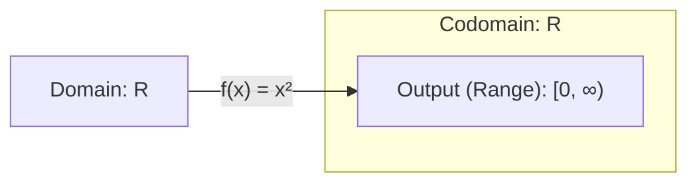

import { Mafs, Coordinates, Plot, Line, Circle, Theme, useMovablePoint, useStopwatch, vec, Vector, LaTeX, Polygon, Transform } from "mafs";

import { useState, useCallback } from "react";
import { lineLabel } from "@site/src/utilities/lines";
import { color, gradient } from "@site/src/utilities/colors"
import TOCInline from '@theme/TOCInline';
import * as MB from "mathbox-react"
import * as THREE from "three"
import { OrbitControls } from "three/examples/jsm/controls/OrbitControls"
import range from "lodash/range"

# Formalizing Linear Transformations

In the previous sections, we introduced the concept of linear transformations and how they can be represented by matrices.
We explored everything in a visual manner, using 2D and 3D space to help us understand the transformations.

In this section, we will formalize the concept of linear transformations.

## Table of Contents

<TOCInline toc={toc} />

## Functions and Sets

Before we dive into linear transformations, let's first review some basic concepts from functions and sets.

A function is a rule that assigns each element in a set to exactly one element in another set.
For example, the function $f(x) = 2x$ assigns each real number $x$ to the real number $2x$.

We will need to understand some terminology related to functions:

- Every function has a **domain** and a **image** (or **range**), representing the set of possible inputs and possible outputs, respectively.
- The image lives in the **codomain**, which is the set in which the function outputs are contained.

We can draw a diagram to represent visually how a function maps elements from the domain to the range:

For example, consider the function $f(x) = x^2$:

- The domain is all real numbers, $\mathbb{R}$.
- The codomain is also all real numbers, $\mathbb{R}$.
- The range is all non-negative real numbers, $[0, \infty)$.

We can notate the function $f$ as $f: \mathbb{R} \to [0, \infty)$, which reads as "$f$ maps from the real numbers to the non-negative real numbers".

## What Linear Transformations Really Are

Now, let's dive into linear transformations.
Linear transformations are a special kind of function; previously, we stated that they act on vectors.
For example, a linear transformation $T$ might take a 2D vector and output another 2D vector.
Then, we can write the transformation as $T: \mathbb{R}^2 \to \mathbb{R}^2$.

Recall that when we apply a linear transformation to a vector, if we express the vector as a linear combination of the basis vectors, the transformation can be applied to each basis vector separately.
Then, the coefficients of the linear combination are preserved.

For example, consider a linear transformation $T$ and a vector $\va{v} = a\ihatc + b\jhatc$.
Then, $T(\va{v}) = aT(\ihatc) + bT(\jhatc)$.
This is due to the linearity of the transformation, which we said means that the transformation:

- Preserves the origin.
- Preserves lines, which stay parallel and evenly spaced.

Let's see how we can formalize this. We start with a premise:

$$
\begin{equation}
T\qty(\mqty[a \\ b]) = aT(\ihatc) + bT(\jhatc)
\end{equation}
$$

We will go from this to the formal definition of a linear transformation.

Consider applying the transformation $T$ to the sum of two vectors $\va{v}$ and $\va{w}$, where $\va{v} = a\ihatc + b\jhatc$ and $\va{w} = c\ihatc + d\jhatc$.
Then:

$$
\begin{equation}
\begin{split}
T(\va{v} + \va{w}) = T\qty(\mqty[a + c \\ b + d]) &= (a + c)T(\ihatc) + (b + d)T(\jhatc) \\
&= aT(\ihatc) + cT(\ihatc) + bT(\jhatc) + dT(\jhatc) \\
&= T(\va{v}) + T(\va{w})
\end{split}
\end{equation}
$$

Additionally, consider applying the transformation $T$ to a scalar multiple of a vector, $\alpha \va{v}$, where $\va{v} = a\ihatc + b\jhatc$:

$$
\begin{equation}
\begin{split}
T(\alpha \va{v}) = T\qty(\mqty[\alpha a \\ \alpha b]) &= \alpha aT(\ihatc) + \alpha bT(\jhatc) \\
&= \alpha (aT(\ihatc) + bT(\jhatc)) \\
&= \alpha T(\va{v})
\end{split}
\end{equation}
$$

So we have shown that a linear transformation $T$ satisfies the following properties:

1. $T(\va{v} + \va{w}) = T(\va{v}) + T(\va{w})$. This is called the **additivity** of the transformation.
2. $T(\alpha \va{v}) = \alpha T(\va{v})$. This is called the **homogeneity** of the transformation.

These properties are the formal definition of what it means for a transformation to be linear.

We can construct a formal definition of a linear transformation from these properties:

<Boxed>
The transformation $T: \mathbb{R}^n \to \mathbb{R}^m$ is linear if it satisfies the following properties:

1. **Additivity**: $T(\va{v} + \va{w}) = T(\va{v}) + T(\va{w})$ for all vectors $\va{v}, \va{w} \in \mathbb{R}^n$.
2. **Homogeneity**: $T(\alpha \va{v}) = \alpha T(\va{v})$ for all vectors $\va{v} \in \mathbb{R}^n$ and scalars $\alpha \in \mathbb{R}$.
</Boxed>

A good exercise is to consider our geometric understanding of linear transformations and see how it fits with this formal definition *without getting lost in the notation*.
Are the properties of additivity and homogeneity consistent with our understanding of how linear transformations behave geometrically (preserving the origin and lines)?

## Linear Transformations of Different Sets
