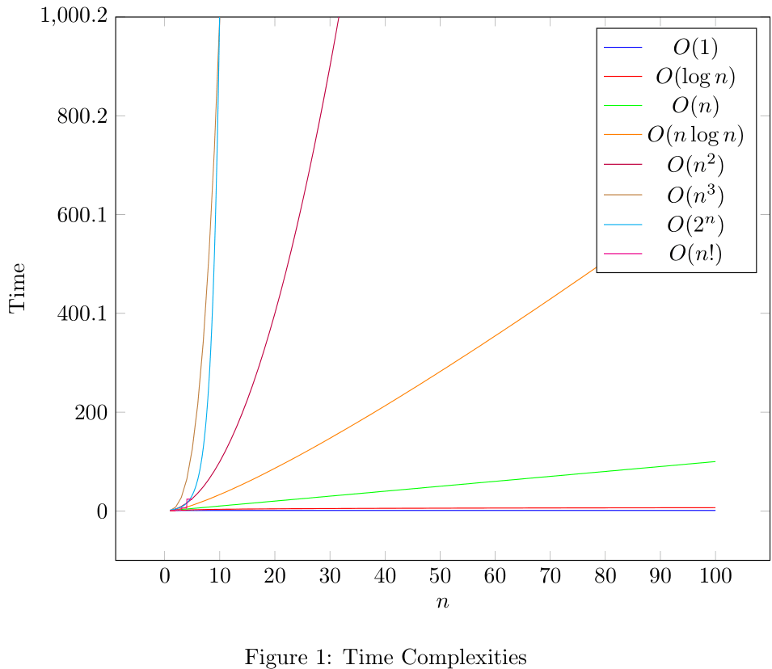

# Big-O Notation

Categorizes algorithms on time/memory based on input.

## Why?

- Helps us make decisions on what data structures and algorithms to use.

## Fundamental concept

As input grows, how fast does computation or memory grow?

## Important concepts

### Growth is **with respect to input**

```rust
fn sum_char_codes(input: String) -> u32 {
    let mut i = 0;
    for char in input.chars() {
        i += char as u32;
    }
    i
}
```

It runs an iteration in the `for` loop for the length of the string.
This function has $O(n)$ time complexity.

(Generally, look for loops to determine time complexity)

### You always drop constants

$$
O(k\cdot n) \longrightarrow O(n)
$$

While **practically important**, they're not **theoretically important**.

For example, if comparing $O(10n)$ and $O(n^2)$:

| $n$     | $O(10n)$ | $O(n^2)$                   |
| --------- | ---------- | ---------------------------- |
| $1$     | $10$     | $1$                        |
| $5$     | $50$     | $25$                       |
| $100$   | $1000$   | $10000$ (10x bigger)       |
| $1000$  | $10000$  | $1000000$ (100x bigger)    |
| $10000$ | $100000$ | $100000000$ (1000x bigger) |

We're not concerned with the exact time, but instead, _how_ it grows.

#### Practical and theoretical differences

Just because $O(n)$ is faster than $O(n^2)$ doesn't mean it's always better.

Remember, we drop constants. Therefore, $O(100n)$ is faster than $O(n^2)$ but in the practical sense, it's slower for small inputs.

For example, in sorting algorithms, we use insertion sort for small inputs. Though slower in the theoretical sense because it's $O(n^2)$, it's faster in the practical sense because it's faster **for small inputs** than for example, quicksort which is $O(n\log n)$.

### Consider the worst-case scenario

```rust
fn sum_char_codes(input: String) -> u32 {
    let mut i = 0;
    for char in input.chars() {
        if char == 'E' { // checks if char is 'E', then instantly breaks
            return i;
        }
        i += char as u32;
    }
    i
}
```

This function _still_ has $O(n)$ time complexity because we're looking for the worst-case scenario.

While there are some algorithms where it's better to reason using the best case and the average case, most of the time, we're concerned with the worst-case scenario.

In interviews, almost always assume the worst-case scenario.

## Common Big-O runtimes

| Big-O                   | Name        | Example               | Notes     |
| ----------------------- | ----------- | --------------------- | --------- |
| $O(1)$                | Constant    | Hash table lookup     | Fastest   |
| $O(log n)$            | Logarithmic | Binary search         | Fast      |
| $O(n)$                | Linear      | Simple search         | Slow      |
| $O(n \textrm{log} n)$ | Log-linear  | Quicksort             | Fast      |
| $O(n^2)$              | Quadratic   | Selection sort        | Slow      |
| $O(n^3)$              | Cubic       | Matrix multiplication | Slow      |
| $O(2^n)$              | Exponential | Traveling salesperson | Very slow |
| $O(n!)$               | Factorial   | Traveling salesperson | Very slow |



### Simple examples

#### $O(n^2)$

```rust
fn sum_char_codes(input: String) -> u32 {
    let mut i = 0;
    for char in input.chars() { // loop 1
        for char in input.chars() { // loop 2
            i += char as u32;
        }
    }
    i
}
```

For each character in the string, we iterate through the string again. This is $O(n^2)$.

#### $O(n^3)$

```rust
fn sum_char_codes(input: String) -> u32 {
    let mut i = 0;
    for char in input.chars() { // loop 1
        for char in input.chars() { // loop 2
            for char in input.chars() { // loop 3
                i += char as u32;
            }
        }
    }
    i
}
```

Just like the previous example, but we iterate through the string three times. This is $O(n^3)$.

#### $O(n \textrm{log} n)$

(Quicksort) - will be covered in a later section.

#### $O(\textrm{n})$

Binary search trees.

## $O(\sqrt{n})$

This is a very unique time complexity.

## Other notations

### $\Omega$

$\Omega$ is the **lower bound** of an algorithm.

For example, $\Omega(n)$ means that the algorithm will take at least $n$ time.

### $\Theta$

$\Theta$ is the **tight bound** of an algorithm.

For example, $\Theta(n)$ means that the algorithm will take at least $n$ time and at most $n$ time.

## Space complexity

Space complexity is the amount of memory an algorithm takes up. Generally it's less consequential than time complexity.

```tsx
return <Component {...props} /> // O(n) time and O(n) space
```

## Conclusion

- Big-O is a way to categorize algorithms based on time/memory.
- Growth is with respect to input.
- You always drop constants.
- In most cases consider the worst-case scenario.
