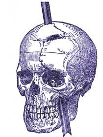

# The Brain and Neuroscience

In the summer of 1848 in Vermont, a railroad construction foreman named Phineas Gage was working on the Rutland and Burlington Railroad.

His job is to clear the way for the tracks by blasting through rock. To do this, he drills a hole into the rock, fills it with gunpowder, and then packs it down with a tamping iron.

On September 13, 1848, Gage was packing down the gunpowder when the iron sparked against the rock, igniting the gunpowder.
The tamping iron was shot out of the hole, entering Gage's skull below his left cheekbone and exiting through the top of his head.

<figure>
    
    <figcaption>Phineas Gage's Skull</figcaption>
</figure>

Somehow Gage did not immediately die.
After a few months of recovery, he had regained his physical health, as well as his cognitive abilities; he could talk, walk, and remember things.
However, his personality had changed drastically.

Before the accident, Gage was described as (direct quotes):

- "The most efficient and capable man"
- "A man of temperate habits"
- "Considerable energy of character"
- "A sharp shrewed businessman"

After the accident, "Gage was no longer Gage":

- "He is fitful, irreverent, indulging at times in the grossest profanity"

Eventually, Gage was unable to hold down a job, and ultimately ended up as a circus attraction.

## Why Study the Brain?

Courses in psychology often start with the brain, and for good reason.
Gage's story is a prime example that points towards the brain as the source of mental processes and behavior.

By beginning with the brain, we can understand from the most fundamental level how our thoughts, feelings, and behaviors are generated.
Then, we can build up to more complex topics like perception, memory, and social behavior.

## The Astonishing Hypothesis: Materialism

Francis Crick, a Nobel Prize-winning biologist, once said:

> "You, your joys and your sorrows, your memories and your ambitions, your sense of personal identity and free will, are in fact no more than the behavior of a vast assembly of nerve cells and their associated molecules."

This is known as the **Astonishing Hypothesis**. It states that everything "conscious" about us is a result of the physical processes in our brain.

This is a form of **materialism**, which is the belief that everything in the universe is made of matter and energy.
It directly opposes ideas like **dualism**, which posits that the mind and body are separate entities, and other theories that suggest non-physical entities like the soul.

At first, the idea that everything we experience can be reduced to physical processes seems absurd.
After all, how can the feeling of love or the taste of chocolate be explained by neurons firing in the brain?

There are many reasons to challenge materialism. The ideas of free will, consciousness, and other emergent properties of the mind are difficult to explain in materialist terms.

Many will tend to argue that materialism is too reductionist, that it ignores the complexity of human experience and the richness of our mental lives.

Instead, they may argue for a dualist view, where the mind and body are separate entities.
Dualism is an ancient idea, with roots in the philosophy of Plato and Descartes.

## Descartes' Dualism

René Descartes (1596-1650), a French philosopher, is often credited with the idea of dualism.

Firstly, he believed that materialism, in terms of the brain, was correct for non-human animals.
They were, in his view, like machines, responding to stimuli in a mechanical way that can be explained purely via physical processes.

However, he argues that "humans are different".
As the name "dualism" suggests, Descartes believed that humans have two distinct parts: the body and the mind.

He made two arguments that supported his view, which were very influential in the history of psychology.

### Argument 1: Creativity and Spontaneity

The first argument he made was that humans have abilities that machines and other animals do not.

He was actually familiar with the mechanical automata of his time - machines that could perform simple tasks like writing or playing music.
In the French Royal Gardens (Jardin des Plantes), there were automata that could do very simple tasks via hydraulics (instead of electricity).

Descartes argued that human behavior is far more complex than these machines.

## Summary and Next Steps

We introduced the first big topic in psychology: the brain, and how it relates to our thoughts, feelings, and behaviors.

Here are the key points to remember:

- Phineas Gage's accident was a turning point in psychology, as it showed that the brain is the source of our mental processes and behaviors.
- The Astonishing Hypothesis states that everything about us is a result of the physical processes in our brain.
- Materialism is the belief that everything in the universe is made of matter and energy.

In the next section, we will dive deeper into the concept of dualism.
